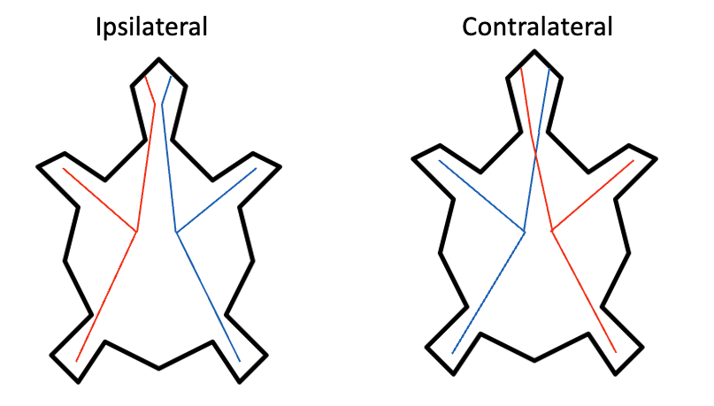

# Lab 1

1. Come up with a one sentence definition of the mind. Don't look it up on the internet or in a dictionary, try to come up with your own definition.
  
2. Now that you have a definition of the mind, be a little more explicit, and cast your definition in terms of features that minds must or usually have.
   - Make a list of 10 features of the mind. Have your features take the form of “propositions”, like “can X”, “is Y”, and “has Z”.
   - For each feature, list whether you think that feature is a necessary feature of a mind, a sufficient feature of a mind, or a typical feature (that is neither necessary nor sufficient).
  
3. Now we are going to apply the inductive reasoning process described in Chapter 1. We will go through a series of examples of entities.
   For each example below, answer: 1) whether you think it has a mind, 2) does your definition of a mind, in terms of your list of features, say it should be considered a mind?, and 3) how would you need to change your definition to make your definition match your intuitions.
   - A human being in a deep sleep
   - A human being with severe brain damage and who is in a vegetative state
   - A human being with dementia who cannot remember anything from their life
   - A typical one-month-old human being
   - A human fetus at 8 months of gestation
   - A cow
   - A cockroach
   - A tree
   - A single living neuron kept alive and functioning in a petri dish
   - A single living skin cell kept alive and functioning in a petri dish
   - A cloud
   - A thermostat (a machine that can sense the temperature and changes internal and perhaps external attributes in response)
   - Your phone
   - The Terminator (or some other advanced robot from science fiction that you are familiar with)
   - ChatGPT
	
4. Imagine that you are a scientist tasked with explaining the behavior of a new organism.
   You can only find the organism in a specific kind of environment: one with abundant sources of heat.
   At the following link, you can download and run a simulation of this organism. To run the simulation first you will need to install python on your computer, following the instructions here:
   [Intalling Python](https://github.com/jonwillits/python_for_bcs/blob/master/ebook/CH00/0.0.%20Installing%20Python.md)

   Then download the program located here:
[Braitenberg's Vehicles #2](https://github.com/jonwillits/intro_to_bcs/blob/master/CH1/vehicles.py)

   The orange circles are heat sources. The turtle-shaped entities are the organism that you are studying.
   You can press the start button to begin and pause the simulation. If you want to observe a new sample, you can press the “Reset” button.
   Note that you can click on and move the heat sources around to observe their effect on the organisms.
   Watch the simulation independently for a few minutes and then jot down your thoughts about what is happening. After observing the behavior and developing hypothses about their behavior, answer the following questions:
  - Briefly describe what your group thought was happening. What levels of explanation did you come up with? 
    Were they at the psychological level? The Neuroscience level? The Physics level? 
  - How do the explanations that you used compare to the Three Levels of Analysis proposed by David Marr that were discussed in the reading and in the videos? Give reasons for your comparison of Marr’s levels to the levels you used above.

5. Did you use anything like the scientific method to answer the question? Remember, the scientific method is often described as a set of steps:
- having a general theory about the nature of a system
- using the theory to generate hypotheses about what will happen in a specific situation 
- testing the hypothesis 
- using the results of the test to evaluate your theory, and if so, update it.

Using this framework, can you describe a theory you had about the organism, hypotheses you generated from the theory, and a test of the hypothesis that you performed? 
 
6. Now imagine that you have done a dissection on one of these organisms and discovered the organization of their nervous system that controls their movement.
   It is surprisingly simple, and is shown in the figure below:

   

   It turns out that the two kinds of turtles have slightly different nervous systems. The blue turtles' nervous system looks like the one on the left. At the front of the organism near the eyes are two neurons that are heat sensitive, one on the left, and one on the right. These neurons project all the way to the back of the organism and stimulate the feet (the boxes on the bottom left and bottom right). As you can see in the picture, the blue organism has what is called "ipsalateral" organization, the sensor on the left is connected to the foot on the left, and the sensor on the right is connected to the foot on the right. The red turtle, shown on the right, has was is called a "contralateral" organization. It is very similar to the blue turtle, except that the left heat sensor is connected to the right foot, and the right heat sensor is connected to the left foot. This means that if a heat source is located ahead and to the middle of the turtles, it will stimulate the heat sensors that are closer to the heat source a little more than the sensors that are further away, causing the connected legs to move faster.

   Discuss the implications of the organization of this nervous system. What does it explain about how and why the organisms behave the way that they do? 
 
8. One of the main themes of this week is that there are many different levels of analysis, and they sometimes provide different answers. You already attempted to describe this organism's behavior at multiple levels of analysis. Now, I want you to reflect on the value of the different levels, by answering the questions below.
   - Do you think the different levels of analysis provide complimentary or contradictory explanations? Your group members may disagree on this question, feel free to document different perspectives.
   - Are some levels of analysis better or more useful than others, at least in certain circumstances? Again, your group may have differing opinions, please share them. 
  
  
  
 
