# Lab 5: Neural Systems

## I. Exploring Human Brain Anatomy (48 POINTS TOTAL)

In the first part of this activity, you will be learning a bit about the anatomy and function of the human brain.
Go to https://www.brainfacts.org/3d-brain.

The **Intro** will play immediately and will guide you through the interface controls. 
After going through the Intro, click on **Get Started** and begin exploring the brain, so you can answer the questions below. 

First, get oriented to the views. With the structure box set on “The Brain”, move the brain into different views. 
Turn the brain so you are seeing it from the front (as if you were facing the person whose brain you are viewing).  
It should look like this:

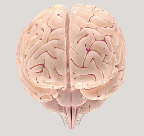

Note that the folded lobes (the cerebrum) are at the top and the brain stem, which connects to the spinal cord, is at 
the bottom and toward the back.

Turn the brain around so that you can see the back.  It should look like this:

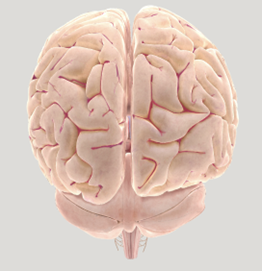

In this view, below the cerebrum and above the brain stem, you can see the cerebellum (in the front view, it can also 
be seen, but behind the structure known as the pons).

Finally, turn the brain so you can see the bottom.  Orient it so that the brainstem is at the bottom of the image, like this:
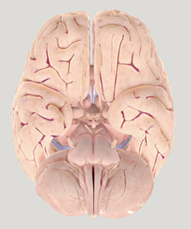

In this view, you are looking at the brain as if you were standing at the feet of someone lying on their back and 
looking through their body.  The top of their head is away from you.  Their eyes are facing up, toward the top of this 
image. The brainstem and cerebellum are at the bottom (near the person’s back).

Now, by using the menu and clicking on the brain itself, explore the anatomy and answer the questions below from the 
associated text. Note that you can skip the cranial nerves.

### 1. What is “grey matter”? (2 POINT)

### 2. What are the names of the four “lobes” in each hemisphere of the cerebral cortex and what functions is each lobe associated with? (8 POINTS)

|   | Name | Function |
|---|------|----------|
| 1 |      |          |
| 2 |      |          |
| 3 |      |          |
| 4 |      |          |

### 3. Find the primary visual cortex (make sure to move the brain around so you can see this)? How is the visual “map” created in the primary visual cortex organized? (2 POINT)

### 4. What are two “pathways” for processing visual information and where does each go? (4 POINTS)

|   | Pathway from visual cortex toward what area? | Type of information processed? |
|---|-----|---------|
| 1 |     |         |
| 2 |     |         |
	

### 5. What part of the brain is associated with “hemi-neglect” if it is damaged? (2 POINT)
	

### 6. What area of the brain is important for math, language, and tool use? (2 POINT)

### 7. What is a “homunculus”? Which brain areas show this kind of organization (there are two)? (2 POINTS)
1) 
2) 

### 8. What are two areas that have been associated with language and what lobes are they in? (4 POINTS)

|   | Area | Lobe |
|---|------|------|
| 1 |      |      |
| 2 |      |      |

### 9. Which brain areas (two) are important for controlling our social behaviors? (2 POINTS)
1) 
2) 

### 10. What are the three structures that make up the brain stem and what is a primary function of each? (6 POINTS)

|   | Structure | Function |
|---|-----------|----------|
| 1 |           |          |
| 2 |           |          |
| 3 |           |          |

### 11. What brain structure is important for helping us remember events that caused fear? (2 POINT)
	

### 12. What brain areas/structures (two) help us localize ourselves in space through “grid cells” and mental maps? (2 POINTS)
1) 
2) 

### 13. What brain structure serves as a critical relay (sending information to the right places)? (2 POINT)

### 14. What brain structure is associated with Parkinson’s disease, Tourette’s syndrome, and Huntington’s disease? (2 POINTS)
	

### 15. Which brain structure is linked to reward and addiction? (2 POINTS)

### 16. Which structure in the brain has the most neurons? What does that structure do? (2 POINTS)

### 17. Where do we process smell information? (2 POINT)
	

## II. Comparative Neuroanatomy (22 POINTS TOTAL)

Now that you have familiarized yourself a bit with the human brain, let’s take a look at the brains of a wider range of 
animal species. Look at the following brain specimens. You will not see exactly the same views or the same number of views of all the brains. 
That is just due to the fact that these came from different sources and were prepped at different times by different groups.
Take a look through the brains and familiarize yourself a bit with the images.  
Make sure you can generally tell which view is top, bottom, or side. 
See if you can find some of the same general structures you looked at on the human brain:  
cerebral hemispheres? cerebellum? brain stem? olfactory bulb?

| 1.  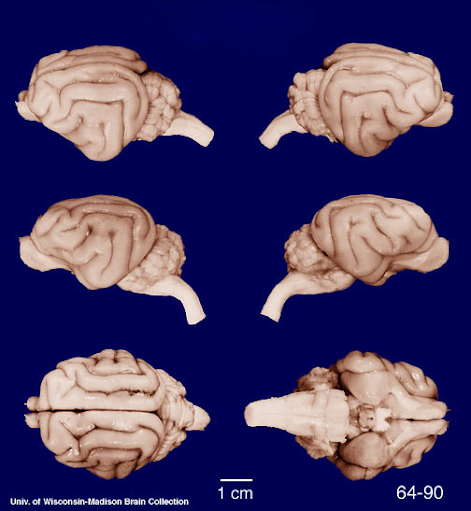    | 2.      |
|-----------------------------------------------------------|-----------------------------------------------------------|
| 3.  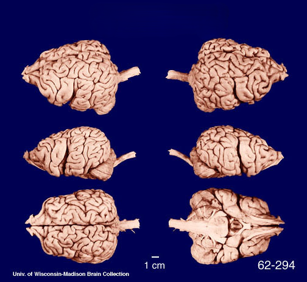    | 4.  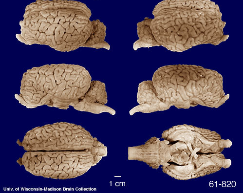    |
| 5.  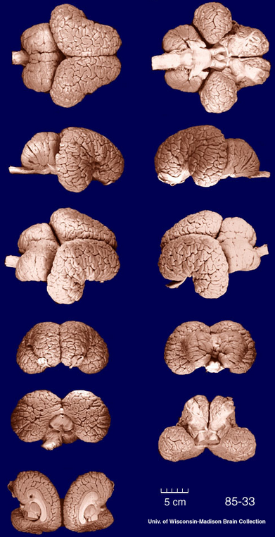    | 6.  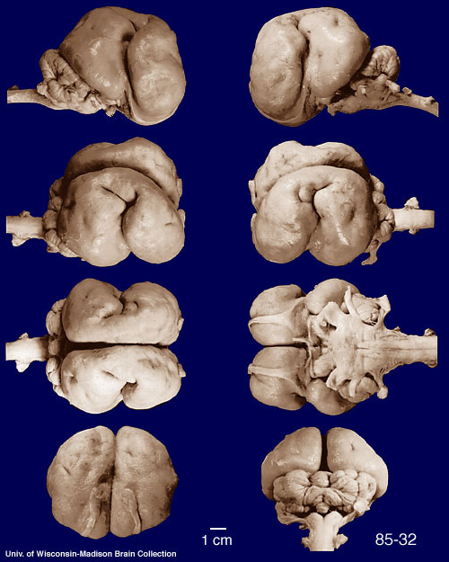    |
| 7.  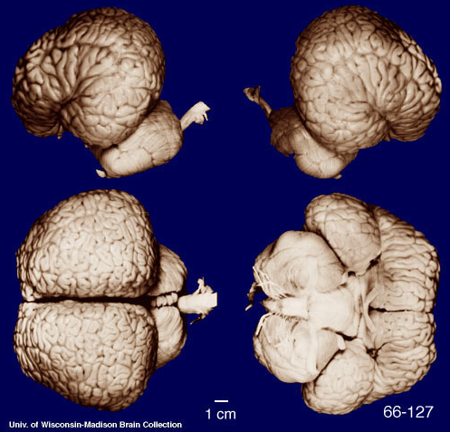    | 8.  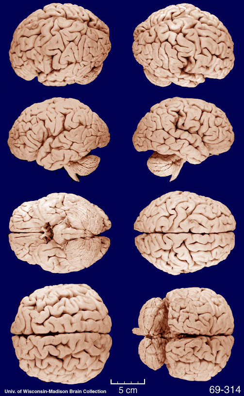    |
| 9.  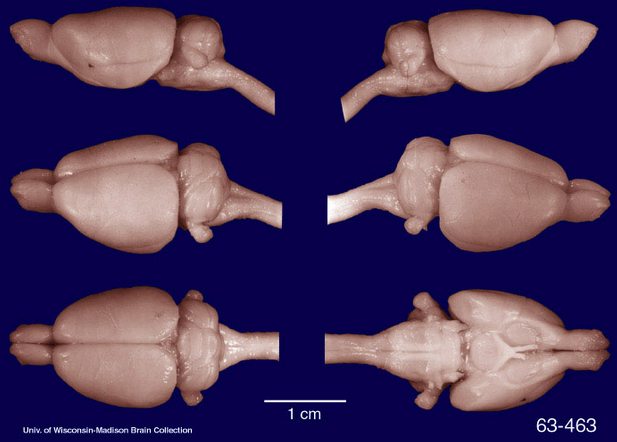    | 10.  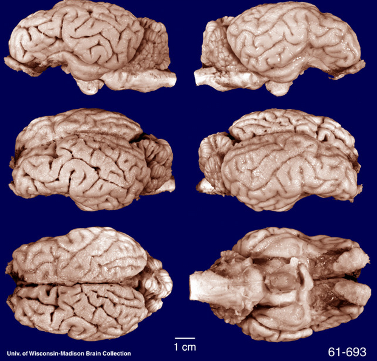 |
| 11.  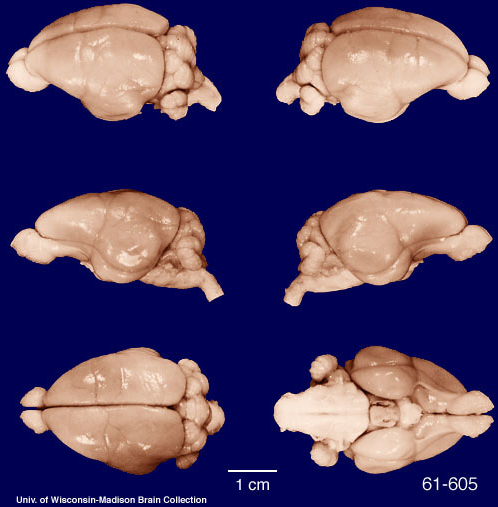 | 12.  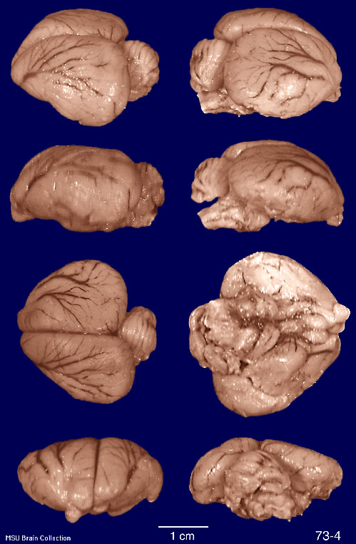 |
| 13.  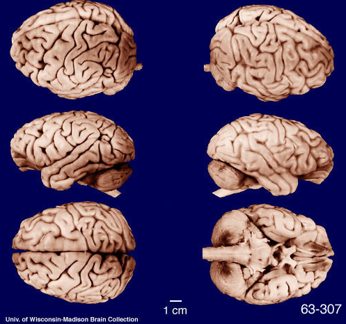 | 14.  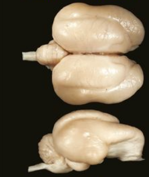 |
| 15.  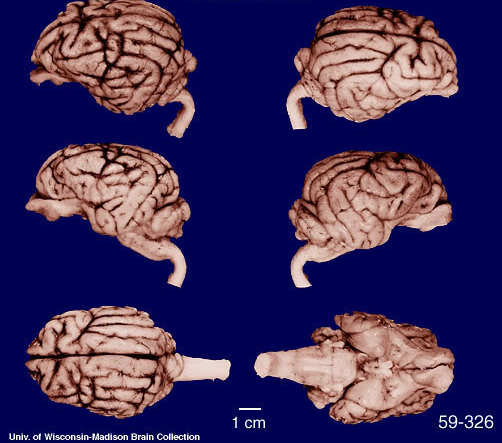 | 16.  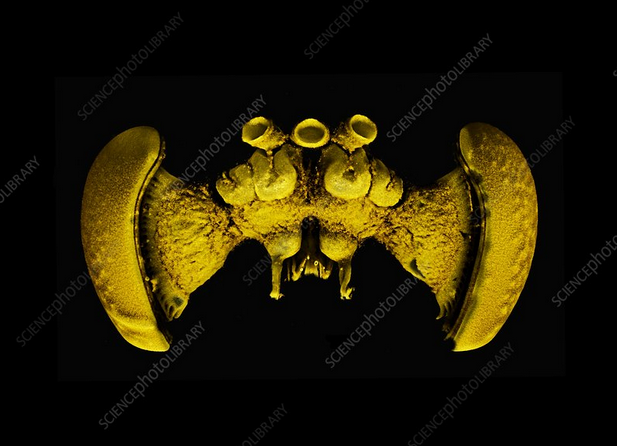 |
| 17.  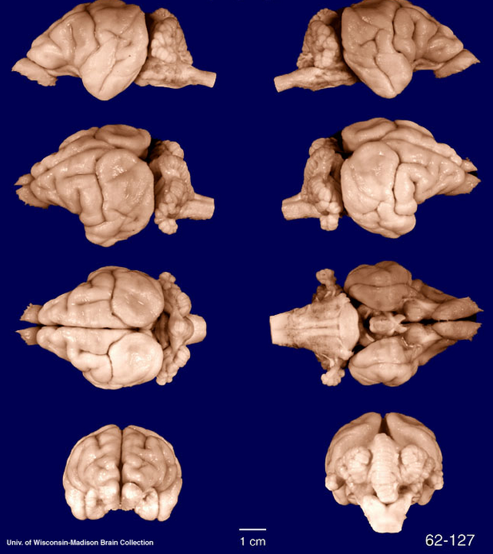 | 18.  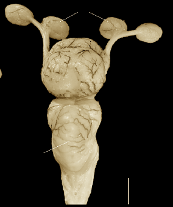 |

### 1. What are some characteristics or brain regions that seem to be common across all or most of the brains? Name at least 2. (2 POINTS)

### 2. What are some factors that vary across the brains? In particular, what are factors that might help you figure out which species a particular brain might be from? Name at least two. (2 POINTS)

### 3. Using the list of animals, try to identify the species of animal for each brain image. (9 POINTS)
Write your guess for which numbered picture goes with each animal.
You should find this a challenging task.
Don’t spend a lot of time trying to perfect the matching; 
just develop a strategy for trying to make reasonable guesses.

___Cat 
___Chimpanzee 
___Dog 
___Dolphin 
___Elephant 
___Honey Bee 
___Human 
___Gorilla 
___Kangaroo 
___Macaw 
___Manatee 
___Platypus 
___Rat 
___Sea lion 
___Sharpnose Shark 
___Sheep 
___Squirrel 
___Zebra 

### 4. At the end of class, we will show the answers. (3 POINTS)
- How many did you get correct?
- Did you correctly identify the human brain?
- If not, which brain did you confuse it with?

### 5. Describe the strategy you used to try to identify the brains. (2 POINTS)
- Having seen what kind of errors you made, describe ways you might have improved your strategy (Were there features you should have weighted more or less? 
- Did you make assumptions that turned out to be incorrect?) (1)

### 6. What did you learn from this activity? Talk about things that surprised you or ways that your assumptions were challenged. (2 POINTS)

### 7. How might studying comparative anatomy (or physiology) inform people’s reactions to claims about the idea that cognitive functions are localized (that is, that some particular part of the brain is responsible for some particular function -- for example, that there is a “face processing area”) or that the human brain is “special”? (2 POINTS)

## III. Brain Imaging Methods (30 POINTS TOTAL)

Now that you have discussed some of the methods that are used to study the brain and to make links between brain activity 
and behavior/cognition, try your hand at “designing” some brain imaging experiments.  
For each scenario below:
- suggest which technique(s) might be used (2 pts)
- why they would be a good choice (3 pts).

Then very briefly (in a few sentences) describe how you might design an experiment to address the question using one of the techniques you have selected:
- what you would present to the subjects (2 pts)
- what task they would have (2 pts)
- what you would measure/expect to observe (1 pt).

### 1. You have been reading about findings in animals that suggest that different areas of the visual cortex are specialized for recognizing faces as compared with scenes. You would like to know whether humans show the same kind of organization in their visual system. How can you find out? (10 POINTS)

### 2. You know that there is an area in the parietal lobe that becomes active when people view pictures of tools. You suspect that this area may be critical for allowing people to shape their hands the right way to grasp a particular tool. How can you support your claim? (10 POINTS)

### 3. You are working with some older adults who have tinnitus (ringing in the ears). They are having comprehension difficulties and you suspect that this is because the tinnitus is causing them to be slower to access the meaning of words. How can you test this? (10 POINTS)

