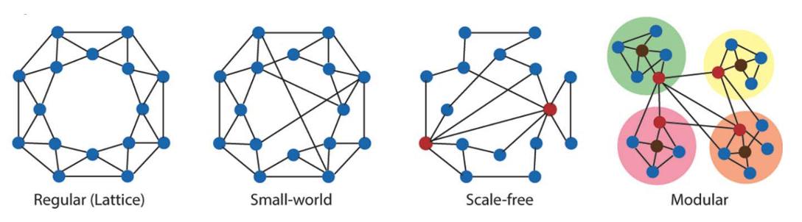

# Lab 11: Network (Neuro)Science

## 1. Creating Networks
You have identified 26 different areas in the brain (we will label these with letters from A to Z).
You have conducted a series of studies to see which areas activate together in different tasks. 
You want to create a functional network diagram of the brain based on your work.

### Network 1:
First, you run a series of studies using visual stimuli and observe sets of co-activations (in square brackets). 
If you assume that co-activation means connection (and that all connections are bidirectional), 
draw the visual processing network that these studies as a group suggest:

\[B, D, K] \[A, J, K] \[A, K, M] 

### Network 2:
Now, you run a series of studies using auditory stimuli and get a different set of co-activations.  
Draw this network as well.  

\[C, I, R] \[G, I, R] \[G, I, O] \[C, M, O]

Compare this network with the one you drew above. 
Are there any points of connection (assume that a letter label always refers to the same brain area, across experiments)? 
Where? 

### Network 3:
Now draw the graphs associated with a motor task (like very carefully manipulating small objects with your hands)

\[E, F, M] \[F, N, S] \[F, P, S] \[P, Q] \[H, S] \[H, X]

Are there any connections between network 1 and network 3? What about network 2 and network 3?

### Network 4:
Finally, draw the graph associated with a language task:

\[E, M, O] \[E, F, M] \[E, L, M] \[E, L, U] \[E, U, W] \[U, V] \[W, Z] \[F, Z] \[Z, T] \[V, Y]

Describe the connections between Network 4 and Networks 1, 2, and 3.

## 2. Analyzing the Networks
Now, let's analyze our networks.

### 2.1. Calculating Network Degree (k)
Calculate the degree of each node in the “whole brain”.
Remember, the degree is just a number representing how many other nodes a given node is connected to. 
For nodes that appear in more than one subnetwork, make sure to count up connections across all the networks.

| Node | Degree |
|------|--------|
| A    |        |
| B    |        |
| C    |        |
| D    |        |
| E    |        |
| F    |        |
| G    |        |
| H    |        |
| I    |        |
| J    |        |
| K    |        |
| L    |        |
| M    |        |
| N    |        |
| O    |        |
| P    |        |
| Q    |        |
| R    |        |
| S    |        |
| T    |        |
| U    |        |
| V    |        |
| W    |        |
| X    |        |
| Y    |        |
| Z    |        |

### 2.2. Calculating Degree (k) Distribution
Now create a chart of the k distribution (to make it easier, we will just count rather than do probabilities, which are more typical). 
Remember that k refers to the degree, so we are creating a chart of how often each degree appears in the network.

| K | Frequency of k in network |
|------|--------|
| 1    |        |
| 2    |        |
| 3    |        |
| 4    |        |
| 5    |        |
| 6    |        |
| 7    |        |

### 2.3. Network Architecture
- Which of the following network architectures does our network resemble? Why?

- Which nodes are good candidates for being network hubs based on this metric?
- What are likely provincial hubs in your brain network?
- What are likely connector hubs?
- Can we make this distinction using measures of degree alone? 

### 2.4. Experimenting on the network
Now, imagine you asked participants to do an experiment consisting of a series of tasks one after the other, cycling through visual to auditory to motor to language and back to a (different kind of) visual task, etc.
- If you were able to use something like transcranial magnetic stimulation (TMS) to disrupt the function of one of the non-hub nodes during this experiment, what might happen?
- What if you disrupted a single provincial hub?
- What about a single connector hub?
