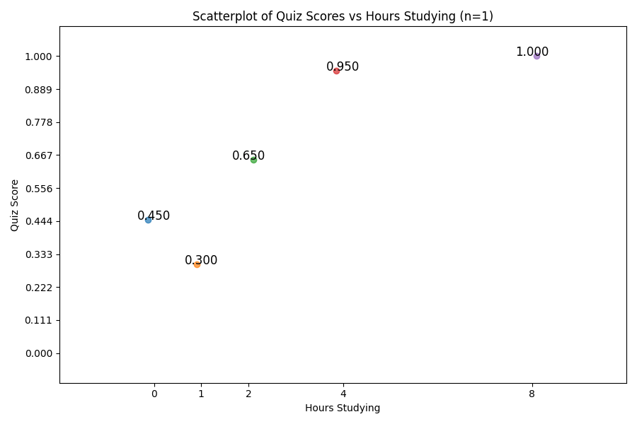

# Lab 3: Scientific Method in BCS

## 1. In your group, evaluate the law of effect example from the video “The Scientific Method”.

### a) What is an example of a hypothesis you can derive from this theory (the missing box in the slides)
### b) Does this theory meet the criteria we noted for a good scientific theory? Which does it meet, and on which does it fall short?
### c) How would you improve it in the ways that it falls short?

## 2. Designing a Study

Some people do well on their weekly quizzes. Some people do poorly. Try to come up with a scientific explanation for the variation. 

### a) If the dependent measure (or outcome variable) is a person's percent correct on a weekly quiz with 20 questions, what are some of the predictor variables that could explain the different?
### b) How would you design a correlational study to test your hypothesis?
### c) How would you design an experimental study to test your hypothesis?

## 3. Interpreting Results and Building Models

### Preparing the program
Go to the following web page and download python program called:
https://github.com/jonwillits/intro_to_bcs/blob/master/CH3/simulation/exp.py
Save the file where ever you are saving stuff for this class.

Open your terminal program (mac) or command prompy (windows) and type or paste the following two commands (one at a time) and press enter:
- "python -m pip install numpy"
- "python -m pip install matplotlib"
Remember that on a mac, you need to type python3
- "python3 -m pip install numpy"
- "python3 -m pip install matplotlib"

After navigating to the saved location in your terminal (i.e. "cd desktop/bcog100/lab3/" or wherever you saved it), run the program at the terminal by
typing:

"python exp.py 1" (or "python3 exp.py 1" on a mac).

The program is simulating an experiment where you conduct an experiment that recruits participants into a quiz performance study, by giving them material 
to study and randomly assigning them to different experimental conditions of how many hours they spend readings, reviewing, and studying the materials. 
Then the people take a 20-question multiple choice quiz. 
We are going to try to build a simple linear model relating the amount of study to how well they perform.

When you run the program, it will show you the results of the experiment. 
The number you typed after "python exp.py" is the number of participants in the study.
The results will look like this:

Each dot is a participant. The x-axis shows how many hours they studied, and the y-axis shows their quiz score. 
The numbers printed next to the dots shows the average score for all the participants who studied that number of hours.
In this case, that is only an average of 1 participant.

### a) Rerun the experiment three times. What do you observe about the results?

### b) Replications

In your lab report, create tables like the one shown below. Run the experiment 9 times, three times each with 10, 100, and 100 subjects. 
Record the mean score in the table. Then answer the following questions:

| Row/Col | 0 Hours | 1 Hours | 2 Hours | 4 Hours | 8 Hours |
|---------|---------|---------|---------|---------|---------|
| n=10    |         |         |         |         |         |
| n=10    |         |         |         |         |         |
| n=10    |         |         |         |         |         |

| Row/Col | 0 Hours | 1 Hours | 2 Hours | 4 Hours | 8 Hours |
|---------|---------|---------|---------|---------|---------|
| n=100   |         |         |         |         |         |
| n=100   |         |         |         |         |         |
| n=100   |         |         |         |         |         |

| Row/Col | 0 Hours | 1 Hours | 2 Hours | 4 Hours | 8 Hours |
|---------|---------|---------|---------|---------|---------|
| n=1000  |         |         |         |         |         |
| n=1000  |         |         |         |         |         |
| n=1000  |         |         |         |         |         |

- what is the apparent relationship between the amount of time studied and the performance on the quiz?
- How does the sample size affect your ability to detect this relationship? How correct or incorrect would you have been
if you had only run 10 subjects. Could you have discovered the real relationship?

### c) Creating a linear model
- For one of the experiments with the smallest sample size (10), save the figure of the results that is output by the program, and paste it into your lab report.
Then, use the "add shape" function in your word processing to try to add a line to the figure that minimizes the error between the
line and your points (i.e. make a like that is as close to all of the points as possible). In the real world we would use statistics 
to do this, but for now just estimate it visually as best as you can.
- Once you have inserted a line, try to actually estimate its parameters (the slope and the intercept). Remember your algebra 1?
Pick the point on the line where x=0. What is the value of y there? That's the y-intercept (b). Then pick any other point and estimate its
x,y values. Then compute the slope as m = (y2 - y1) / (x2 - x1), where x1,y1 is your y-intercept, and x2,y2 is your other point. When you have both 
points, right your equation as y = mx + b, subbing in your values of m and b.
- In every day english terms, interpret the parameters of your model. Give a definition of what x, y, m, and b "mean".
- Is this a good model? Why or why not.
- Now repeat the process with the largest sample size. Paste in that figure, draw the line, and estimate that model's parameters.
- How are the two models different? Is one a better model? Why or why not?

### d) Interpreting linear models
- What does the model suggest Is the relationship between studying and quiz score?
- Do you think the relationship between the two is a linear relationship? Why or why not?