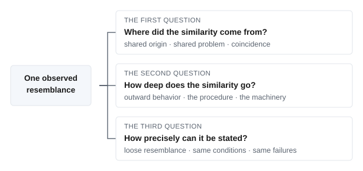
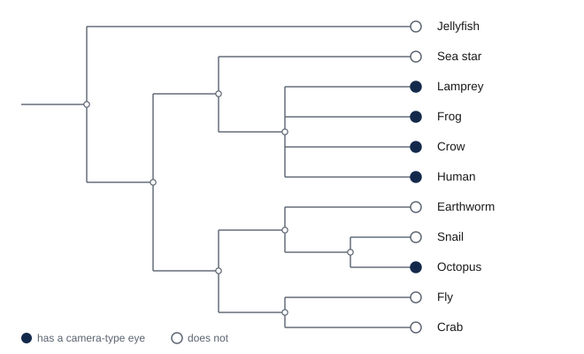

# 2. Comparative Approaches

This module is about comparison, the method most of brain and cognitive science runs on: setting two systems side by side, or one system under two conditions, and asking what the likeness and the difference between them reveal. While reading, look for the beginnings of answers to these:

- When two things resemble each other, what follows from the resemblance, and what does not?
- If two species share a trait, how do we tell whether they inherited it from a common ancestor or arrived at it independently, and why does the answer change what we can conclude?
- What would it take to say that a machine does what a mind does, and would behaving the same way be enough?
- When two different ways of studying the same mind disagree, does that mean one of them is wrong?
- When a study finds a difference between two conditions, what besides the manipulation could have produced it?
- Comparisons between minds have been used to decide whose mind counts. How should that history shape the way such comparisons are made?

By the end we should have a working answer to each, and one habit worth carrying into every module that follows: when two things look alike, ask why they are alike before asking what it means.

## §2.1 — Comparison

Brain and cognitive science is a science built on comparison. Scientists compare how minds behave in different situations, and compare the structure and behavior of different brains and minds (or mind-like things) to one another. They set different systems next to each other, and ask what their similarities and their differences reveal. The process of comparison could be said to be the general method of brain and cognitive science.

Brain and cognitive scientists make many kinds of comparisons. Scientists frequently compare cognitive performance across different experimental conditions, testing theories by seeing what people do in different situations. Scientists also frequently make comparisons across species, across development, and by comparing typical behavior to behavior in cases of brain difference and disorder. And an increasingly common kind of comparison is with machines, comparing human and animal cognition to different computational models and AI algorithms.

In each case, comparison is the instrument we can use to better understand how a cognitive system works. This practice of setting systems or situations side by side, we will call the **comparative method**. Arguably, it is the field’s primary engine of inference, and a great many of the claims in the rest of this book are, underneath, claims about a similarity or a difference between two systems, or the behavior of the same system in multiple contexts. In the following sections of this chapter, we will take a look at some of these different kinds of comparisons, and what can and cannot be learned from them.

One note about the name *comparative method* before we go on. In evolutionary biology, the comparative method often means something narrower and more specific: just the comparison of traits across species, which §2.2 takes up at length. We are using the phrase in a wider sense, to cover every case where two measurements are set beside each other and made to inform one another. When the narrower sense is meant, the context will make it clear.

### §2.1.1 — Comparison and Decomposition

Notice how the comparative method relates to what we discussed in the previous module. Marr’s three levels are a way of taking a single system apart. One mind can be examined by asking three different questions about it. That is decomposition, which can be thought of as a vertical method, to look at one system from multiple perspectives. Comparison is a complementary method. It can be thought of as a method that compares horizontally, either to another system or to the same system under different circumstances. A field equipped with both methods can ask what a capacity is, and also ask what else in the world has anything like it. Using the two methods together helps constrain both kinds of questions in many useful ways.

Vision makes the two moves easy to see at once . In the previous module, we looked at human vision at all three of Marr’s levels. Now set a frog’s visual system beside it. A frog’s eye, in the classic description by Jerome Lettvin and his colleagues, is largely a device for finding bugs. A frog will ignore, possibly not even “see,” a motionless fly, and can starve surrounded by them.

: Marr’s three levels asked of two visual systems. Module 1 built the human column; setting a second column beside it is the comparative move. {#t-levels-vision}

| Level | Human vision | Frog vision |
|---|---|---|
| Computational: what problem, and why | Recover a general description of surfaces, objects, and their arrangement, one that can serve many tasks at once: recognizing a face, reading a word, judging whether a gap is wide enough to walk through. | Find a small dark thing moving the way an insect moves, and strike at it. Detect a large shadow spreading overhead, and flee from it. |
| Algorithmic: by what procedure | Build the description up in stages, from local edges and orientations toward shapes, and then toward objects that stay recognizable from a new angle or in a new light. | Compute a few specific features and route them almost directly to an action. Little general-purpose description gets built along the way. |
| Implementational: in what physical stuff | The retina, then a relay station in the thalamus, then a large hierarchy of cortical areas given over to vision. | Much of the work done in the retina itself, whose output goes chiefly to the optic tectum in the midbrain. |

Reading down a column is doing Marr’s analysis: one system, three questions. Reading across a row is doing the comparative method: one question, asked of two or more systems. The table is small, but almost everything in this chapter lives in that second move. What can this comparison tell us about both systems?

Notice what the human-frog comparison buys us. Looking at the human column alone, it is natural to think of vision as one thing, which some animals do better and others do worse. Comparing across the rows suggests something different. The frog is not a poor version of humans. It is solving a different problem, and its machinery fits that problem well. Mistaking the first description for the second is a common mistake, which we will discuss more in §2.2.

### §2.1.2 — Why a Resemblance Is Never Enough

The comparative method is very useful, but it also comes with a particular kind of difficulty. A comparison cannot interpret itself. We can set two measurements beside each other, and find a relationship between them. We might see a similarity, or a difference. But this relationship does not tell us why it is there.

Consider a case from the human-machine comparison. Say that we show the same photograph to a person and to an image-recognition AI model, and both give it the same incorrect label. Both label a picture of a wolf as a dog. More broadly, say that both models and people tend to be correct about 95% of the time, and also agree with each other 95% of the time. That is a similarity, and it is exactly the kind of finding that gets reported as evidence that the model sees the way people do.

What we may conclude from that agreement depends entirely on why the two systems are similar in the first place. Perhaps the model inherited its answers from us. If it was trained on photographs that people had labeled, then our confusions were built into its lessons from the start. Perhaps neither system inherited anything, and the photographs they both miss are simply hard ones. Perhaps the two really do work alike, building from edges toward shapes in a way that fails at the same point. Or perhaps some of the agreement is chance. And in the example we described, we can actually say how much. Two systems working entirely independently, each correct 95% of the time, with their errors randomly distributed, will still agree on about 90% of the photographs, simply because both are usually right. So if they agreed 95% of the time, this is roughly five points more than independence alone would produce. It is that surplus agreement, and not the agreement itself, that calls for an explanation.

Notice also that the disagreements between the two systems are also informative. Two quite different procedures can arrive at almost the same answers. And when they do, the handful of items they treat differently may be the only visible sign that they differ at all. But that same signature, high agreement with a small residue of disagreement, can also come from the reverse arrangement. The two procedures may be nearly identical rather than genuinely different, alike except for a step somewhere that is random, so that they diverge now and then for reasons that reflect no real difference between them. From the outside these two cases are indistinguishable. The agreement rate is the same in both, and it cannot tell us which one we are looking at. Telling them apart means dropping to the algorithmic and implementational levels and asking what each system is actually doing. This is why the vertical and horizontal methods need each other.

The work of a scientist is not just noticing that two things are similar or related. Often, noticing similarity is the easy part. We are extremely good at noticing similarities and jumping to conclusions about why that similarity exists. The work is figuring out *why* the relationship is there. That is the central skill this module is trying to teach.

### §2.1.3 — The First Question: Where Did the Similarity Come From?

Start with the case where the two things being compared are two different systems. When two systems resemble each other, the resemblance can come from three broad sources. The first is *shared origin*. They inherited the trait from some common source (genetically from a parent, or environmentally from a teacher or through imitation). In this case, the likeness is a family resemblance. The second is a *shared problem*. Two systems that have no relationship to each other can arrive at the same solution (either genetically or through learning or environmental adaptation) because they faced the same constraint, and the world contains only so many solutions to some problems. The third is *coincidence*. Sometimes there is no meaningful connection at all, and we have been falsely seeing a pattern in the noisy randomness of the world.

Each of these three reasons for similarities across systems gives us reasons for and against different kinds of conclusions. If two species share a capacity because they inherited it, we may reason about the ancestor that had it. If they share it because they faced the same pressure, we cannot make inferences about the ancestor at all. Saying the trait arose twice, independently, is precisely the claim that the ancestor did not have it. But in cases of similarity due to shared problem, we have also learned something arguably more interesting. We have learned that the pressure or problem was real, and that it is a good candidate for a computational-level explanation of the problem that needed to be solved. *And* we have learned that this capacity is what solving that problem looks like. Finally, if the similarity is a coincidence, we have learned nothing at all, other than that coincidences explain more than we sometimes think they do and want them to.

### §2.1.4 — The Second Question: How Deep Does the Similarity Go?

In addition to why a similarity between two systems exists, there is a second question we can ask about any resemblance between systems: how deep does the similarity go? This is a question about Marr’s levels, and the answer names the level at which the match holds. Two systems can match only in what they do or what problem they solve, while working quite differently inside. Or the match can run down to the algorithmic level, so that they are doing the same thing in the same way. Or it can run all the way down to the implementational level, so that they do the same thing, in the same way, using similar physical machinery.

When two systems merely act alike while working differently underneath, we have learned less than we might think. But notice that the reverse case is possible too. Two systems can be built from nearly the same materials and still be doing entirely different jobs with them.

### §2.1.5 — The Third Question: How Precise Is the Similarity?

There is a third question, and it is worth keeping apart from the second, because the two are easy to run together. Depth asks *at which level* two systems match. Precision asks *how finely specified the match is* at whatever level we are looking. These are independent. A claim can be shallow and precise, or deep and vague.

Precision can be asked at every level. At the level of behavior, the least precise kind of similarity is that both systems are, on average, capable of making the same kind of distinction. A far more precise version is that both make the same pattern of errors, on the same items, in the same proportions. At the algorithmic level, the loose version is that both recognize objects by building up from simple features toward complex ones. A precise version is that both compute the same specific set of features at the first stage, and combine them in the same order. At the implementational level, the loose version is that both are built from cells that signal electrically. The precise version is that both use the same molecules to carry those signals, with the same timing, in the same arrangement.

Specifying how precisely two systems resemble each other turns out to be critical in terms of what claims we can make. To say two systems behave alike is never to say they would behave alike in every possible circumstance. It is to say they matched on the things we happened to measure. Look at more things, or look harder at the same things, and differences tend to surface. So precision is not really a matter of yes or no. It is a matter of how finely we looked before we stopped looking.

The three questions are worth separating because they cross . Two systems can share an origin and still have drifted into different mechanisms. Two systems that arrived at a solution independently can nonetheless land on nearly the same machinery, if the problem has only a few workable solutions. A precise behavioral match tells us nothing on its own about depth, and a shared mechanism described loosely tells us very little at all. And notice what happens when we do find a shared mechanism. That shared mechanism is itself a resemblance, so we are sent straight back to the first question. Why do they share it? Inherited, independently arrived at, or chance? Depth tells us what is shared. Precision tells us how well we have pinned it down. History tells us why the similarity exists.

{#f-resemblance-questions alt="A box on the left reading 'one observed resemblance', with three lines branching to three panels of equal size. The first panel asks where the similarity came from, and lists shared origin, shared problem, and coincidence. The second asks how deep the similarity goes, and lists outward behavior, the procedure, and the machinery. The third asks how precisely it can be stated, and lists loose resemblance, same conditions, and same failures."}

### §2.1.6 — Other Comparisons, Same Questions

Comparisons other than those across systems ask the same questions with a different list of possible answers. When a researcher tests one entity in two different conditions and finds a difference between them, that difference can come from the change they deliberately introduced. But it can also come from something else that happened to vary alongside the deliberate change. Or, again, the change can be due to chance, since no two measurements of the same thing ever come out exactly alike. When two entirely different ways of measuring the same mind agree with each other, the agreement can mean that both are tracking something real. But it can also mean that both methods share a blind spot, or again that the similarity was due to chance. Different kinds of comparisons have an overlapping set of candidate explanations. Our ambitious goal is to find a way to rule out all explanations but one.

Mistaking one candidate for another is the classic error of the comparative method. This is an error that is not made only by beginners. Serious careers have been built on relationships that turned out to be the wrong kind. The sections ahead focus on the details of the different kinds of comparisons, and introduce the terms that are typically used for that type of comparison. Across species, shared origin and shared problem get the formal names *homology* and *analogy*. Across the natural and artificial divide, it is the depth question that gets formal names, and acting alike and working alike become behavioral and mechanistic equivalence. Different domains often use different words, but keep coming back to the same three questions.

### §2.1.7 — Three Families of Comparison

The comparisons ahead fall into three families. The first compares *different systems*, and asks the questions we have just set up. Why do these two resemble each other? We ask it across species, across ages, across typical and atypical minds, and across the divide between natural and artificial minds. The second family compares *one system across different conditions*, where the difference between the conditions is one the researcher has chosen on purpose. This is the ordinary experiment, or the naturalistic comparison. The third family compares *different methods* used on the same system, asking not why two things are alike but whether independent ways of measuring agree.

The chapter gives these unequal space, on purpose. Comparison across species (§2.2) and comparison between natural and artificial minds (§2.3) each get a section, because those two run through every module that follows. Comparison across methods gets a section as well (§2.4), because behavior and the brain are the two windows the field actually looks through, and a great deal depends on what happens when they disagree. The remaining comparisons share §2.5: across conditions, across ages, and across typical and atypical minds.

It is worth being straightforward about which of these the field actually spends its time on, and which this book emphasizes, because they are not the same. The great majority of day-to-day work in cognitive psychology, cognitive neuroscience, and behavioral neuroscience uses the second family, comparison across different conditions. A theory predicts one result under condition 1 and a different result under condition 2. We create the contrast, or find it in the world, and look. Cross-system comparison is the more integrative mode. This kind of comparison is the one this book focuses on. That is because setting a human mind beside an octopus’s, or an infant’s, or a machine’s, often exposes things that no amount of careful work inside a single system will show us. So the comparison a working scientist makes most often is the one that gets the least room here, and that is a choice about what a first course should teach rather than a ranking of what matters.

### §2.1.8 — Ways the Comparative Method Can Fail

Because a relationship across different systems is always ambiguous, people tend to make characteristic kinds of mistakes. **Anthropomorphism** is projecting human qualities onto a system that has not earned that description. We do this all the time, when we immediately assume that a dog looks guilty, or that a chatbot sounds like it means what it says. **Anthropocentrism** is subtler, and often does more damage. It treats the human case as the reference point, default case, or even “normal” case. The result of anthropocentrism is that every other mind gets measured by how near it comes to a human mind, and gets described in terms of what it has or lacks compared with a human mind. **Unconstrained adaptationism** is the habit of assuming every trait must be a finely tuned solution to some problem, which turns evolutionary and cultural adaptation explanations into a game where every explanation, even contradictory ones, sounds correct. We explain the long human childhood by the time it buys for learning. But had childhood turned out to be short, we would have explained that just as smoothly, by the years of helplessness it avoids.

There is a common theme to all three of those mistakes. **Surface matching** is the assumption that what a system does on the outside tells us how it works on the inside. Two systems that behave alike get treated as alike underneath, when the only thing anyone has checked is the handful of dimensions that happened to be measured. This mistake involves making incorrect assumptions about the depth and precision of the similarity between systems.

Surface matching is not only a mistake we make about other creatures. We make it about ourselves. We routinely credit our own choices to sophisticated reasoning, when a much simpler process explains them just as well. Ask someone why they picked the jar of pasta sauce they picked, and they will talk about the ingredients, or the price, or a memory of the brand. They may be right. But in a well-known study from the 1970s, shoppers were shown several pairs of stockings, laid out in a row, and asked which they preferred. They chose the pair on the right far more often than the pair on the left, even though the pairs were identical. Asked to explain, they talked about the knit and the sheerness of the fabric. Asked directly whether the position on the table had mattered, they said it had not. Richard Nisbett and Timothy Wilson, who reported this, drew the uncomfortable conclusion that we often have no direct access to why we did something, and generate a plausible-sounding reason instead. The discipline that keeps us honest about animals turns out to be the same discipline that keeps us honest about ourselves.

### §2.1.9 — Why Comparisons of Minds Are Never Neutral

There is one more issue we need to address up front, because it shapes how we will think about every debate in later sections. Comparisons of minds are rarely neutral. When people argue about whether animals really think, or whether a fetus has conscious experiences, or whether a machine really knows anything, the argument is very often powered by something other than the evidence. Claims about who has which capacity have historically tracked claims about who deserves a certain kind of treatment, respect, or rights. Deciding that a creature reasons, or suffers, or has a perspective on its own life, has consequences. The consequences are practical ones, about how we are permitted to treat that creature, and everyone in the argument knows as much.

The pull works in both directions. Someone who wants to raise an animal’s moral standing has a reason to read its behavior generously. Someone who does not want to change how animals are used has a reason to read the same behavior as thinly as possible. Neither motive makes anyone wrong, but motives shape which studies get run, which results feel convincing, and which get explained away. It is easier to think clearly about these debates when we can see the motivation as well as the argument. This chapter will not settle what any creature is owed. But it will keep pointing out where these biases pop up, which turns out to be nearly everywhere. It happens in comparisons across species, across ages, across cultures, across typical and atypical minds, across sex and gender, and now across the boundary between living things and machines and AI.

With all this in mind, we can start comparing. The oldest of these comparisons, and the one that became this course’s organizing spine, is the comparison across species, where the difference between shared origin and shared problem gets its sharpest and most classical formulation.

## §2.2 — Comparison Across Species

The oldest form of comparison in this field compares species to each other. It is also where §2.1’s distinction between shared origin and shared problem acquires its classical names. Comparison across species will be a primary organizing structure of this entire course.

The idea that minds of different species share properties and can be compared was made famous by Charles Darwin himself. In 1871, Darwin followed *On the Origin of Species* (the book that outlined his theory of evolution by natural selection) with *The Descent of Man*. In this latter book, he argued that the difference between the human mind and the minds of other animals is one of degree rather than of kind. That claim is what makes cross-species comparison legitimate in the first place. If minds are products of evolution, then they have histories, and related species should have related minds. A century and a half later the argument still looks reasonable. It is not unanimous, though. Some researchers hold that human thinking differs from that of other animals in kind and not merely in degree, and the Further Reading points to where that case is made at length.

### §2.2.1 — Evolution by Natural Selection

The rest of this section relies on understanding how evolution by natural selection works, so it is worth setting the mechanism out plainly before we use it. Some readers will have had this taught well in previous courses. Others will have had it taught badly, or skipped. Either way, what follows is short, and the rest of the chapter depends on it.

Evolution by **natural selection** needs only three things to be true of a population, and all three are ordinary observations rather than assumptions. The first is *variation*: the individuals in a population are not identical. Some moths are darker, some beaks are deeper, some bacteria carry a slightly different version of a protein. The second is *inheritance*: offspring tend to resemble their parents, because they inherit the genes that helped build them. The third is *differential reproduction*: some of those variants leave more surviving offspring than others, because of how they interact with the world they happen to live in.

If those three properties of a population are present, there is an outcome that is guaranteed to occur. The variants that reproduce more become more common in the next generation, and more common still in the one after that. Over many generations the population changes. Notice that natural selection is not a force pushing anything anywhere. It is closer to bookkeeping. Whatever reproduces more, becomes more common. Short and simple. Darwin worked the logic out without knowing what a gene or DNA was, which is a good sign that the logic does not depend on the details of the mechanism.

The classic demonstration is a moth. Before industrial Britain, the peppered moth was mostly pale and speckled, which made it nearly invisible on the pale, lichen-crusted bark it rested on during the day. Birds ate the rare dark ones because they were easier to see. Then coal smoke killed the lichens and blackened the bark, and the situation reversed. Now the pale moths were conspicuous and the dark ones were hidden, and within a few decades dark moths made up the overwhelming majority in the sootiest regions. After clean-air laws took effect in the second half of the twentieth century, the trend reversed again. The bird-predation explanation was disputed for a while on methodological grounds, and then confirmed by a careful seven-year field study by Michael Majerus.

Nothing about evolution is confined to the past. For a version happening now, consider antibiotic resistance. A population of bacteria already contains some individual bacteria that happen to survive a given drug. Give the drug, and those bacteria are the ones that reproduce. Within days the population is mostly resistant. The point worth noticing is that the drug did not make the bacteria resistant. It killed everything that was not resistant, and the survivors did the rest. Selection edits an existing range of variation. It does not create the variation it acts on.

Two consequences of the process of natural selection matter for everything we will discuss later. The first is that there is no foresight anywhere in the process. Natural selection cannot plan, cannot try to achieve some future benefit, biological structure, or behavior. And it cannot hold out for a better design that would require passing through a worse one first. It works only on the variation that happens to be present, and only on what pays off now. This is why the evolutionary answer to a “why” question is *not* a statement about what something is *for* in some general sense, in the way a hammer is for driving nails. It is instead always a claim about the past, about what happened to work for a creature’s ancestors in their ecological environment.

The second consequence is what the word **adaptation** means, and what it does not. An adaptation is a trait that became common because organisms that had the trait were more likely to survive and reproduce in the environment they were actually living in. That last clause is important. An adaptation is a fit between a creature and a particular set of circumstances. When the circumstances change, the fit can vanish. A trait that was an adaptation two hundred years ago may be a liability now. So adaptation is not improvement in any general sense, and it is not movement toward anything. It is local fit. Keep local fit in mind, because the idea becomes important in §2.2.5.

That is the brief primer on evolution by natural selection. With it in hand, it becomes easier to discuss the distinction we made earlier about two reasons different species might share some feature or trait. Do they share the trait because of a shared origin, or because of a shared problem? If two species resemble each other, either they inherited the resemblance from an ancestor that already had it, or selection built it twice over, separately, in two lineages that faced similar demands.

### §2.2.2 — Homology and Analogy

Begin with the shared origin versus shared problem distinction itself. When two species share a trait, the resemblance can be inherited or it can be arrived at independently. A resemblance is called a **homology** when both species inherited it from a **common ancestor**, a species from which both are descended. A resemblance is called an **analogy** when it arose separately in each lineage, under similar pressure, and their common ancestor did not have the trait. The process that produces analogies is called **convergent evolution**, because the two lineages converge on the same solution from different starting points.

Notice what kind of claim is being made when we use words like homology and analogy. What we actually observe, in both cases, is a resemblance. We see two structures that look alike, or two animals that behave alike. The label is not a description of that resemblance. It is a claim about its history and its cause. Two things can look identical and be homologous, or look identical and be analogous, and nothing about how they look will tell us which.

The eye is a standard example. The camera eyes of humans, mice, lizards, and sharks are homologous. All inherited that design from a common ancestor that already had it. The differences between them are modifications of one inherited plan. Now compare a human eye to an octopus eye. These are also both camera eyes, with a lens that focuses an image onto a sheet of light-sensitive cells. But the two designs evolved independently, starting from a common ancestor that had no such eye. They are the textbook analogy, and they are alike because the physics of forming an image leaves few good options.

There is an important detail about homology and analogy that is easy to get wrong. Whether something counts as shared or independent depends on which structure we are asking about. The vertebrate and octopus eyes evolved independently. Yet the genetic switch that starts an eye developing is shared, inherited from a distant ancestor that had no eyes at all. So both answers are true, of different things. An honest claim always says what structure, behavior, or capacity, described at what level, is supposed to share an origin.

### §2.2.3 — Phylogeny and What It Licenses

To make any of these judgments we need a map. A species’ evolutionary history is its **phylogeny**, and the map of it is a **phylogenetic tree**. This is a diagram of how species are related by descent, with branch points marking common ancestors. A phylogenetic tree is what converts a raw resemblance into an inference. If two species sit close together on it and share a trait, inheritance is the natural first hypothesis. If they sit far apart and the species between them lack the trait, inheritance is ruled out, and we are looking at either convergence or coincidence .

{#f-phylogeny-eyes alt="A branching tree of eleven animals, with every living species drawn at the same right-hand edge. Filled circles mark lamprey, frog, crow, human and octopus as having a camera-type eye. Open circles mark jellyfish, sea star, earthworm, snail, fly and crab as not having one, and every branch point inside the tree is an open circle too."}

When convergence is the answer, the natural next question is what drove the two lineages to evolve the same trait. Here the useful notion is **selective pressure**. Selective pressure is said to occur when some feature of an organism’s environment makes one variant reproduce more successfully than another, so that the variant spreads. Two lineages facing the same problem are under pressure to develop an adaptation. If the problem has few good solutions, they may well land on the same one.

### §2.2.4 — Convergent Minds

Cognition raises the same questions, and they are harder than questions about anatomy. New Caledonian crows manufacture tools. They trim twigs into hooks and use them to extract grubs from holes. And they do it in the wild without being taught by humans or any other species. Is shared tool use between humans and crows better explained by homology or analogy? The evolutionary tree says analogy. The last common ancestor of birds and mammals was a reptile-like vertebrate that lived roughly three hundred million years ago, before the time of the dinosaurs. Nothing about it suggests tool manufacture. So corvid and human tool use are analogous, not homologous. Two lineages found the same trick.

That answer turns out to be the interesting one, and it generalizes. Features of intelligence have evolved more than once. Corvids and apes share a great deal beyond tool use. They plan, they deceive, they keep track of who did what to whom. Nicola Clayton and her colleagues have shown that scrub jays remember not only where they cached food. They remember what they cached and how long ago, and they recover the perishable items first. That looks like a memory for a specific past event, which was long assumed to be a human-only trait. Yet corvid brains are built on a plan that diverged from the mammalian one before either group had much of a brain at all. Clayton and Nathan Emery gave the phenomenon a memorable label when they described crows as feathered apes.

The octopus is the still more radical case. Its nervous system is large, but it is arranged nothing like ours. Most of its neurons are distributed through the arms rather than centralized in a brain. It descends from a lineage that separated from ours roughly six hundred million years ago, before anything we would call a brain existed. The philosopher Peter Godfrey-Smith has suggested that meeting an octopus is about as close as we are likely to come to meeting an intelligent alien. If we want to know what intelligence is in general, as opposed to what human intelligence is, a comparison between humans and octopuses is exactly the kind that helps.

Here is why convergent minds matter so much for this course. Module 1 argued that the computational level asks what problem a system solves. And we stated further that for most biological systems, the answer is an adaptive one. What problem did a creature’s ancestors face, such that solving it helped them survive? That kind of explanation is always vulnerable to the worry that we invented the problem after the fact to suit the solution. Suppose we find that people are unusually quick to spot a snake in a cluttered photograph. It is easy to say that this is an adaptation for avoiding venomous animals, and it may well be.

But notice that the story was built to fit the finding. Suppose the result had come out the other way, and people had turned out to be unusually slow to spot the snake in the photograph. We could have explained that just as comfortably, by saying that holding still is the better response once a predator is already too close to outrun, and that a rapid visual search is exactly the sort of movement that draws a strike. But an explanation that would have accommodated either outcome has not yet told us anything.

Convergence is one kind of evidence against the worry that we are making up a story to fit the facts. When two lineages that share no history arrive at the same solution, that is evidence that the problem they were both solving was real. The same answer, reached twice, is a strong hint that the question was not one we made up.

That said, convergent evolution can also be over-interpreted, and the temptation is worth naming. Convergent cognition looks like multiple realizability in the wild. We see the same functional ability, running on very different hardware, just as Module 1 described. But “the same functional ability” is a claim, and claims have to be tested. Capacities that look identical from outside often turn out to be neighboring but distinct once they are probed more finely. Two species may both cache food and both recover it, while relying on different cues and different time windows, and failing in different ways. So whether two minds share a functional capacity is an empirical question with a graded answer, not something that is certainly true given a resemblance. §2.1.5 called this the question of how precise a similarity is. Luckily, we can state a rough rule for answering this question. We can find out whether two systems really do the same thing by finding out whether they break the same way. We will use exactly this rule in §2.3, when the other system is a machine.

There is a real disagreement underneath the question of precision, and the disagreement is a live one. Multiple realizability (and for that matter convergent evolution) can look compelling from a distance, and much less so up close. Describe a mental state loosely, in terms of what it does, and many different systems seem to share it. Describe the machinery precisely, in terms of parts and operations, and the matches thin out. William Bechtel and Jennifer Mundale argued that multiple realization looks far more common than it is, because we are in the habit of describing minds at one level of precision and brains at another. When we match the two, apparent cases of multiple realizability tend to disappear. But others hold that the loose description is the right one, because that is where the regularities are. This course will not settle the question. What matters is that sameness of function is always a claim at some level of precision, and that level is a choice someone made.

### §2.2.5 — There Is No Ladder of Intelligence

In §2.1.8, we named the characteristic ways comparison of different systems can go wrong. Three of them do their worst damage in comparisons across species, and the next three subsections discuss them in turn.

One way comparisons can go wrong is the picture of a single ladder of intelligence, with simple creatures at the bottom, humans at the top, and everything else ranked in between by how close it comes to us. There is no such ladder. Every living species is equally the product of the same span of evolutionary time, and each is adapted to its own circumstances. William Hodos and C. B. G. Campbell argued in 1969 that this tendency to rank, inherited from a medieval picture of nature as a great chain progressing upward from plants to animals to humans to God, had left comparative psychology without a real theory. The habit is anthropocentrism, and it is hard to shake.

Given our understanding of how natural selection works, the more appropriate approach is to judge a capacity against the world the animal actually lives in. The biologist Jakob von Uexküll called that world the animal’s *Umwelt*. Not the environment as we see it, but the environment as that species senses and acts on it. A tick’s *Umwelt* is built out of butyric acid, warmth, and touch. Asking whether a tick is smarter than a crow is not a hard question. It is a badly formed one. Frans de Waal made the same argument at book length in *Are We Smart Enough to Know How Smart Animals Are?*

Comparing minds across species rests on two assumptions, and each assumption has serious opposition worth naming. The first is that another mind can be understood from the outside at all. Thomas Nagel argued in 1974 that we can know everything there is to know about how a bat’s echolocation works and still not know what it is like to be a bat. Aspects of another mind may be closed to us in principle, which is a problem we meet again in §2.3, when the other mind is artificial. The second is Darwin’s argument itself, that the difference between human and other animal minds is one of degree rather than kind. Some scientists have argued that there is a real discontinuity between human and nonhuman minds in the capacity for relational, higher-order reasoning, and that continuity has been oversold. Both possibilities should be held open, rather than considered settled.

### §2.2.6 — Anthropomorphism and Anthropodenial

Another common error that is made when comparing across systems is crediting one system with more mind than it has, or with less mind than it has.

Overshooting is anthropomorphism: reading human-style thought into behavior that does not require it. The classic case is Clever Hans, a horse in early twentieth-century Berlin. When asked a question like “what is three plus five,” Hans could reliably tap his hoof the correct number of times. Hans was a sensation, and made many people believe that horses could understand human language and do arithmetic. However, the psychologist Oskar Pfungst worked out that Hans was reading tiny, unintentional changes in the posture and breathing of whoever knew the answer. They would be tense until Hans got to the right number, and would relax or shift posture when he reached it. Hans noticed this, and would stop when he saw the change. That is a real and impressive ability. But it is not arithmetic.

Undershooting a mind’s capabilities has a name too. Frans de Waal called it *anthropodenial*: refusing to grant an animal a capacity it plainly has, because granting it feels unscientific. Both errors have the same cause, which is deciding in advance what the answer should be.

Three habits keep the field honest regarding these two mistakes. The first is **Morgan’s Canon**, from C. Lloyd Morgan in 1894. Morgan’s Canon says that we should not explain a behavior by a higher mental process if a simpler one accounts for it. The second is the working rule that follows from Morgan’s Canon, developed by Sara Shettleworth among others. This rule is that we should eliminate plain associative learning as an explanation before reaching for anything richer. The third habit is the reminder, pressed by Donald Griffin in the 1970s, that refusing to study animal awareness at all is not caution but avoidance. Griffin’s argument founded *cognitive ethology*, a branch of **ethology**. Ethology is the study of animal behavior as a biological trait with an evolutionary history, usually observed in natural conditions.

Morgan’s Canon is not really a rule about animals. It is a rule about explanation, and it applies to humans with equal force. We narrate our own behavior in terms of reasons, deliberation, and judgment. But recall the shoppers who explained their choice of stockings by the knit and sheerness of the fabric, when what actually drove the choice was the position on the table. *We* are frequently the Clever Hans in our own experiments and even introspections. We respond to cues we have not noticed, and then supply a dignified account of why we did what we did. Being careful about animal minds and being careful about human minds are not two different habits of thought. They are one.

### §2.2.7 — Just-So Stories

A third error we often make when comparing species concerns the word *why* itself. It is the unconstrained adaptationism named earlier, in the setting where it does the most damage. Because natural selection explains so much, it is tempting to treat every trait as a finely tuned solution to some problem, and then to supply a plausible evolutionary story for whatever we find. But many traits of many organisms are *not* adaptations acquired through natural selection. They have come to be for some other reason.

Stephen Jay Gould and Richard Lewontin gave this habit its most famous criticism in 1979, borrowing an image from architecture. The decorated spaces where the arches of a cathedral dome meet were not put there for the purpose of being decorated. They were a byproduct of putting a dome on arches; the design of the building required that structure. But once the structure existed, later builders decided those spaces would be excellent places to add a decoration. Someone who studied only the paintings would badly misread the purpose of those spaces. In biological organisms, physiological and behavioral traits can be byproducts too, or constraints of development, or leftovers that never cost enough to remove. Stephen Jay Gould and Richard Lewontin called such explanations just-so stories, after Rudyard Kipling’s children’s tales about how the leopard got his spots and how the camel got his hump. Kipling’s stories are charming, and each one fits its animal perfectly. That is exactly the problem. Each was written to fit.

The protection against treating every trait as an adaptation is to notice that *why* is not one question. Asking why a trait exists can mean several different things, and each has its own answer. Niko Tinbergen proposed in 1963 that a full account of any behavior should answer four distinct questions: 1) what causes it right now, 2) how it develops over a lifetime, 3) what it is good for, and 4) how it evolved. These are not the three sources of similarity from §2.1.3, which are about diagnosing a resemblance between two systems. Tinbergen’s four questions are about explaining a single trait. What they share is the underlying warning. Different kinds of questions have different answers, and collapsing them is how a plausible story comes to feel like evidence.

### §2.2.8 — The Stakes and the Spine

In §2.1.9, we noted that comparisons across different systems, and across species in particular, are loaded comparisons because they often have moral stakes. Arguments about animal minds carry a moral charge that arguments about animal digestion do not. Many think that whether an animal thinks, plans, or suffers bears directly on how we should be permitted to treat it. This perspective often says that this is true whether the animal is a laboratory subject, a farmed animal, or a pet. This moral pressure distorts the science in both directions. A generous reading can be motivated by a wish to extend protection. A stingy reading can be motivated by a wish to avoid changing anything. But scientifically speaking, the evidence should be assessed on its own terms. Assessing it honestly is easier when we can see what else is riding on the answer.

We close this section where the course begins. Comparison across species is not one lens among several in this book. It is the organizing spine of everything that follows. From Module 3 onward, each module takes up a step in the evolution of the human mind and brain. The story starts before neurons existed, and follows evolution forward in time until we reach the modern day. That ordering is based on the argument that we understand what a capacity is for by understanding the problem it was a solution to. And the way to see the problem clearly is to look at who else solved it, and how.

That ordering deserves one caution, because on its face it looks like the ladder of intelligence we rejected in §2.2.5. Walking forward in time from the first cells to human cognition can leave the impression that human minds are what evolution was working toward. They are not. Evolution has no destination, and no lineage is further along than any other. We follow the human lineage because human cognition is what this course is trying to explain, not because that lineage is the best one, and not because it is the last one.

Every species alive today sits at the end of a lineage exactly as long as ours. Crows, octopuses, and the bacteria in a puddle have all been evolving for the same span of time, and none of them stopped when our lineage branched away from theirs. A course built around octopus cognition could follow a different path through the same tree and be no less complete. Which path we take is a choice about what we are trying to understand. It is not a claim about where evolution was headed.

The next comparison keeps the same three questions and crosses a different boundary. Instead of setting one evolved lineage beside another, we set evolved minds beside machines that were designed.

## §2.3 — Comparison Between Natural and Artificial Minds

Module 1 asked whether anything other than a human brain could have a mind. It argued that the question is valid, using multiple realizability and functionalism as one way to approach this question.

That question does not get a clear yes or no. When people ask whether a machine really thinks, they are usually asking three different questions at once without noticing. Most disagreements about artificial intelligence are disagreements about which of the three is being asked.

### §2.3.1 — Three Modes of Equivalence

A machine can match a mind in three different senses, and the three license very different conclusions .

The first is **behavioral equivalence**. Two systems are behaviorally equivalent when they do the same things, as judged from outside. Given the same inputs, they produce the same outputs, and an observer watching only what goes in and what comes out could not tell them apart. Nothing in that claim says anything about what is happening inside either system.

The second is **mechanistic equivalence**. Two systems are mechanistically equivalent when they arrive at those outputs the same way, through the same operations on the same kinds of intermediate representation. Mechanistic equivalence is a much stronger claim, and it is much harder to establish.

Behavioral and mechanistic equivalence should look familiar. They are the depth question we asked in §2.1.4, given formal names for the case where one of the systems is artificial. Behavioral equivalence is a match at the computational level only. Mechanistic equivalence is a match that runs down to the algorithm and sometimes further.

Also notice that behavioral and mechanistic equivalence are not really two distinct categories. They are the same question asked at two levels of detail. In §2.1.5, we warned that level of detail is a choice. Two systems that match behaviorally at a coarse grain will nearly always come apart at a finer one, because looking harder means measuring more things. This is the engine of comparison. The fine-grained behavioral differences are exactly what let us infer what is happening inside a system without opening it up.

The third sense in which a machine can match a biological mind is different in kind, and it is the one most often confused with the other two. We can call it **engineering convenience**: the use of an artificial system as a simplified stand-in for a natural one, chosen because it is easier to study. A researcher who trains an artificial neural network on a recognition task, and then examines what its internal layers came to represent, is not claiming the network *is* a brain. They are claiming it is a workable model of one, in the way a wind tunnel is a workable model of the sky. Engineering convenience is not a claim about similarity at all. It is a claim about usefulness, and treating it as though it were a similarity claim is a large share of the confused writing about artificial intelligence.

: The three senses in which a machine can match a mind. The third is not a weaker version of the other two but a different kind of claim altogether. {#t-equivalence}

| | What is claimed | What would establish it | What it licenses |
|---|---|---|---|
| Behavioral equivalence | The two systems do the same things, judged from outside | The same outputs for the same inputs, including where each fails and how each degrades under pressure | A claim about what the system does, and nothing about how |
| Mechanistic equivalence | They reach those outputs the same way | The same operations over the same kinds of intermediate representation, shown by evidence from inside the system | A claim about the machinery, and so about what should transfer to new cases |
| Engineering convenience | Nothing about similarity; the artificial system is a tractable stand-in for study | That the model is useful for the question being asked | Nothing about the natural system’s mechanism. It is a claim about usefulness |

A final note about equivalence: how much equivalence is enough depends on what the equivalence is for. Whether a machine can do a person’s job in some setting is a practical question, and behavioral equivalence at the grain of that job may be a complete answer to it. Whether the machine solves the problem the way the person does is a scientific question, and behavioral equivalence alone cannot answer it. Confusing the two is how a system that is genuinely useful comes to be described as though it were genuinely a mind.

### §2.3.2 — The Turing Test and the Chinese Room

The cleanest statement of behavioral equivalence as a criterion came from Alan Turing. Turing was an early pioneer in the invention of computers, and he also wrote extensively about intelligence in humans and machines. In 1950 Turing proposed setting aside the question of whether machines can think, which he thought too vague to answer, and replacing it with a test. If a person conversing with a hidden partner cannot reliably tell whether the partner is a person or a machine, then the machine passes the test. The proposal is now called the **Turing test**, and its logic is deliberately behavioral: what the machine does is all that matters. But the question of whether behavioral equivalence is all that matters is highly controversial.

The most famous objection was from the philosopher John Searle in 1980. Searle asked us to imagine a person locked in a room with a rulebook for how to respond in Chinese to a Chinese sentence given as input. But this is done by someone who doesn’t know or understand Chinese at all. Chinese characters are passed in, the person looks them up, and follows the rules to produce other characters in response, and passes those out. To a Chinese-understanding reader outside, the room gives fluent answers. But the person inside understands nothing. They are manipulating shapes according to instructions. Searle’s argument, called the **Chinese Room Argument**, is that the same is true of any computer running a program, however fluent its output. According to Searle and many others, behavior of the right kind is not sufficient for demonstrating understanding.

Module 1 gave us the limiting case already. The philosophical zombie is a being behaviorally identical to a person with nobody home inside. Whether such a being is genuinely possible is contested, but its role in the argument is clear enough. If a perfect behavioral match is even conceivably compatible with the absence of a mind, then behavioral equivalence cannot by itself establish mechanistic equivalence.

We already gave this mistake a name in §2.1.8. Treating a behavioral match as evidence about the machinery underneath is surface matching. The Turing test and the Chinese Room give us another example of this error that we can easily see and consider.

### §2.3.3 — Breaking the Same Way

Naming the error, surface matching, does not tell us how to avoid doing it. For that we need §2.1.5’s third question, the question of how precise a similarity is, and the rule we gave for answering it: find out whether two systems break the same way.

Return to the situation where a person and an image-recognition model are correct 95% of the time, *and* agree on 95% of photographs. That is about five points more agreement than two independent systems of that accuracy would produce by chance. We can now say what would settle the interpretation.

What settles it is what happens when both systems are pushed to make mistakes. Do they fail on the same photographs, in the same proportions, in the same direction? Does adding noise degrade them along the same curve? Does each generalize to a new category the same way? Agreement on the easy cases is cheap. Agreement on the failures is more informative.

Applied to the question of whether language models that (usually) sound like humans are thinking like humans, the test gives an interesting, mixed answer. These systems are behaviorally very close to people on many tasks, and also diverge in ways no person would. They fail at problems a child handles, succeed at problems most adults cannot, and can be pushed into confident nonsense by rephrasing a question. Melanie Mitchell and David Krakauer have surveyed the resulting disagreement about whether such systems understand anything, and Emily Bender and Alexander Koller have argued that a system trained on form alone has no route to meaning. Behaviorally close, mechanistically uncertain, and diverging under pressure.

But now turn the same discipline on the skeptic of human-machine similarity, because it cuts both ways. The common dismissal is that a language model is *just* predicting the next word, and therefore is not really thinking. Notice what that argument assumes. It assumes we know what real thinking is at the mechanistic level, and that prediction is not it. But we do *not* know the mechanisms of human thinking. And in fact, the idea that prediction plays a big role in human thinking is an influential family of theories in cognitive psychology and neuroscience. These theories hold that the brain is itself largely a prediction engine, constantly anticipating its next input and learning from the error. Waving a machine away by appeal to a “real understanding” nobody can specify is the machine version of the Clever Hans mistake made about ourselves. We credit ourselves with a rich process we cannot describe, and then deny the machine a process we can actually describe. A more fair position would hold both humans and machines to the same standard.

### §2.3.4 — What to Do with a Strong Intuition

There is a common feeling that some people have when reading about or discussing this topic. That feeling is that a machine simply *cannot* be intelligent, not in the same way as a natural biological organism. And certainly not the same way as a human. A machine cannot be conscious. A machine cannot *really* understand anything. The feeling arrives before any argument does. It is what makes the Chinese Room argument feel so compelling. What are we to do with this strong feeling, this strong intuition?

Start with the uncomfortable part. We have repeatedly noted that claims about who has a mind are usually paired with claims about who is owed what. If granting that a machine understands would be inconvenient, or frightening, or would make a comfortable position harder to hold, then we have a motive for rejecting the claim that has nothing to do with evidence. But reasoning backward from the answer we want is not reasoning. And there is a sharper form of the worry: if no possible observation would change our minds, then whatever we are doing, it is not science.

But there is also something that lets our intuition off the hook, somewhat. Holding a belief firmly enough that it takes a great deal of evidence to move is *not*, by itself, irrational. A more surprising claim *should* require stronger evidence, and that is ordinary good sense rather than stubbornness. There is also a respectable move in logic: when an argument arrives somewhere that we *know* cannot be right, we are entitled to be suspicious that something is wrong with the argument, rather than accept the conclusion.

So what separates the reasonable version of using our intuitions from the unreasonable one? It is not how strongly the conviction is felt. What separates them is whether we can say, in advance, what would change it. It is worth trying that question directly. What would a machine have to do before we granted that it understood something? Or that it was conscious? Or that it had a “mind” in the same sense that humans do? If we can answer what evidence would change our mind, then the intuition is doing scientific work. If there is no answer at all, then the intuition is showing us that, for us at least, this is not a scientific question.

### §2.3.5 — Artificial Systems as a Method, Not a Rival

Engineering convenience deserves more than the brief description we gave it above. This is because in science, comparisons of natural systems to artificial systems or computer simulations is where we learn a great deal.

An artificial system need not be a candidate mind to be scientifically useful. It can be a hypothesis. Building a system that reproduces some capacity is a way of finding out what that capacity requires. And the failures of these artificial systems are as informative as the successes. If a model has to be given something extra before it can handle a new situation, that requirement is a claim about what the natural system needs as well. Understanding by building is a genuine method, and we take it up in the next section alongside the other ways of studying a mind.

### §2.3.6 — The Parallel Ahead

From Module 3 onward, this book walks forward along the evolutionary path that produced human minds. It walks a second path at the same time. At almost every step there is an artificial system built to solve a version of the same problem, and setting the two side by side is one of the two comparisons this course runs on.

The pairings arrive in their own time, so there is no need to memorize them now. But it is worth knowing the shape of what is coming. When Module 4 takes up the first simple nervous systems, creatures whose sensors are wired almost directly to their movement, the artificial counterpart is the robot vacuum bumping around a living room. When Module 5 takes up learning from reward, the counterpart is the family of reinforcement-learning systems that taught themselves to play chess and Go. When Module 7 takes up pattern recognition, the counterpart is the layered networks that recognize objects in images. Models of planning and search return in Module 12. Language models like ChatGPT return in Module 13.

Each one of these pairings between natural and artificial systems is an instance of the three questions from §2.1. Why do the natural and artificial systems resemble each other, given that one was designed and the other evolved? How deep does the resemblance run? How precisely can we state it? The answers differ every time, and the differences are revealing about the nature of the natural and the artificial systems.

One last thing, and it is a different point from the one §2.3.4 made. There the worry was that moral stakes can bend our judgment about what a machine is. Here the worry runs the other way, and concerns what would follow if the judgment came out a particular way. If a machine were mechanistically equivalent to a mind in whatever respects we claim should matter, questions would follow about what we owe to that machine. Most researchers think current systems are nowhere near this bar at the current time. But the question of what would have to be true before the question became serious is not a foolish one, and it is being asked now rather than later for good reason.

The next comparison sets aside other systems entirely. Instead of comparing one mind to another, we compare the different ways of studying a single mind, and ask what to make of it when those ways disagree.

## §2.4 — Comparison Across Methods

Sections §2.2 and §2.3 discussed comparisons where we set different systems (species, or machines versus natural systems) beside one another. In this section, we do something different. Here, there is a single mind on the table, and what gets compared is the set of ways we have of looking at it.

The question changes accordingly. It is no longer why two things resemble each other. It is whether two independent ways of measuring the same thing tell the same story, and what to make of it when they do not.

### §2.4.1 — Three Ways to Study a Mind

The first way to study a mind is to watch what a mind does. Cognitive psychology measures behavior. How long does someone take to do something? How often are they wrong? Which errors do they make? How does the context change those reaction times and errors? Almost all of these measurements work by comparing a person under one set of circumstances to the same person under another.

The second way to study a mind is to look at the brain directly. Neuroscience measures the physical system. How are different parts of the brain connected to each other? Which neurons or regions become more active during a task? How does the brain change its response over time? What stops working when a region is damaged? And what changes when particular cells are switched on or off?

The third way to study a mind we set up in our discussion of natural versus artificial systems. We can build a system that does a thing, and see what building it requires. This is the **synthetic method**, sometimes described as understanding by building. It has a long history in this field.

One notable example are Valentino Braitenberg’s imaginary vehicles, which Module 1’s lab brought to life. Braitenberg showed that we can wire a sensor to a motor in the simplest possible way, and watch behavior emerge that observers describe as fear or aggression. Modern versions are less charming and more quantitative. Networks trained to recognize objects turn out to develop internal responses that resemble those recorded in the visual cortex, and researchers now use those networks as explicit hypotheses about how the cortex does the job.

Each of the three ways of studying minds sits at a different place in Marr’s framework. Behavioral methods speak mostly to the algorithmic level, since they constrain what procedure is being run without revealing the hardware. Neural methods speak mostly to the implementational level. Models can be built at either level, and are often the only way to check that a proposed algorithm actually produces the behavior it is supposed to explain. The field arrived at all three in stages, swinging from a period when only behavior was considered respectable, through the cognitive revolution that made internal processes discussable again, to a turn toward the brain that continues now.

### §2.4.2 — Converging Operations

Every method has a characteristic blind spot, and the blind spots are different from each other. A behavioral measure can show that something changed without showing what changed inside. A brain measure can show where or when something happened, but often not both at the same time, and always without explicitly showing us what that activity was accomplishing. A model can show that a set of assumptions is or is not enough to produce some behavior, without showing that a mind actually uses those assumptions. None of these limits is a flaw that can be fixed. Each is a boundary on what that kind of measurement is able to see.

The way out is to use multiple methods whose weaknesses are unrelated, and see whether they agree. When they do, the agreement is unlikely to be an artifact of any one technique. This is because no single technique’s flaws could produce it. Researchers call this strategy **converging operations**.

Face recognition is a good illustration of converging operations. Behavioral studies found that faces are treated as wholes rather than as collections of parts. Turning a photograph upside down makes a face much harder to recognize than the same manipulation does to a house or a chair, which suggests that whatever we do with faces depends on their normal overall arrangement. Neuroimaging then found a patch of cortex on the underside of the temporal lobe that responds far more strongly to faces than to other objects. And people with damage in that region can have prosopagnosia. They see normally, they can describe the eyes and the nose in front of them, and they still cannot tell whose face it is. Three methods with almost nothing in common, pointing at the same conclusion: recognizing a face is not simply object recognition applied to faces. Something special is going on in what temporal lobe when we recognize faces (although exactly what is still an active area of debate and research).

### §2.4.3 — Disagreement as Data

Agreement is not the only informative outcome. When two methods disagree, the disagreement is itself a finding. This is because it means at least one of them is measuring something other than what we assumed. *Which* two methods disagree tells us what kind of finding we have.

When the brain and behavior disagree, the disagreement almost always begins as a failed prediction. A brain measure supports a claim about what some structure does. That claim predicts what should happen to behavior when the structure is damaged. But sometimes, the behavior does something else. Blindsight is a notable case. The primary visual cortex is where signals from the eye first arrive in the cortex, so destroying it should abolish vision in the corresponding part of the visual field, and patients with that damage do report seeing nothing there. When asked to guess where a light appeared, they say that guessing is pointless. But when they do guess, they are correct far better than chance. The anatomy predicted that nothing would get through, but some behavior says otherwise. What the contradiction shows is that visual processing and visual awareness are separable, and that some visual information reaches behavior by a route that does not pass through the damaged structure.

When behavior and a model disagree, the synthetic method is doing its real work, and the lesson is usually about the model. A model that reproduces most of a behavior but breaks on some particular case is telling us precisely what it is missing. The gap between what the model does and what people do is a specification of the missing part, which is why building a model is worth doing even when the model turns out to be wrong.

When the brain and a model disagree, the lesson is often that the task can be solved in more than one way. A model may perform a task very well by a route the brain demonstrably does not take. That is not a failure of either one. It means the problem admits several solutions, and that the brain’s particular solution is a fact needing its own explanation rather than something that follows from the task.

Each of these three disagreements is a collision between Marr’s levels, which is why they are informative rather than merely awkward. A brain measure and a behavioral measure disagree about how an implementation supports an algorithm. A behavioral measure and a model disagree about what the algorithm is. A brain measure and a model disagree about whether a proposed algorithm is the one the implementation actually runs. Evidence about any one level constrains the others without determining them, so two methods aimed at different levels can both be right and still refuse to agree.

### §2.4.4 — Reverse Inference and the Levels Again

The characteristic error of comparison across methods has a name: **reverse inference**. Reverse inference is when one goes from seeing “this brain region was active during the task” to “therefore the task involved the process that region does.” The reasoning is tempting, and often wrong. This is because brain regions are not dedicated to single processes. A region that becomes active during fear also becomes active during many other things, so its activation is weak evidence that fear was the critical thing that led to that region’s activation.

This is the chapter’s central problem in a new setting. A relationship between two measurements never interprets itself, and activity in a brain region during a task is exactly such a relationship. What inferences we can draw from observed activation depends on how selectively that region responds. This is an empirical question with an answer that varies from region to region.

Step back and the three ways of studying a mind stop looking like rivals. They are not three competing accounts of the same thing. They are methods that take one explanation, and explore it at different levels of analysis. That is why the modules from here forward take each level in turn rather than picking one, and why Module 3 gives each of Marr’s three levels a lecture of its own.

The comparisons that remain are the ones this chapter has been setting aside.

## §2.5 — Other Important Comparisons

Three important kinds of comparisons remain. Each one is a full research tradition in its own right. But each gets only a few paragraphs here rather than a section, because this book focuses on the two comparisons already covered. This is not a judgment about importance. In the case of the next one we will discuss, it is the reverse: comparison across conditions is what most working scientists do most days.

### §2.5.1 — Across Conditions

Thus far, our comparisons have either compared different systems (species vs. species, natural vs. artificial) or compared different methods (behavioral vs. neurobiological vs. computational). This one takes a single system, using the same method, and measures it twice, under circumstances that differ in one respect the researcher chose.
The researcher had a hypothesis about how some difference in context or some change in some variable should predict or cause a change in some other variable they are measuring. The purpose of the study is to see if that hypothesis is true.

Visual search is a standard illustration. A person is shown a display of shapes and asked to find one particular target as quickly as they can, and the number of other shapes on the screen is what the researcher varies. Finding a red circle among blue circles takes about the same amount of time, whether five or fifty other shapes are on the screen. Finding a red circle among red squares and blue circles gets steadily slower as the display fills up . We have one system and one method, tested in two conditions, and we are looking for a difference between those conditions. From that difference comes a claim about how attention works. The claim is that some properties are registered across the whole display at once, while combinations of properties have to be checked more or less one at a time. What makes the contrast informative is that the theory predicted a different pattern in each condition before the data arrived.

{#f-pop-out alt="Four panels of equal size. The top two show a red circle among blue circles, with six items on the left and twenty-four on the right. The bottom two show a red circle among red squares and blue circles, again with six items and then twenty-four. The red circle is present in all four panels."}

A difference between conditions can come from three places. It can come from the change we introduced, which is what we hoped. It can come from a **confound**, meaning something else that varied along with our change and would produce the same result on its own. If the harder condition also had more items on the screen, or took longer, or was always run second when people were tired, then the difference is real and our explanation of it is wrong. Or the difference can come from random chance, because two measurements of the same thing never come out exactly alike.

Confounds are answered by design rather than by cleverness, and the available designs are not equally strong.

A great deal of research takes the form of a **naturalistic study**, also called an observational study: we observe things as they occur in the everyday world, and look for a relationship between two variables. For example, does brain size predict intelligence? In a naturalistic study, we cannot randomly assign subjects to different conditions. Nobody can be randomly assigned to be bilingual, to have had a particular childhood, or to have sustained a particular brain injury. So we compare groups that already differ and treat the difference between them as though we had introduced it. Every respect in which those groups differ other than the one of interest is a potential confound, and there are always many.

Three techniques can help us control for confounds in observational studies. We can match the groups on the variables we are able to measure. We can measure a suspected confound directly and ask whether the difference survives once it is accounted for. And we can follow the same people over time, so that each person serves as their own comparison across time. Each of these controls only for confounds someone thought of, and none of them can rule out a cause nobody has imagined.

There is only one kind of study design that can promise more with regard to controlling for confounds: an **experiment**. An experiment is a study where, rather than studying variation in the naturally occurring world, we introduce that variation ourselves. We choose one or more variables and explicitly manipulate them, and observe the effects of that manipulation.

In experiments, confounds are avoided by using a **control condition**. This is when we make sure our experiment has a condition that is matched to the experimental condition in every respect except the thing being tested. If this is done well, the thing we were manipulating is the only thing that could have caused the difference we observed. In the visual search case, the control condition matches the experimental display for the number of items, their size, and how long they are shown, which is what licenses attributing the difference to the feature structure rather than to one display simply being busier. The honest limit is that we can only control for confounds we have thought of. This is why experimental results are only believed after other people have tried and failed to break them, rather than when the results first appear.

If we’ve avoided confounds, it is still possible differences between conditions can be due to random chance. This kind of variation is always present, and there will always be differences between conditions, even those that are identical. If I flip the same fair coin 20 times, and then do it again, I will be very unlikely to get exactly 10 heads and 10 tails each time. Knowledge of probability is actually exactly how we can protect ourselves against thinking a difference is real when instead it was due to chance. Statistical inference methods give us many ways to estimate how often and by how much we would expect two conditions to differ, if in reality we expect them to be the same. In the coin example, we can estimate the exact probability of how often we would expect to get heads 8 times, 9 times, 10 times, and 11 times. We can compare what we actually observe to what we would expect to occur by random chance, and if this is different enough, we can be more confident (though rarely ever certain) that the results were not due to chance.

Two limitations close out this section on comparison across conditions. The first limitation is that a condition contrast shows only that a manipulation moved a measure in the predicted direction. It does not by itself show how the system works inside. This is why a single result usually does not rule out every explanation but one, and why comparison across systems or across methods is often helpful. The second limitation is that the contrast is run within a single kind of system (just in typical college students, just in mice, just on ChatGPT). This means the finding is limited to that system. A great deal of what textbooks report as facts about the human mind was measured in undergraduates at wealthy universities in a handful of countries. That is a claim about who was available to study as much as it is a claim about minds.

### §2.5.2 — Across Ages

The second comparison in this final section sets a mind beside its own earlier self. Where §2.2 asked where a capacity came from across millions of years of phylogeny, this one asks where it comes from across a single lifetime. Biologists call that developmental history **ontogeny**, and watching a capacity come into being is itself evidence about how it is built.

Comparison across ontogeny is put to several different uses. It is used to find out when a capacity first appears. This sets boundaries on what processes could have produced it. It is used to find out what order capacities appear in, since one that reliably arrives before another is a candidate ingredient of the second one. It is used to find out what structures and behaviors run on their own schedule, and which wait on experience or other events. And it is used to separate gains in an ability from gains in the machinery for displaying it, since a child who fails a task may lack the ability, or may lack something like the memory or attention the task happens to demand.

The largest of these uses, and the one that has organized the most research, is the question of what a mind starts out with. This is the **nature versus nurture debate**. It is worth close attention, because the way it is usually posed does not survive contact with the evidence.

One phenomenon can be used to demonstrate the argument. Newborn infants prefer their mother’s voice to another woman’s, prefer women’s voices to men’s voices, and prefer human speech to closely matched sounds that are not speech. How do we know this, since infants cannot report anything? Researchers read what they can measure. How long does a baby look at something, how vigorously does it suck on a pacifier-like device, what makes it turn its head, and what makes its heart rate change. A newborn that is given a device that plays one voice when sucked quickly, and another when sucked slowly, will adjust its sucking to hear its mother. That is a preference expressed by a means measurable by a researcher.

Given these infant preferences about language, what do they mean?

One account is the **nativist** explanation, an argument that the data is best explained by innate, genetic properties of human babies. Nativists argue that infants arrive prepared to learn human language. For example, Athena Vouloumanos and Janet Werker found that infants who are only hours old prefer speech to carefully matched non-speech sounds. They argue this is difficult to attribute to anything learned after birth. On this view, development starts from rich, structured, built-in foundations. The weakness in the argument is that a bias to attend to something is not the same as knowledge about it, and the preference might track acoustic properties rather than speechness as such (an example of a confound).

Another account is the **empiricist** explanation, an argument that the data is best explained by learning and experience. Empiricists note that learning can occur even before birth. Anthony DeCasper and William Fifer showed that newborns not only prefer their mother’s voice, but also show evidence of recognizing passages read aloud during the third trimester of pregnancy. Newborns even cry with the melodic contour of the language they heard in the womb. Jacques Mehler and colleagues added the decisive case: newborns prefer the rhythms of the language their mother speaks to those of a rhythmically different language. That preference cannot be built in, because which language it happens to be depends entirely on where the child developed. A preference that looks innate turns out to be the product of months of listening in utero. But the empiricist argument has a weakness too. Prenatal learning explains which voice and which language are preferred, without explaining why a fetus attends to voices at all.

A third account is the **constructivist** explanation, which says the other two accounts are two halves of one story. Constructivists argue that infants have a modest built-in bias to attend to the low-frequency sounds that reach the womb, plus a powerful general learning capacity. In a fetus’s typical acoustic environment, these together produce a preference that neither ingredient would produce alone. That preference then does further work, drawing the infant toward the caregiver and toward the flood of language that follows. The weakness with the constructivist view is that, stated loosely, it can accommodate anything. So the job of the constructivist is to name what the innate biases and learning mechanisms are, and then test them.

The takeaway is that the question was never innate versus learned. It is what, exactly, is claimed to be innate. And the candidates are quite different from one another: specific content, or a general architecture, or a bias about what to attend to.

Notice what the comparison actually did here. Nobody watched a mind before and after learning. What was observed was a preference at a particular age. The inference then ran backwards from the age to what could and could not have produced the preference by then. That is the general shape of developmental evidence, and the nature versus nurture debate is only its most famous instance.

Three misuses cluster around developmental comparisons. The *recapitulation fallacy* treats a lifetime’s development as a replay of evolutionary history. This is a tempting error precisely because both are origin stories. Confusing *competence* (whether an entity has the capacity to do something at all) with *performance* (how well and under what conditions it can do it) treats a child’s failure at a task as absence of the underlying ability, when memory or attention may be the limiting factor. And *adultomorphism* reads adult concepts into infant minds, which is anthropomorphism wearing different clothes.

### §2.5.3 — Across Typical and Atypical Minds

The last comparison in this section sets a mind beside another mind that developed differently, or that has been changed by injury or illness. These kinds of comparisons have taught the field an enormous amount. They also tend to carry the heaviest moral freight of anything in this chapter.

What comparison across injury or developmental differences buys is a kind of evidence no other comparison provides. If a capacity can be lost while everything around it remains, then that is evidence that the capacity is a real component of the system rather than an incidental consequence of the whole thing working. §2.4.2 used prosopagnosia (face blindness) this way, where face recognition fails while vision and object recognition are intact. The same logic runs through the study of language, where some people lose the ability to produce fluent speech while comprehension survives, and others show the reverse pattern. Many inferences can be made from these kinds of differences.

But developmental and injury-based differences can also lead to mistaken inferences, and the mistake has the shape we discussed in §2.2.5. There, we rejected the picture of a single ladder of intelligence, with humans standing at the top. Here that same ladder reappears in miniature, with the typical mind as the standard and every other mind described purely as a set of deficits. An autistic person is not a neurotypical person with pieces missing, any more than a frog is a defective human. Describing a difference only as a lack tends to hide whatever the difference makes possible, and it also tends to be wrong about the mechanism, because a system that develops differently throughout is not the same as a typical system with one part removed.

The moral stakes are not an abstraction here, and this is where §2.1.9’s warning has done its worst historical damage. Claims about whose mind counts as fully functioning have been used to decide who could be educated, institutionalized, sterilized, or believed. The history of intelligence testing includes the use of “mental age” to justify exactly those decisions. None of that is a reason to stop making the comparison, because the comparison is genuinely informative and often helpful. But it is a reason to remember that the people being compared are people first, and that the language used to describe a difference is itself a choice with consequences.

## §2.6 — Close

One inferential logic ran through this entire chapter. A comparison never interprets itself. Setting two measurements side by side produces a relationship, and the relationship does not say why it is there. So, the scientific work is diagnosing the why before drawing the conclusion. Around that central problem we built three questions to ask about any resemblance. Where did the similarity come from? How deep does the similarity go? And how precisely can it be stated?

We then watched those questions work in six settings. Across species, where the first question takes the classical form of homology against analogy. Across the natural and artificial divide, where the second question becomes behavioral against mechanistic equivalence. Across methods, where independent measurements are made to check on one another. Across conditions, where we build or seek out the difference ourselves, and a confound is a wrong-why error. Across ages, where a capacity can be watched coming into being. And across minds with developmental or injury-based differences, where a capacity can be watched coming apart.

There are other important kinds of comparisons we did not have time to discuss, but which run on the same logic. Comparing across cultures, across individuals, and across historical periods all raise the same three questions and meet the same characteristic errors. What this chapter offers is not an inventory of comparisons but a way of handling any of them.

We focused on the cross-species and natural-artificial comparisons, because they are the organizing structure of everything that follows. From Module 3 onward, each module takes up a step along the evolutionary path that produced human minds, and sets beside it the artificial systems built to solve a version of the same problem. The evolutionary spine and the AI parallel are the two threads this book is woven from.

We must be clear about what comparison can and cannot deliver. Done carefully, it licenses conclusions about origins, about mechanisms, and about the problems a capacity was a solution to. This is quite an accomplishment for a method that requires only looking at two things at once. But it does not settle what any creature is owed, and this chapter has repeatedly noted that the moral stakes bend the science in both directions. It also cannot reach all the way into another mind. Questions about what it is truly like to be another kind of mind, be it an octopus, an infant, or a machine, are difficult to answer with this method.

Module 3 begins our narrative. It takes up the neuron, the first cell specialized for carrying signals quickly over distance. And it is the first module to give each of Marr’s three levels a section of its own. The questions will be the same ones Marr described. What problem is being solved by the neuron, by what procedure, in what physical stuff? And what else in the world solves it the same way.

## Further Reading

These are good next steps for going deeper. They are starting points rather than the last word, and several of them argue with one another.

**Max Bennett, *A Brief History of Intelligence: Evolution, AI, and the Five Breakthroughs That Made Our Brains* (2023).** A popular science book that served as the inspiration for this course’s structure. Bennett walks the evolutionary path from the first nervous systems toward human cognition and sets an artificial system beside each step along the way.

**Frans de Waal, *Are We Smart Enough to Know How Smart Animals Are?* (2016).** The book-length case against the ladder of intelligence, from the primatologist who named anthropodenial. It is unusually good on a specific failure: how often a negative result about an animal turns out, on inspection, to be a result about the test.

**Michael Tomasello, *A Natural History of Human Thinking* (2014).** The serious counterweight to Darwin’s continuity claim, gestures at when we say not everyone agrees with Darwin’s continuity argument. Tomasello argues that human thinking differs from other primates’ in kind and not only in degree, and proposes what produced the difference. The sharpest technical statement of the same case is Derek Penn, Keith Holyoak, and Daniel Povinelli, ”Darwin’s Mistake: Explaining the Discontinuity Between Human and Nonhuman Minds,” *Behavioral and Brain Sciences* 31 (2008), which is heavier going and comes with published commentary from most of the field.

**Jennifer Ackerman, *The Genius of Birds* (2016).** A tour of avian cognition that makes the convergence in §2.2.4 concrete. Corvids and parrots solve problems that primates solve, using a brain organized along quite different lines, which is the closest thing to a natural experiment this chapter has.

**Melanie Mitchell, *Artificial Intelligence: A Guide for Thinking Humans* (2019).** The clearest general-audience account of what current artificial systems do and do not do. It supplies the empirical backdrop to the three modes of equivalence, and a working feel for how a system can be behaviorally close and mechanistically foreign at the same time.

**Alison Gopnik, *The Philosophical Baby: What Children’s Minds Tell Us About Truth, Love, and the Meaning of Life* (2009).** How infant minds are actually studied and what those studies license. It reviews the nativist, empiricist, and constructivist positions for a general reader.

**Temple Grandin, *Thinking in Pictures: My Life with Autism*, expanded edition (2006).** A scientist writing about her own autistic cognition from the inside. It is the direct answer to the deficit framing we warn against, because it describes a mind in terms of what it does differently rather than what it lacks.

## Glossary

**adaptation** — A trait that became common because organisms that had it were more likely to survive and reproduce in the environment they were actually living in. That last clause is what does the work: an adaptation is a fit between a creature and a particular set of conditions, not a mark of general superiority, and a trait that was adaptive under past conditions need not be adaptive now.

**analogy** — A resemblance between two species that arose separately in each lineage, under similar pressure, where their common ancestor did not have the trait. The counterpart of homology, and the answer that attributes a similarity to a shared problem rather than a shared origin.

**anthropocentrism** — Treating the human case as the reference point, the default, or even the “normal” case, so that every other mind is measured by how near it comes to a human one and described in terms of what it has or lacks by comparison. Subtler than anthropomorphism and often more damaging, because it shapes which questions are asked at all.

**anthropomorphism** — Projecting human qualities onto a system that has not earned the description, as when a dog is assumed to look guilty or a chatbot is taken to mean what it says. Its opposite number is *anthropodenial*, refusing an animal a capacity it plainly has because granting it feels unscientific.

**behavioral equivalence** — A match between two systems in what they do, judged from outside: given the same inputs they produce the same outputs, and an observer watching only what goes in and what comes out could not tell them apart. The claim says nothing about what happens inside either system, which is why reading it as evidence about mechanism is surface matching.

**Chinese Room Argument** — John Searle’s 1980 objection to the Turing test. A person in a room follows a rulebook that turns incoming Chinese characters into outgoing ones, so the room answers fluently while the person inside understands nothing. Searle’s claim is that the same holds for any computer running a program: behavior of the right kind is not sufficient to demonstrate understanding.

**common ancestor** — A species from which two or more later species are descended. Branch points on a phylogenetic tree mark common ancestors, and whether a trait was present in one is what separates homology from analogy.

**comparative method** — The practice of setting systems or situations side by side and asking what their similarities and differences reveal. This book uses the phrase in a wide sense, covering every case where two measurements are made to inform one another; in evolutionary biology it often means something narrower, just the comparison of traits across species.

**confound** — Something other than the change we introduced that varied along with it and would produce the same result on its own. A confound leaves the observed difference real and our explanation of it wrong, which makes it the wrong-why error in the setting of comparison across conditions.

**constructivist** — The account of development on which a modest built-in bias and a powerful general learning capacity together produce an outcome that neither ingredient would produce alone. Its weakness is that, stated loosely, it can accommodate any result, so the job is to name what the biases and the learning mechanisms are and then test them.

**control condition** — A condition matched to the experimental condition in every respect except the thing being tested, so that the manipulation is the only thing that could have caused an observed difference. It controls only for the confounds someone thought of.

**convergent evolution** — The process that produces analogies, in which two lineages converge on the same solution from different starting points. Convergence is also evidence that the problem being solved was a real one rather than one invented after the fact to fit the finding.

**converging operations** — The strategy of using several methods whose weaknesses are unrelated and asking whether they agree, on the reasoning that no single technique’s flaws could produce agreement across all of them.

**empiricist** — The account of development on which an observed capacity is best explained by learning and experience. In the case of newborn speech preferences, the empiricist locates that learning before birth. Its weakness is that prenatal learning explains which voice and which language are preferred without explaining why a fetus attends to voices at all.

**engineering convenience** — The use of an artificial system as a simplified stand-in for a natural one, chosen because it is easier to study. It is not a claim about similarity at all but a claim about usefulness, and treating it as though it were a similarity claim is a large share of the confused writing about artificial intelligence.

**ethology** — The study of animal behavior as a biological trait with an evolutionary history, usually observed under natural conditions. *Cognitive ethology*, which Donald Griffin’s argument founded, is the branch that treats animal awareness as a legitimate object of study rather than a question to be avoided.

**experiment** — A study in which, rather than observing variation as it occurs in the world, we introduce that variation ourselves: one or more variables are chosen and explicitly manipulated, and the effects of the manipulation are observed. It is the only design that can promise more than a naturalistic study with respect to confounds.

**homology** — A resemblance between two species that both inherited from a common ancestor. The counterpart of analogy, and the answer that attributes a similarity to a shared origin rather than a shared problem.

**mechanistic equivalence** — A match between two systems in how they arrive at their outputs, through the same operations on the same kinds of intermediate representation. A much stronger claim than behavioral equivalence, and much harder to establish.

**Morgan’s Canon** — C. Lloyd Morgan’s 1894 principle that a behavior should not be explained by a higher mental process if a simpler one accounts for it. A guard against anthropomorphism, though one that has to be applied with care, since refusing a system a capacity it has earned is its own error.

**nativist** — The account of development on which an observed capacity is best explained by innate, genetic properties, so that development starts from rich, structured, built-in foundations. Its weakness is that a bias to attend to something is not the same as knowledge about it.

**natural selection** — What follows when three ordinary things are true of a population at once: individuals vary, some of that variation is inherited, and some variants leave more offspring than others in the environment the population actually occupies. It is not a force pushing anything in any direction; it is the consequence of those three facts holding together.

**naturalistic study** — A study in which a relationship is observed as it occurs in the everyday world rather than produced by a manipulation, also called an observational study. Because subjects cannot be assigned to conditions, every respect in which the compared groups differ is a potential confound. Matching the groups, measuring a suspected confound directly, and following the same people over time all help, and none of them can rule out a cause nobody has imagined.

**nature versus nurture debate** — The question of what a mind starts out with. This chapter’s argument is that the question as usually posed does not survive contact with the evidence: what matters is not whether a capacity is innate or learned, but what exactly is claimed to be innate, and the candidates differ enormously from one another.

**ontogeny** — The developmental history of an individual across its own lifetime, as distinct from the evolutionary history of its lineage. Watching a capacity come into being over an ontogeny is itself evidence about how that capacity is built.

**phylogenetic tree** — A diagram of how species are related by descent, with branch points marking common ancestors. The tree is what converts a raw resemblance into an inference, because it says whether inheritance is even available as an explanation.

**phylogeny** — A species’ evolutionary history: which lineages it descends from, and where it branched from its relatives. A phylogenetic tree is the map of it.

**reverse inference** — The move from “this brain region was active during the task” to “therefore the task involved the process that region does.” Tempting and often wrong, because brain regions are not dedicated to single processes, so how much an activation licenses depends on how selectively that particular region responds.

**selective pressure** — A feature of an organism’s environment that makes one variant reproduce more successfully than another, so that the variant spreads. Two lineages facing the same problem are under pressure to develop an adaptation, and if the problem admits few good solutions they may well land on the same one.

**surface matching** — The assumption that what a system does on the outside tells us how it works on the inside. Two systems that behave alike get treated as alike underneath, when the only thing anyone has checked is the handful of dimensions that happened to be measured. It is the theme running under anthropomorphism, anthropocentrism, and unconstrained adaptationism alike.

**synthetic method** — Studying a mind by building a system that does the thing and seeing what building it requires, sometimes described as understanding by building. Its failures are as informative as its successes, since whatever a model has to be given before it works is a claim about what the natural system needs too.

**Turing test** — Alan Turing’s 1950 proposal to set aside the question of whether machines can think and replace it with a test: if a person conversing with a hidden partner cannot reliably tell whether that partner is a person or a machine, the machine passes. Its logic is deliberately behavioral, which is both its appeal and what the Chinese Room Argument attacks.

**unconstrained adaptationism** — The habit of assuming every trait must be a finely tuned solution to some problem, which turns adaptive explanation into a game where every explanation, even contradictory ones, sounds correct. The test for it is whether the explanation offered would have accommodated the opposite result just as comfortably.
