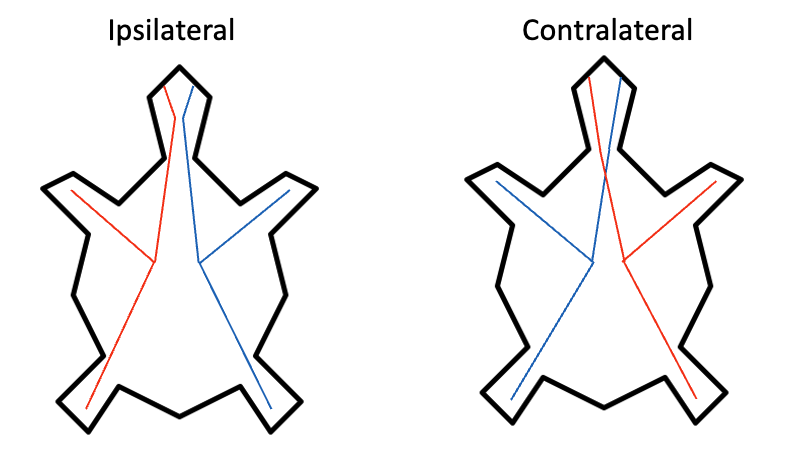

# Lab 1
In this lab, you will explore a simulation of simple agents called Braitenberg vehicles. 
In the simulation, you will imagine you are a scientist who has discovered a new organism.
We are calling the organism "Vehicle 2".
You are interested in trying to understand Vehicle 2's behavior.
Some vehicles (type 2A) are colored orange, and some (type 2B) are colored blue.
One thing we know: Vehicle 2 can sense heat sources and move in response to it. 
In the simulation, heat sources will appear as gold circles.
Your task is to observe, explore, and describe what vehicle 2A and 2B do.

## Part 0: Installing the Python and Downloading the Simulation (≈15 minutes)
To do this lab, you'll need to do three things.
1. First you will need to install Python 3.13 on your computer, 
following the instructions here: [Installing Python](https://github.com/jonwillits/python_for_bcs/blob/master/ebook/CH00/0.0.%20Installing%20Python.md).
2. Once you have successfully installed Python,
then download the program located here: [Braitenberg's Vehicles #2](https://github.com/jonwillits/intro_to_bcs/blob/master/mind_and_brain/vehicles.py).
You can run the program by double-clicking on the vehicles.py file.
You can also run the program by opening in your Terminal (Mac) or Command (Windows) app,
using the instructions here: [Running Python Programs](https://github.com/jonwillits/python_for_bcs/blob/master/ebook/CH00/0.1.%20Creating%20%26%20Running%20Python%20Programs.md)
3. Finally, make sure to download the lab report Microsoft Word document.
It is available here: [Lab 1 Report](https://github.com/jonwillits/intro_to_bcs/blob/master/mind_and_brain/vehicles_lab_report.docx)
This document is what you will turn in to the course website.

## Part 1: First Impressions  (≈5 minutes)

### Goal of Part 1
The purpose of this stage is to notice patterns and give them names. 
Later, we will step back and consider what might actually be happening under the hood.

### Instructions
1. Start the simulation and watch the vehicles for a few moments without doing anything. Notice how they move.
2. Reset and restart the simulation as often as you’d like. Try out different arrangements of the heat sources.

### What to Record
Write down your first impressions. 
For now, don’t worry about being technical or precise. 
Just describe the behaviors in everyday language.
Don’t be afraid to use “mentalistic” language like curious, afraid, aggressive — that’s part of the exercise!
How would you describe what the blue vehicles seem to be doing?

## Part 2: Systematic Compare and Contrast (≈15 minutes)

### Goal
Now that you’ve had a chance to freely explore, your task is to compare the two types of vehicles systematically. 
Instead of describing them in everyday language, focus on how their behaviors differ when you change the environment.

### Instructions
1. Run the simulation again, this time paying attention to differences between blue and orange vehicles.
2. You can move the heat sources by clicking on them and dragging them. 
Try dragging them into different positions to see what effect this has on the vehicles.
Place multiple sources in different corners.
Move sources gradually closer or farther. 
3. Reset and restart as often as needed. Keep experimenting until you feel you’ve seen enough patterns.
If you want, feel free to draw a picture of what you are observing. 

### What to Record
- What are the consistent differences you notice between blue and red vehicles?
- How does the distance to the heat source change the behavior?
- Do they respond the same way to a single source as they do to multiple sources?
- Which behaviors seem predictable and which seem surprising?

## Part 3: Reverse Engineering the Mind (≈15 minutes)

### Goal
Shift from describing behaviors to explaining them. 
You will now be given the wiring diagrams that control the vehicles. 
Your task is to connect what you observed in the simulation with how the wiring actually works.

### Instructions
Look at the wiring diagrams provided for the blue vehicles and the red vehicles. 
Each diagram shows how the vehicle's heat sensors are connected to its actuators.
Actuator is a fancy word for a part of an entity that helps it move, like feet or wheels.
Each vehicle has two sensors, one on the right and left sides of its head.
And each vehicle has actuators on the left and right sides of its body.

Investigation of the sensors and neural connections to the actuators shows that 
the more heat a sensor receives, the faster it makes the actuator move. 
But the two kinds of vehicles (blue and orange) differ in the ways the neurons connect the sensors to the actuators.

One vehicle has what is called "Ipsilateral" connectivity.
Ipsilateral is a Latin word you see in brain science meaning "same side" (ipsi = same, lateral = side).
This means that each of the vehicle's sensors are connected to the actuators on the same side of its body as the sensor.

The other vehicle has what is called "Contralateral" connectivity.
Contralateral means "opposite side" (contra = opposite, lateral = side).
This means that each of the vehicle's sensors are connected to the actuators on the opposite side of its body as the sensor.

Compare the wiring diagrams to the behaviors you observed in Part 2.

Work with your group to decide:
- Which wiring diagram matches the blue vehicle's behavior, and which matches the orange vehicle's behavior?
- Why does this particular wiring lead to the movements you saw?

### What to Record

- Which wiring diagram do you think goes with the blue vehicles? Which goes with the red vehicles?
- How does the wiring explain the way each type of vehicle moves around the heat sources?
- Why do such small differences in wiring lead to such different “psychological-looking” behaviors?

## Part 4: Philosophical Reflection (≈20 minutes)

### Goal
Step back from the wiring details.
Reflect on what these vehicles tell us about the relationship between brains, behavior, and how we explain them. 
You will connect your observations Marr’s levels of analysis, which we discussed in class and in our reading.

### Instructions
1. Think back to your first impressions in Part 1.
What kinds of words did you use to describe the vehicles’ behavior?
Did you use everyday mentalistic terms like “fear,” “curiosity,” or “aggression”?  
2. Compare those initial descriptions with what you learned about the wiring in Part 3.
How do the two explanations differ?  
3. Recall Marr’s three levels of analysis from this week’s readings: 
4. As a group, discuss how each level could be applied to explain the vehicles’ behavior.  
5. Reflect on whether the levels provide complementary or conflicting explanations.

### What to Record
- Which mentalistic descriptions came up in your group’s first impressions?  
- How did your explanations change after seeing the wiring diagrams?  
- Define Marr's three levels of analysis.
- How would you describe Vehicle 2’s behavior at each of Marr's levels?  
- Do the different levels of analysis seem to give complementary or contradictory explanations?  
- Which level(s) do you think are most useful for understanding these vehicles, and why?  

## Completing the Lab Assignment
- Make sure you answer all the questions in the document Lab1_Report.docx.
- Make sure you have added everyone's name on your lab report who worked on your lab.
- When you are done, submit the lab report document on the course website.
Remember, even though you worked in a group, each lab member must submit their own lab report.
