# 1. Mind and Brain

This module is about what a mind is, and how it relates to the brain and to the physical world. As you read, look for the beginnings of answers to these:

- What do we even mean by “mind,” and does the word mark off anything with a clear boundary?
- What kind of thing is a mind? Is it a special kind of stuff, is it nothing but the brain, or is it something else again?
- Could anything that is not a human brain, such as an animal, a machine, or an alien, have a mind, and what would have to be true of it?
- Can the mind be studied in its own terms, or only through the brain that carries it?
- What are the different levels at which a mind can be explained, and how does the question asked at each level differ?

By the end you should have a working answer to each, and a way of asking them that will come back in every module that follows.

## §1.1 — The Mind–Brain Relationship

If you ask a chatbot like ChatGPT a question, it will answer quickly and probably correctly. If you ask it many questions, it will seem to recall everything you told it earlier. If you challenge any of its answers, it may report, in fluent sentences, that it finds your response frustrating. Plainly a great deal is happening behind the screen. But is any of it *understanding*? Does the program want anything? Does it feel anything? Or is it an intricate mechanism arranging the right words in the right order, with no one home inside? You may have a firm intuition here. Consider, how you would go about proving it to someone who disagreed?

Now ask the same kind of question about yourself. Take a single moment of fear. You might be out hiking in the forest when suddenly you notice a large animal moving nearby in your peripheral vision. In that instant your heart pounds. Adrenaline pours into your blood. A small structure buried in the brain called the amygdala drives the whole cascade. That is one description of the moment. It is a completely physical description. There is a second description we can use. The fear *feels* like something. There is the lurch, the jolt, the urgent wish for it to stop. Both descriptions are about the very same instant. Are they two different accounts of one event? Or one event rendered in two languages? And would the experience be different, in principle, if the system doing the fearing were built from silicon instead of cells? Or if it were built from a brain organized very differently from your own?

These puzzles are old, but they are not solved or trivial. A lot is at stake based on how we answer them. In artificial intelligence, if a machine grows fluent, does it thereby have a mind? And if so, what kind? In ethics and law, we hold people responsible for what they do. Could we ever hold a machine responsible, and what would have to be true of it before that made any sense? In neuroscience, what should even count as a good *explanation* of a thought or a feeling? In psychology, can mental notions like belief and desire be translated into the language of biology? Or do they name something biology will never fully reach?

Two general questions sit underneath all of these, and this module is built around those questions. The first is, *what is the relationship between the mind and the brain?* The second is, *what would it take for something that is not a human brain (whether an animal, an alien, or a machine) to have a mind?* These are not two separate subjects. The second question is a version of the first, asked about a different kind of stuff. Whatever we conclude about how minds relate to brains will, at the same time, tell us what else besides a brain might have a mind.

It is worth pausing on why a course largely about how minds and brains *evolved* and how they *work* should open with questions this abstract. The rest of this book treats minds and brains as natural objects with histories. They are something that arose in living things, took different forms in different lineages, and can be studied piece by piece like any other product of biology. But that whole project takes something for granted. It assumes there *is* a mind there to have a history, and that a mind is the kind of thing the methods of science can reach. Both assumptions can be doubted, and thoughtful people have doubted them, in more than one way. If the mind were a non-physical soul, its story would not be a chapter of biology at all. But the doubts do not end with souls, and the ones this chapter dwells on longest are more modern. Even granting that the mind is fully physical, we can wonder whether our everyday mental words for things like belief, desire, and fear name anything real, or whether a mature brain science will find nothing there for them to pick out. And even granting that they do name something real, one can still ask whether the mind can be understood in its own terms at all, or whether any real understanding of it must run through the biological details of the brain beneath. Each of these doubts, taken seriously, changes what a science of the mind could be. So before we can ask how a mind evolved, how a brain produces one, or whether a machine could ever have one, we have to know what a mind is, and whether it sits within the reach of science. This chapter clears that ground. It is what makes “the evolution of the mind” a coherent subject rather than a figure of speech.

There is a second thing to flag before we begin. This chapter is philosophy more than it is science, and that is not an accident or an apology. Science answers questions by observation and experiment: you form a hypothesis, you test it against the world, and the world gives you information you use to judge the value of your hypothesis. But some questions have to be settled before that process can even start. What do we *mean* by “mind”? What would count as a physical explanation of one? Is the mind the sort of thing an experiment could detect at all? No measurement answers these, partly because they are questions about which measurements would count. This is the work of philosophy. It sharpens concepts and draws distinctions. And for questions that observation cannot now (or ever) settle, it evaluates whether a set of commitments hangs together. Far from being opposed to science, this work establishes the foundation that science is built on.

Because these questions are not settled by experiment, you will meet several competing answers in the pages ahead, and no one of them can simply be proven the way a claim in the lab can. That is easy to misread, so it is worth being careful. “Cannot be settled by experiment” does not mean there is no fact of the matter, or that any answer is as good as any other. It means the tools that decide the question are different ones. Philosophers and scientists reason toward these views, and between them, by asking which account is internally consistent, which fits best with everything else we know about the brain and the world, and which explains the most while assuming the least. Judged that way, the answers are not equal. As we will see, most contemporary brain and cognitive scientists have converged on one broad family of views, for reasons this chapter will lay out. But argument rarely compels the way a decisive experiment does. A coherent, well-supported position can almost always be resisted at some cost, by giving something up elsewhere. That is why thoughtful people still disagree, and why this stays a live conversation rather than a closed case.

People have been offering answers to these questions for as long as they have been asking them. The answers pile up into a bewildering heap: souls and spirits, brain states, patterns of behavior, flows of information. There are many named perspectives attempting to explain the mind–body relationship, such as dualism, materialism, idealism, and emergentism. But rather than march through different answers one at a time, we will try to do something more helpful. First we will pin down what we even mean by “mind.” Then we will ask a short sequence of questions about how the mind might relate to the brain, and show how the famous positions fall out of how one answers these questions.

### §1.1.1 — What We Mean by “Mind”

Before asking how the mind relates to the brain, we had better say what we mean by the word *mind*. Loose terms often lead to misunderstandings or debates that wouldn’t exist with clearer definitions. And few terms are looser than *mind*. In this book, we use **mind** to refer to the broad set of capacities a system has for taking in information about the world, holding onto it in some usable form, and putting it to work in guiding what the system does. Perceiving, recognizing, learning, remembering, reasoning, deciding, communicating: each is a way of turning information into something useful. Together, they are what we will mean by a mind. This is the same information-processing picture the previous module introduced, now serving as our working definition.

Stated that broadly, our definition of *mind* has blurry edges, and these edges are where interesting fights sometimes break out. Consider a motion sensor on a door. It takes in information that something moved, and acts on it, sliding a door open. Or consider a smart thermostat that senses the temperature, compares it against a goal, and switches the air conditioner on or off. Almost no one wants to grant that a thermostat has a mind. Yet it is doing, in miniature, the very thing our definition names. Consider a much more complex artificial entity. Large language models like ChatGPT, Claude, and Gemini produce strikingly fluent and apt responses. Many nonetheless insist they do not and cannot have minds. One common dismissal is that they are “only predicting the next word,” and therefore are not really thinking at all. Is that right? Does *how* a system processes information, or *how much* of it, decide whether the word *mind* applies? We will not settle these questions here. The point for now is that “mind” has no crisp boundary you can check a system against. Where the line falls is itself one of the field’s live debates, and it is the very problem the machine cases keep forcing us to think about. Our definition is a starting place, not a test.

One aspect of the mind sits apart from the rest, and it is worth setting aside for now. When we imagined that jolt of fear a moment ago, part of what we noted was that there is something it is *like* to feel afraid. That felt, qualitative character of an experience is what philosophers call **qualia**. Qualia are closely tied to **consciousness**, though the two are not simply the same thing . Consciousness is used broadly, covering everything from being awake and aware to knowing that one knows. Qualia name something narrower: the raw feel of an experience. Some philosophers treat qualia as the defining core of consciousness, while others keep the wider sense in view. We need not adjudicate between those views right now. What matters here is that this cluster of problems is hard and distinctive enough that a longer version of this course would give it a week to itself. Consciousness is a real part of the mind, or at least of the human mind. But it is only one part. And at least descriptively it can be pried away from the rest. A system might perceive, remember, and reason at a high level while it stays a separate question whether anything is *experienced* along the way. Some views resist that separation, holding that mind simply *is* consciousness. But this is a book about the mind in the broad sense, and consciousness is one subtopic within it rather than its center. Whatever one finally concludes about consciousness, the relationship between mind and the physical stays a rich and largely tractable question across the whole territory of mental life. So we flag consciousness here, and then mostly set it aside for now.

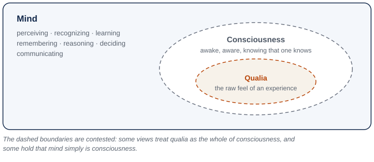{#fig-mind-consciousness-qualia alt="A large solid-edged panel labeled Mind lists perceiving, recognizing, learning, remembering, reasoning, deciding, and communicating. Inside it sits a dashed oval labeled Consciousness, described as awake, aware, and knowing that one knows. Inside that sits a smaller dashed oval labeled Qualia, described as the raw feel of an experience. A note records that the dashed boundaries are contested: some views treat qualia as the whole of consciousness, and some hold that mind simply is consciousness."}

With “mind” defined well enough to work with, we can take up the relationship we came for. Philosophers call it the **mind–body problem**: how does the mind relate to the physical stuff it seems to arise from? We will often put it even more neutrally, as the relation between mind and the *physical*, because part of what is in question is whether that physical stuff has to be a brain at all. We will build our understanding of it from a short sequence of questions, and the familiar named positions will fall out along the way as answers we can label, rather than as boxes we start from.

### §1.1.2 — What Kind of Thing Is a Mind?

Our first question is the most basic one there is: what kind of thing is a mind? This is a question about the mind’s **ontology**, or its basic nature. Three answers have serious defenders. The first is that mind is a distinct kind of thing in its own right, separate from physical stuff. The second is that mind is nothing but the physical stuff of the body, so that “mind” is only another word for what the brain is doing. And the third is that mind is a real property of physical stuff, as genuine as the stuff itself but not identical to any particular piece of it. We will take the three in turn.

One quick test sorts the first answer from the other two. Imagine two systems physically identical down to the last particle, in exactly the same state at the same instant. Must they have exactly the same mind, the same thoughts and the same feelings? If you think they could differ, that one could have a mind, or an experience, the other lacks, then you hold the first answer, that the mind is something over and above the physical. If you think the physical facts settle the mental ones, so that identical bodies must house identical minds, then you hold that the mind is physical, and your quarrel is only between the second answer and the third. Most scientists take the physical side; the general commitment that the physical fixes the mental is called **materialism**.

Start with the first answer, that the mind is a thing in its own right, separate from physical stuff. Its classic defense (though by no means the first) comes from 17th-century philosopher René Descartes. Descartes was wondering what he could actually be certain about. Perhaps some powerful deceiver was tricking him at every turn. Maybe all of his experiences were a dream, or a hallucination, or a fabrication. Resolving to doubt everything he possibly could, Descartes found that he could doubt that he even *had* a body, or that the world outside him even existed. The one thing he could not doubt was that he was *thinking*. The very act of doubting proved there was a mind doing the thinking. Descartes argued that the mind’s existence itself was a certainty, entirely separate from the body, which could be doubted away. This intuition is far older than Descartes, running back through the medieval philosopher Avicenna to Augustine to Plato’s eternal soul, and it carries deep religious roots. Descartes simply gave the argument its sharpest edge.

Now aim Descartes’ intuition at a machine. Picture a being physically identical to a person. Wired the same, behaving the same, flinching from pain, saying “that hurts,” and seeming to mean it as far as anyone could tell. But this being has no inner experience of any kind. No actual feeling of pain. No light on inside. Nobody home. The philosopher David Chalmers made this thought experiment famous and named its subject a **philosophical zombie**. Notice that what the zombie is missing is exactly the consciousness we set aside a moment ago. This is no accident: the independent view draws most of its force from felt experience. That we can apparently *imagine* such a being at all is what gives the view its grip. If the physical facts leave it open whether experience is present, then experience looks like something over and above the physical facts.

At the center of this answer to the mind–body problem sits the view called **substance dualism**, sometimes just called dualism. Dualism is the view that mind and body are two different kinds of substance, and the non-physical mind, though it interacts with the brain, cannot be reduced to it. Around dualism sit related views that also refuse to ground mind in the physical. **Idealism** is the odd cousin that keeps only the mental, and demotes the physical. Idealism holds that the physical world is in fact all an illusion in some entity’s mind (often God’s). **Panpsychism** is another view related to dualism that holds that qualia (experience) are basic features of all matter, present in some dim degree even in a rock or an electron. *Neutral monism* proposes that mind and matter are two arrangements of a more basic stuff that is itself neither.

This commitment about the nature of mind fixes what dualism says about machine minds. If having a mind requires a share of non-physical mind-stuff, then no feat of engineering can ever produce one, because engineering only arranges physical parts. This is the philosophical zombie from a moment ago, now turned on real hardware. However fluent or intelligent-seeming a computer is, it is an empty mechanism, saying all the right things with no one inside. Panpsychism is the family’s lone exception to this. If experience saturates all matter, then a chip has its faint share too, strange as that sounds, though it holds no more of it for being a computer than a stone does.

Why is this first answer, that mind and the physical world are distinct kinds of things, so tempting? And if it is so tempting, why do so few scientists hold it? Its appeal is real. It sidesteps the hardest puzzle of all, how mere matter could ever give rise to felt experience, by denying that matter has to. It honors the strong sense that consciousness is special and not just more chemistry. And it leaves room for the existence of an immaterial soul that might continue to exist independent of the body. What makes it problematic as a scientific view is twofold. First is the *interaction problem*: if the mind is genuinely non-physical, how does it affect the physical neurons that move your hand? Every answer seems to smuggle the mind back into the physical world it was meant to transcend. Second is untestability: a mind that leaves no physical trace is a mind no experiment can find. It is by its very nature outside of science. 

For all its intuitive pull, the first answer (mind is a separate kind of stuff from the physical) keeps few working scientists in its camp, for the reasons just given. The great majority hold that the mind is not a separate thing at all, but physical through and through. Yet that agreement hides a deep disagreement, because there are two very different ways to be a materialist about the mind. They are our second and third answers, and the difference between them shapes everything that follows.

### §1.1.3 — The Mind as Nothing but the Physical

The second popular answer to the mind–body problem is quite blunt: the mind just *is* the brain, and a separate mental vocabulary earns its keep only as a convenient shorthand, if at all. On this answer, mental talk adds nothing that a physical vocabulary could not, in principle, replace. 

The starkest historical form was **radical behaviorism**. John Watson and B. F. Skinner urged psychology to study only what could be observed, namely behavior, and to banish talk of inner mental states as unscientific ghost-chasing. For a time (roughly from 1920-1960) behaviorism dominated. What broke it was its inability to account for the very things minds most obviously do: understand and produce language, reason, remember, and plan. The cognitive revolution of the 1960s and 1970s reopened the door to a science of inner mental processes.

Another variant of this answer is **identity theory**. Identity theory grants that mental states are perfectly real, but insists each one simply *is* a physical brain state. Its slogan is that “pain is the firing of C-fibers.” C-fibers are a particular kind of nerve fiber, the ones that carry the slow, dull, aching kind of pain from the body toward the brain. The claim is not just that this firing causes pain, or reliably comes with it, but that the pain *is* that firing. One event, two names. The model is the earlier discovery that heat is the motion of molecules, not caused by it or merely correlated with it, but the very same thing. Identity theory bets that every mental state will turn out this way, each one revealed to be some specific state of the nervous system. But pinning a mental state to one specific physical state carries a cost. If pain simply is the firing of C-fibers, then anything lacking C-fibers, an octopus, an alien, or a silicon computer, could not be in pain no matter how it behaved. Philosophers call this the **chauvinism problem**. Escaping it will be one of the attractions of the third answer.

The boldest version of the second answer goes further still. **Eliminative materialism** agrees that the mind is physical, but adds that our everyday way of talking about it is not merely incomplete, it is mistaken. We typically explain someone’s behavior by saying she opened the fridge because she *wanted* a snack and *believed* there was food inside. When we do this, we are leaning on everyday language about beliefs, desires, hopes, and fears. The argument from eliminative materialism is that these words are actually unscientific and misleading. Philosophers refer to these kinds of words and the explanations behind them as **folk psychology**. The eliminativist’s claim is that a mature brain science will no more find beliefs and desires inside the head than modern medicine found the four humors it once blamed for disease. Concepts like those were not refined and kept; they were dropped, because there was nothing there for them to name. Folk psychology, the eliminativist says, is headed for the same fate. It will not be tidied up and matched to brain states, but replaced outright. The best-known defenders of eliminative materialism are the philosophers Patricia Churchland and Paul Churchland.

The reductive family’s strengths are genuine. It fits neuroscience’s methods hand in glove. It is parsimonious, and posits no vague mental extras. But its troubles are equally real. There is the chauvinism problem noted above, which implies that any difference in brain structure would make for a different mental state. There is eliminativism’s air of self-refutation, since to assert “there are no beliefs” is to express one. There is the stubborn fact of felt experience, the “what it is like” that a list of brain states seems to leave out. And there is the working practice of psychology itself, which explains and predicts behavior well in terms of memory, attention, and emotion. On the “do machines have minds” question, identity theory says no by way of chauvinism. Eliminativism does something stranger: it eliminates the question rather than answering it. If there are no folk “minds” for *us* to have either, then asking whether a machine has one is as confused as asking it about a person.

Stepping back, these versions of the second answer echo two things that can happen to a higher-level idea in the history of science. It can be discarded as naming nothing, the way the four humors were, which is the eliminativist’s bet about folk psychology. Or it can be kept but shown to be identical to something lower down, the way heat is equated with molecular motion. This is the identity theorist’s view. But a higher-level idea can meet a third fate, unlike either of the first two . In this case it is grounded in a deeper theory without being replaced by or equated with it. Most brain and cognitive scientists think the mind fits this pattern best. That third pattern we explain next.

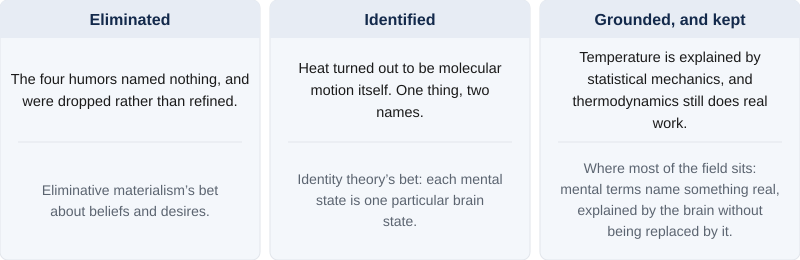{#fig-three-fates alt="Three panels side by side, each with a historical case above a dividing line and a claim about mental vocabulary below it. Eliminated: the four humors named nothing and were dropped rather than refined, which is eliminative materialism's bet about beliefs and desires. Identified: heat turned out to be molecular motion itself, one thing under two names, which is identity theory's bet that each mental state is one particular brain state. Grounded, and kept: temperature is explained by statistical mechanics and thermodynamics still does real work, which is where most of the field sits, with mental terms naming something real, explained by the brain without being replaced by it."}

### §1.1.4 — The Mind as a Real Property of the Physical

The third answer is the one most working brain and cognitive scientists hold. Contrary to the eliminativist, it says our mental terms refer to something real. But the mind is neither a thing in its own right (as a dualist would say), nor a redundant name for the brain (as an identity theorist would say). The dualist’s deepest mistake, on this view, is a kind of category error. The dualist asks what kind of *thing* the mind is, and reaches for a special, non-physical kind, when the mind is *not a thing at all*. It is a *property* of the physical stuff we already have, not a further item standing beside it. Compare mass. Mass is not an object tucked inside a rock; it is something the rock *has*, a property of physical matter. Temperature is another such property, being alive is a third. In Aristotle’s older language, mind is the *form* a lump of matter takes when it is organized a certain way. The mind, this answer says, is a property of just that kind. It is a property a physical system has when its parts are organized and active in the right way. Mind is as real as the matter itself, but it is not a separate ingredient added to it.

Under this view, temperature repays a closer look, because it also marks the borders this answer shares with its neighbors. We earlier noted that physicists came to say that heat *is* the motion of molecules. But even knowing this, thermodynamics, the science of heat, temperature, and pressure, still does real work above and beyond theories of molecular motion. Its laws tell an engineer how an engine or a refrigerator must behave. A deeper theory, statistical mechanics, later explained where those laws come from, by treating heat and pressure as the combined motion of countless molecules. Yet no one throws temperature away to track molecules one by one. It is grounded in molecular motion without being *replaced* by it, and without being *identical* to any one arrangement of it, since countless different arrangements count as the same temperature. That is the line between this answer and identity theory, which instead equates a mental state with one specific physical state. A different line separates it from panpsychism: this property surfaces only where matter is organized and active in the right way, as life does. It is not, as the panpsychist supposes, a basic ingredient present in every scrap of matter. A rock has a mass and a temperature but no mind, because it is not arranged to have one. On the third answer, a mind is what suitably organized matter has and does: a real, higher-level property, not a ghost added to it.

Let us zoom back out and contrast how scientists tend to evaluate the third view compared with the other two. Why not the first answer? Because materialism keeps explaining things. There has never been a scientifically successful account of how a mind, or anything else, could exist apart from a physical instantiation. And we understand the mind better every time we learn more about the brain. The second answer is therefore half right. It is right that the mind is physical and that the brain carries real explanatory weight. Its error, as the next step argues, is the further leap that mental-level explanation can then be thrown away.

Why not stop at reduction to the brain? Because psychological explanations *work*, and they add something a neuron-by-neuron story does not. You cannot in practice predict or explain a person’s decisions in terms of movement of molecules or atoms. The calculation is hopeless, and the higher-level account is how the science actually gets done. Most sciences, moreover, reduce without eliminating, as thermodynamics and the gene remind us. And there is a deeper reason many cognitive scientists take seriously, one that deserves its own name.

That reason is **multiple realizability**, the idea that one and the same mental state can be realized in different physical materials, just as one temperature is realized by countless different arrangements of molecules . The idea has an intuitive starting point. When you and a friend both feel hunger, both grow angry, both recognize an apple, or both believe that the Earth goes around the Sun, we find a lot of value in saying the two of you are in the same mental state. Yet no two brains are wired exactly alike, and it is very unlikely that the state is realized in precisely the same physical pattern in both of you, which is just what a strict identity theory would need. If the mental state is shared while the physical detail is not, that state cannot be identical to the detail. The point only sharpens as the systems grow more different. Pain in a person, pain in an octopus, pain in some hypothetical alien, perhaps pain in a machine, may be functionally equivalent while implemented in vastly different ways or even materials. If that is right, then no single physical state, no particular firing of C-fibers, can *be* pain, if pain turns up in systems that have no C-fibers at all. Multiple realizability is what defeats the identity theorist’s chauvinism. It is also what turns “could a non-brain have a mind?” from a confusion into a real scientific question. It ties the mind–body question to the machine question, which is why it deserves more than a passing mention. It is not beyond dispute. And we will see the multiple realizability perspective challenged later, especially with regard to machines. But its plausibility carries much of the weight behind this view. Multiple realizability, then, lets the mind be a real, physical property without chaining it to one kind of matter. 

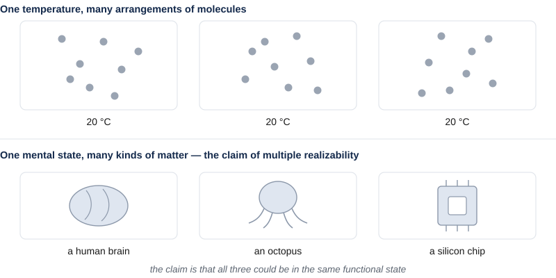{#fig-multiple-realizability alt="Two rows of three panels. The top row, labeled one temperature and many arrangements of molecules, shows three panels of scattered dots in visibly different arrangements, each labeled 20 degrees Celsius. The bottom row, labeled one mental state and many kinds of matter, shows simple silhouettes of a human brain, an octopus, and a silicon chip. A note beneath records that the claim is that all three could be in the same functional state."}

Our third main kind of answer to the mind–body problem is **mind as a real property of the physical**: mind is a property of physical matter arranged in a certain way or doing certain things. It is shared by a family of more specific views, which differ in how they spell it out. **Emergentism** holds that mental properties genuinely arise from physical organization the way wetness arises from many H₂O molecules even though no single molecule is wet. **Functionalism** defines a mental state by the causal role it plays, by what brings it about and what it brings about in turn, rather than by what it is made of. A calculator’s “add” operation is whatever plays the adding role, on a phone or a laptop alike. And by the same logic a mental state is whatever plays its role, in a brain or perhaps elsewhere. This is the position that opens the door to machine minds. If a mental state simply *is* a functional role, then anything that fills the role has the state, brain or no brain. It is, more or less, the working assumption of most people involved in artificial intelligence. In its sharpest contemporary form, this family treats a mental state as a real *pattern of causal organization*, something a physical system genuinely has, discoverable by experiment yet reducible to no single neuron, so that a mind is real the way an organization is real rather than the way an object is. A third perspective, *Embodied or Enactive Cognition*, enters as a pointed caveat. Perhaps thinking is not only something the brain does, but something a *whole body* does in an environment. If this is true, it is the sharpest check on a naive functionalism that expects a disembodied program to suffice for mind. A fourth perspective, the **levels of analysis** approach, we hold back for the whole of §1.2, since it is the framework the rest of the course runs on.

What does this view say about machines? It is the home of “yes, in principle” . Functionalism and the levels approach make a machine mind conceptually possible without claiming that any machine yet built actually has one. Two thinkers who agree the mind is a real physical property can still part ways on machines, because a further question stays open: does a mind’s physical basis have to be *biological*? For the cognitive capacities, most are willing to say a machine could in principle have them. It is usually over *consciousness*, the part we set aside, where many philosophers and scientists are most likely to believe that biological matter is necessary. One can hold the mind fully physical and still suspect that living matter has features, in how it organizes and maintains itself, that a simulation would copy without reproducing. The neuroscientist Anil Seth argues in this spirit; it is a bet about substrate, not a lapse back into dualism. The course returns to weigh all of this in Module 2. Here we set the question up; we do not answer it.

: Eight named positions, set beside one another. The machine column is the one to read across: what each position says about minds and brains fixes what it can say about anything else that might have a mind. {#tbl-positions}

| Position | What a mind is made of | Do mental terms name anything real? | Could a machine have a mind? | Its main problem |
|---|---|---|---|---|
| Substance dualism | A non-physical substance, interacting with the body | Yes | No — engineering only arranges matter | How anything non-physical could move a neuron, and what experiment could ever find it |
| Idealism | Only the mental; the physical is an appearance within a mind | Yes | No | Why the physical world is so orderly, and so reliably shared |
| Panpsychism | Ordinary matter, with experience basic to all of it | Yes | Faintly — but no more than a stone does | Why organized matter has one unified mind rather than a dust of tiny ones |
| Radical behaviorism | The body; only behavior is fit to study | No — set aside as unscientific | The question is not asked | Cannot account for language, reasoning, memory, or planning |
| Identity theory | Brain states, one for each mental state | Yes | No — no C-fibers, no pain | Chauvinism: it rules out any differently built system |
| Eliminative materialism | Brain states; folk psychology names nothing | No | The question dissolves rather than gets an answer | Asserting that there are no beliefs is itself expressing one |
| Emergentism | Physical matter, organized; mind is a property it has | Yes | Yes, in principle | Saying precisely what emergence amounts to |
| Functionalism | Whatever fills the causal role, of any material | Yes | Yes — the role is what matters, not the stuff | Leaves out felt experience, and perhaps the body |

### §1.1.5 — How Freely Can We Study the Mind?

Settling that the mind is a real property of the physical still leaves one more question, which is as contentious today as any in the field. How freely can we study the mind in its own terms? Grant that a mental state is a real property of some physical system. Must a good theory of it keep the physical details in view, or can it abstract them away and work at the mental level alone? Philosophers call this the mind’s **explanatory separability**. It is a question about method, not about what the mind is made of.

At one pole sits strong autonomy. Psychology, on this view, is a science in its own right, standing to neuroscience roughly as chemistry stands to physics: grounded in it, but not replaceable by it. You can describe the procedure a mind runs without much caring what it runs on, exactly as you can describe a chess program without describing transistors, or for that matter describe chemical reactions without describing the micro-details of the underlying protons, neutrons, and electrons. This is the liberal functionalist’s confidence, and it is one wing of the third answer. At the other pole sits a more cautious view. The mind is real and physical, but the details of *how* it is realized shape what it can be. A theory that abstracts away from the body and the brain will miss something, quite possibly something important or critical. Embodied cognition pulls this way, and so does the view that mental kinds are realization-sensitive. Two systems that seem to behave alike when we view them from a zoomed out or abstract perspective may not actually share a mental state unless they are organized alike underneath. And those differences in implementation will be noticeable at the functional level if we look closely enough. On this view the levels of a mind are separable but not independent. You can ask about each on its own, yet the answers constrain one another.

Neither pole is obviously right, and the disagreement is not without consequences. It decides how far a science of the mind can float free of a science of the brain. To make progress on it we need a way to lay the levels of a mind side by side, so that we can see which questions belong to which and how far each constrains the others.

### §1.1.6 — Where the Field Sits

Step back, and the section has been a short sequence of questions. Before anything else we fixed what “mind” means, and set consciousness aside as a subtopic of its own. Then we asked what kind of thing a mind is, and found three serious answers: a distinct kind of thing (dualism, idealism), nothing but the physical (behaviorism, identity theory, eliminative materialism), or a real property of the physical (emergentism and functionalism, including the view of a mind as a real pattern of causal organization). Most people in the field tend to endorse a perspective in the third category. Then we asked how freely such a mind can be studied in its own terms, and found the field genuinely split, from strong autonomy at one end to realization-sensitivity at the other . The famous positions are not boxes we sorted the world into. They are just names for the different ways of answering these and related questions.

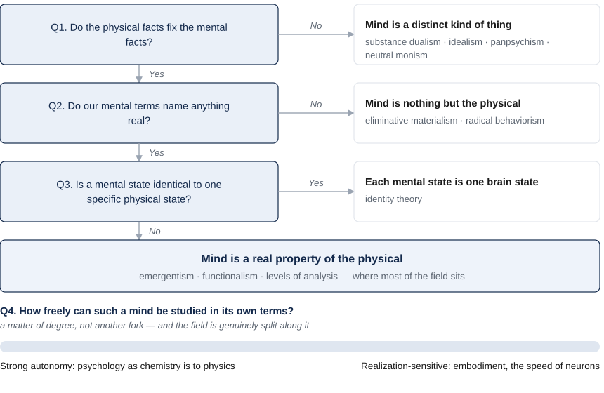{#fig-position-tree alt="A chain of four questions down the left, each with the position family that answering it one way produces. Q1, do the physical facts fix the mental facts? Answering no gives mind as a distinct kind of thing: substance dualism, idealism, panpsychism, neutral monism. Answering yes leads to Q2, do our mental terms name anything real? Answering no gives mind as nothing but the physical: eliminative materialism and radical behaviorism. Answering yes leads to Q3, is a mental state identical to one specific physical state? Answering yes gives identity theory, on which each mental state is one brain state. Answering no arrives at mind as a real property of the physical — emergentism, functionalism, levels of analysis — where most of the field sits. Beneath the chain, Q4 asks how freely such a mind can be studied in its own terms, and is drawn as a bar rather than a fork, running from strong autonomy at one end to realization-sensitivity at the other."}

So this is where most contemporary brain and cognitive science sits. The mind is a real property of the physical, dependent on it and yet demanding explanation in its own terms, with the exact degree of that independence still under active debate. That is a good description, but so far it is still quite vague. “Study the mind at its own level” has a satisfying ring, yet we have not said what those levels are or how they relate to the brain beneath them. In §1.2 we turn this into a concrete, working framework, Marr’s levels of analysis, which gives us a way to lay a mind’s levels side by side and see how each constrains the others. This is the structure the rest of the course is built on.

## §1.2 — Levels of Analysis

### §1.2.1 — One System, Many Kinds of Explanation

We ended the last section by stating that, to most brain and cognitive scientists, the mind is a real property of physical systems. It is an entity that can be studied, at least in part, in its own terms. But it is also answerable to the brain beneath it. That has a satisfying ring. But it stays empty until we say what “its own terms” are, and how those terms relate to one another. Before we reach for the mind, it helps to see the same layered situation in something simpler and fully physical, where nothing about souls or consciousness can cloud the view.

Take the heart. Suppose you want to understand it. One good explanation describes what it is made of and how the parts move. The heart is muscle fibers contracting in sequence, valves opening and closing, and the electrical pulses that set the rhythm. That is a real kind of explanation, of the kind that a physiologist can give in exquisite detail. But notice that it leaves a different question untouched. What is the heart *for*? The answer, that it pumps blood to carry oxygen and nutrients through the body, is not a fact about muscle tissue at all. It is a fact about a *problem the heart solves*. And there is a third question sitting between the other two. *How*, by what strategy, does it solve that problem? Pushing fluid one way through a system of one-way valves is a strategy, and you could describe it without naming a single protein, or even knowing the pump was built from biological tissue rather than metal.

We have identified three questions, then, about one object: 1) what problem is being solved, 2) by what strategy, and 3) in what physical stuff . These are not competing questions with mutually exclusive answers. The molecular story does not make the “what for” false, and knowing the job does not tell you the tissue. Each is a real question with its own answer, and you have not fully understood the heart until you can answer all three. This is the heart (so to speak) of the multiple levels of analysis perspective, so it is worth stating plainly: a single system can demand several *different kinds* of explanation at once, and they complete one another rather than compete with each other.

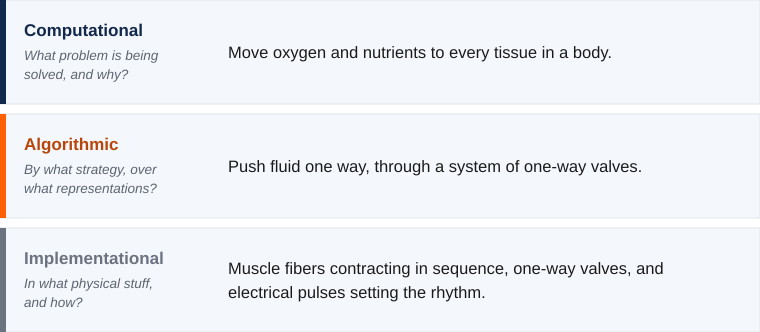{#fig-heart-three-levels alt="Titled The Heart at Three Levels. Three stacked bands, each with a colored rule down its left edge and the question it asks beneath its name. The first, dark blue, is Computational: what problem is being solved, and why? Its answer is to move oxygen and nutrients to every tissue in a body. The second, orange, is Algorithmic: by what strategy? Its answer is to push fluid one way through a system of one-way valves. The third, slate gray, is Implementational: in what physical stuff, and how? Its answer is muscle fibers contracting in sequence, one-way valves, and electrical pulses setting the rhythm."}

There is a reflex worth resisting here, because it returns throughout the course. It says: surely the physical story is the real explanation, and the talk of “problems” and “strategies” is loose shorthand we will drop once we understand the tissue. We met the reasons against this in §1.1, when we saw why the mind is not thrown out in favor of the brain. The same reasons apply one level up, to explanation itself. A complete account of the muscle, every fiber and every firing mapped, would still leave two questions open. It would not tell you what the heart is for, that it solves the problem of moving oxygen through a body. And it would not tell you how it does the job, that its strategy is to push blood one way through a system of one-way valves. Those are further, real facts about the system, and no amount of detail about the tissue will hand them to you. The same holds when we turn from hearts to minds. A complete wiring diagram of the brain, every neuron and every connection, would still not tell you what problem a given circuit is solving, say, recognizing a face, or how it solves it, by what series of steps it turns a wash of light into a name. A map of the stuff is not yet an account of the problem or the method.

This insight, that one system supports several complementary kinds of explanation, is old, and it has been carved up in more than one way. Aristotle held that fully explaining a thing takes answers to four different questions about it: what it is made of, how its parts are arranged, what brought it into being, and what it is for. The philosopher Daniel Dennett describes three “stances” one can take toward a system, treating it as mere physics, as a piece of design, or as an agent with goals. A long tradition in the philosophy of biology explains a phenomenon by laying out the mechanism that produces it: its parts, their operations, and their organization. These frameworks overlap and mostly agree. This course adopts a different one, a system of three levels of analysis proposed by the vision scientist David Marr. We adopt it not because it is uniquely correct but because its three levels line up cleanly with how brain and cognitive science already divides into disciplines, and with the evolutionary spine of the course. Building that alignment is the work of the rest of this chapter. We turn to Marr’s three levels now.

### §1.2.2 — Marr’s Three Levels

David Marr’s framework was born from a complaint. Marr studied vision in the 1970s, at a time when neuroscience was learning an enormous amount about individual visual neurons: which ones fired, when, and in response to what. And yet, Marr felt, the field was not much closer to understanding how *seeing* works. Piling up facts about neurons, he argued, was like trying to understand the flight of a bird by studying only its feathers. You could catalog every barb and filament and still have no idea why birds can fly. Something essential was being missed, and no amount of the same kind of detail would supply it.

What was missing, Marr proposed, is that fully understanding any information-processing system takes answers to three different kinds of question, at three levels. Marr’s contribution was to name them, sharpen them, and insist that all three are needed.

The first is the **computational level**. It asks what problem the system solves, and what anything solving that problem must respect. Notice that this is not a question about the machinery. It is a question about the task itself, considered on its own. Take basic addition. The computational description of addition says what the operation has to do: combine quantities into a total, in a way that does not depend on the order the parts arrive (three apples and then two is the same as two and then three), and where adding nothing leaves the total unchanged. These are facts about addition, true no matter who or what is doing the adding. If described this way, you have specified what addition is at the computational level, without yet saying anything about how the sum actually gets computed.

The second is the **algorithmic level**. It asks *how* the system solves the problem: by what procedure, working over what representations. Here the choices multiply, because one and the same computation can be carried out in many ways. To add, you might line the numbers up as decimal digits and work column by column, carrying as you go, the way many learn to do so in school. You might instead represent the numbers in binary, as a computer does, and follow a different procedure that reaches the very same totals. You might slide beads on an abacus, count on your fingers, or manipulate Roman numerals by rules that look nothing like the digit-column method. Each of these is a distinct algorithm, and all of them compute addition. The algorithmic level is where we say which one a given system actually uses.

The third is the **implementational level**. It asks what physical stuff carries out the algorithm, and how. The column-by-column method can be run by a child with a pencil, by the gears of a mechanical adding machine, or by the circuits of an electronic calculator. Same problem, same algorithm, entirely different matter. The implementational level describes that actual substrate: neurons and their firing, silicon and its voltages, brass gears and their teeth.

The three levels are genuinely distinct, and it is worth seeing *why*, because the reason is structural rather than a matter of taste. The relations between the levels are many-to-one, in both directions . A single computational problem, such as addition, can be solved by many different algorithms. And a single algorithm can be implemented in many different physical materials. So fixing one level leaves the others open. Knowing the problem does not tell you the procedure, and knowing the procedure does not tell you the hardware. That is exactly why an answer at one level cannot stand in for an answer at another. The three are not three descriptions of a single fact. They are answers to three different questions, and a full understanding needs all three.

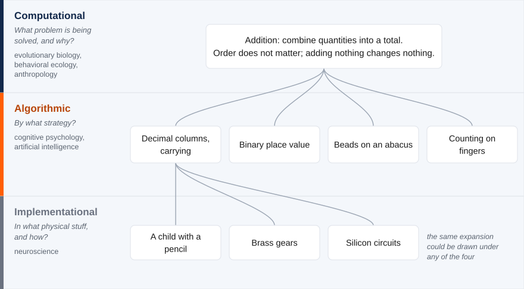{#fig-marr-branching alt="A tree spread across three horizontal bands, each band carrying a colored rule at its left edge, the level's name, the question it asks, and the disciplines that work there. In the top band, Computational, a single box states the problem: addition combines quantities into a total, order does not matter, and adding nothing changes nothing. Curved lines run from that box down to four boxes in the middle band, Algorithmic: decimal columns with carrying, binary place value, beads on an abacus, and counting on fingers. From the decimal-columns box alone, three further lines run down to the bottom band, Implementational: a child with a pencil, brass gears, and silicon circuits. A note beside them says the same expansion could be drawn under any of the four."}

Marr added a further, stronger, and more controversial claim, which we will mention now and examine later. He held that the levels are not merely distinct but *ordered*, with the computational level coming first. You cannot understand how a system works, he argued, until you know what problem it is solving. This means analysis should run from the top down. This top-down priority is central to Marr’s own view, and it is the natural reading of his complaint that studying feathers and muscles doesn’t add up to understanding flight. But it is a claim, not an obvious truth. It has been challenged, and we will discuss that challenge in §1.2.5. For now we have what we came for. We have three distinct levels, each answering a question the others cannot. The next step is to see why these particular three levels make a good backbone for this course.

### §1.2.3 — The Course Backbone: Levels, Disciplines, and the Evolution of the Human Mind

We now have three distinct levels. What turns them from a piece of philosophy into the backbone of this course? You may have already noticed that the three levels line up with the way brain and cognitive science already divides itself into fields. That alignment is what lets a framework guide our curriculum.

Look at how the questions sort out. The computational question, *what problem is being solved, and why*, is the home turf of the disciplines that study why organisms are built the way they are. Evolutionary biology, behavioral ecology, anthropology, and parts of psychology ask what a capacity is for. The algorithmic question, *by what procedure, over what representations*, is the province of cognitive psychology and of artificial intelligence. These fields both describe the steps a mind runs abstracted away from the physical materials they are built from. The implementational question, *in what physical stuff, and how*, belongs to neuroscience. So we have levels corresponding to three broad families of academic disciplines, each asking a different one of Marr’s questions about the same object. This is not a coincidence. The fields grew up around different questions in the first place. This is why they so often talk past one another, and why laying the levels side by side lets their findings be *combined* rather than *ranked*.

One of these alignments between levels and academic disciplines needs more than a label, because it is what gives this course its particular shape. Return to the computational level, the question of what problem a system solves and *why*. For a human-made object, the “why” is easy. The why is explainable in terms of the purpose of its creator or designer. Ask why a calculator does addition and the answer is that its makers wanted a tool for doing arithmetic. But a heart has no designer. Neither does an eye, or a memory system, or the circuit that recognizes a face. So what grounds the “why” for a living thing? The primary answer for most organisms is *natural selection*. For a biological system, the computational question usually becomes a question about ancestry and survival. What problem did this organism’s ancestors face, such that solving it helped them survive and reproduce, and pass on whatever machinery did the solving? The “why” of a biological trait is an **adaptive why**. This is the module’s evolutionary perspective, and it makes evolution the spine of the whole course rather than one week’s topic. Again and again in this course, asking at the computational level what a mental capacity is *for* will mean asking what problem it solved when it evolved.

A word of caution comes with this approach. An adaptive why is a hypothesis to be tested, not a story to be assumed. Not every trait is an adaptation shaped for a purpose. Some are byproducts of other traits, some are the residue of chance, some are accidents of history that stuck around. The computational level *asks* about the adaptive problem a capacity solves. It does not license inventing a flattering tale about a trait or property. Being open-minded about adaptive hypotheses, and demanding evidence for them, is critical.

There is a further reason to be careful about adaptive stories, and for our own species it is the largest of all: culture. Many of the problems a modern human mind solves were set neither by a designer nor directly by natural selection. Reading, symbolic arithmetic, handling money, driving a car: natural selection has not had nearly enough time to adapt the human species to solve these problems. And yet, they are among the most demanding things we do. Their *what for* bottoms out in a goal set by a human practice and handed down socially, not in ancestral survival and reproduction. Culture completes a triad of sources for a computational goal, one to match each kind of system we have discussed: a designer’s intent for an artifact, natural selection for a biological trait, and a cultural practice for learned human skills .

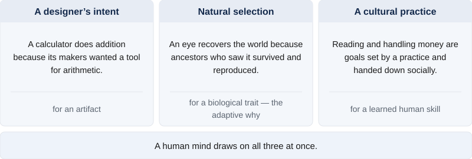{#fig-three-whys alt="Three panels side by side. A designer's intent, for an artifact: a calculator does addition because its makers wanted a tool for arithmetic. Natural selection, for a biological trait and the adaptive why: an eye recovers the world because ancestors who saw it survived and reproduced. A cultural practice, for a learned human skill: reading and handling money are goals set by a practice and handed down socially. A band beneath all three reads, a human mind draws on all three at once."}

Culture is a critical source for the human mind’s computational goals, but it does not float free of biology. The very *capacity* to acquire knowledge through culture, our unusual flexibility in learning, our language, our habit of teaching one another, these abilities are themselves among our strongest biological adaptations. This means cultural goals rest on an evolved foundation rather than replacing it. And cultural skills tend to recycle machinery that evolved for something else. Reading is only a few thousand years old, far too recent for a dedicated brain system. But the ability to read makes heavy use of circuitry that evolved for recognizing objects. Similarly, symbolic arithmetic is a cultural practice that is built atop an approximate sense of number that we share with other animals. One word deserves care in all this, because it names two different things. We say a biological trait is *adapted* across generations, by selection acting on a lineage. And we say a skill is *adapted* within a single lifetime, by a person learning and practicing. Both shape what a mind computes, on entirely different timescales and by entirely different means, and telling them apart is one of the difficult tasks of the field of brain and cognitive science .

: One word, two processes. Both leave a mind better matched to a problem, and almost nothing else about them is the same. {#tbl-two-senses-adapted}

| | Adapted across generations | Adapted within a lifetime |
|---|---|---|
| Timescale | Many generations | Seconds to years — one telling can be enough |
| Mechanism | Natural selection acting on a lineage | Learning and practice in one individual |
| What changes | The inherited machinery a species is built with | One individual’s skills and knowledge |
| What is passed on | Genes | Nothing biologically — culture may carry it socially |
| Example | An eye shaped over evolutionary time to recover the world from light | Reading, or doing arithmetic on paper |

One more relationship between the three levels and the themes of our course deserves to be mentioned. The algorithmic level is where minds and machines become comparable in a disciplined way. Because an algorithm abstracts away from the stuff that runs it, the *same* procedure can in principle run on neurons or on silicon. That is exactly what makes a comparison between a brain and a machine a scientific claim rather than a loose metaphor. The algorithmic level is about comparing procedures, not materials. This is the connection to the multiple realizability issue we discussed in §1.1. It is also why artificial intelligence research tends to sit at the algorithmic level in Marr’s framework. And it is why the question of machine minds, which §1.1 posed and left open, will keep returning as a question about shared algorithms.

Because Marr’s levels map onto disciplines this cleanly, they give the course its structure. Most weeks ahead take up one capacity: perception, memory, decision-making, and examine it at all three levels in turn. What problem did it evolve to solve, what algorithms and representations carry out the solution, and what neural machinery implements it. You will see the same three-part scaffold return again and again, with the discipline labels attached, until the habit of asking “which level is this explanation working at?” becomes second nature. To see the scaffold in action before it becomes routine, in the next section we will examine a single capacity at all three levels.

### §1.2.4 — Vision at All Three Levels

The best way to understand the framework, and to see its value, is to watch it work on a real case. We will use vision as our demonstration, since it was Marr’s own example. It is also a capacity we understand unusually well at all three levels, so the framework can be shown working rather than merely asserted.

Begin at the computational level, which asks what problem vision solves. The obvious answer is that vision uses the information in light to sense the objects and events around us, so that we can respond to them appropriately. That answer is not wrong, but it hides a real difficulty, one that appears only when we look closely at what the eye actually has to work with.

What actually reaches the eye is far less than the world itself. At the back of the eye sits the retina. The retina is a thin sheet of light-sensitive cells. Light bouncing off the things around an organism passes through the lens, and is focused onto the retina, much as a camera focuses an image onto its sensor. What the retina registers is simply how much light, and of what color, falls on each point across its surface.  That surface has only two dimensions: up-and-down and side-to-side, with no depth of its own. This means the raw input to vision is in effect a flat picture, a two-dimensional array of light.

Yet a flat picture is not what the animal needs. What it presumably needs to know about is the three-dimensional world that produced the image.  What surfaces are present and where are they? What objects are present? What is food, and what is a predator? One conceptualization of vision’s task, then, is to recover that solid world from the flat pattern of light.

But the big problem with recovering the 3D world from a 2D image is that, for a given 2D image, there are an infinite number of different 3D scenes that could have generated that image. So the 2D image doesn’t tell you all you need to know about what is actually out there. Different 3D scenes, from different distances and under different lighting conditions, could cast the very same pattern of light on the retina. Recovering one three-dimensional world from that image is what is called an *ill-posed problem*. The data alone cannot precisely specify which scene generated the image .

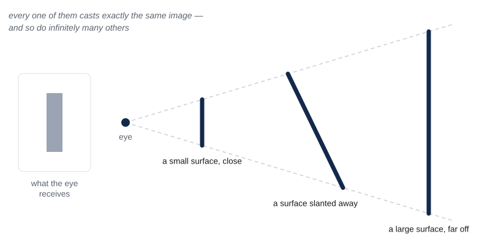{#fig-ill-posed alt="At the left, a small panel shows the flat image the eye receives: a plain vertical bar. To its right, a dot marked eye sends two dashed rays out and apart. Three dark surfaces are drawn across the rays with their ends exactly on them: a short one close to the eye, a longer one slanted away in the middle distance, and a tall one far off. A note says every one of them casts exactly the same image, and so do infinitely many others."}

How does the visual system solve this ill-posed problem? The visual system is able to determine what 3D world most likely generated the image by making assumptions about how the world usually is. These include assumptions such as that light tends to come from above, and that surfaces tend to be continuous. These assumptions help the mind single out the most likely scene from the endless candidates. Discovering that the visual system makes these assumptions would be very difficult, if not impossible, if we were just studying the visual system’s neurons without also thinking about the nature of the problem that it needs to solve.

::: {.if-figure fig="light-from-above"}
One of those assumptions can be caught in the act . Every disc in the grid is shaded identically. The only difference among them is that the middle row has been turned upside down. Yet one set reads as raised bumps and the other as hollow dimples. Turn the page around, and the two sets exchange appearances. Nothing about the ink changed, so the bumps and the dimples were never on the page at all. They were supplied by a visual system that assumes light comes from above, working away whether or not anyone asks it to.
:::

::: {.no-figure fig="light-from-above"}
One of those assumptions can be caught in the act. Photograph a dented sheet of metal, then turn the photograph upside down. The dents become bumps. Nothing about the ink changed, so the bumps and the dents were never on the page at all. They were supplied by a visual system that assumes light comes from above, working away whether or not anyone asks it to.
:::

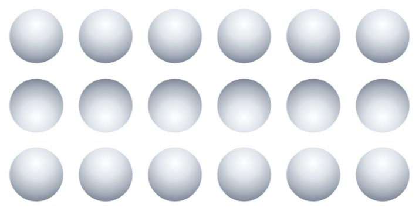{#fig-light-from-above alt="A grid of eighteen gray discs, six across and three down, each shaded lighter at one edge and darker at the opposite edge. The twelve discs in the top and bottom rows are shaded light at the top and dark at the bottom. The six discs in the middle row carry the same shading turned upside down, light at the bottom and dark at the top. Nothing else differs between them."}

One caution before we go on. To state that the problem is to recover the 3D world from a 2D image is not to report a plain fact; it is to propose a theory about what the computational problem is. There are actually other ways we could describe the problem the visual system is solving. A leaner proposal is that vision’s task is only to extract what visual information an animal needs in order to act. A computational-level specification is itself a hypothesis, to be proposed, tested, and argued for like any other. There is not always an obviously correct answer. We take this up in §1.2.5; for now we keep working with the 3D reconstructionist version.

Let us next go to the algorithmic level. By what steps could a system solve the problem of recovering a 3D world from a 2D image? Vision science has worked out much of the procedure the human visual system seems to use. The human visual system finds the places in the 2D image where brightness changes sharply. These locations tend to mark the edges or boundaries of objects. It recovers depth from cues such as the slight difference between the two eyes’ images, and the way texture grows finer with distance. It groups fragments into surfaces and objects, and matches them against things seen before in order to recognize them. None of this mentions neurons; it describes representations and operations, the sort of thing that could in principle run on very different hardware. As we have described it, this is the province of cognitive psychology, which tries to understand the specific representations and processes the human mind uses to solve different problems.

But before we move on to the implementational level, let us first remember that vision, like most problems, is many-to-one. This means there are many different sets of representations and algorithms that can be used to represent information about a 3D world from an observed 2D image or set of images. The one used by the human mind is not the only possible solution. A convolutional neural network, the kind of system behind modern image recognition AI, is built from artificial units loosely inspired by neurons. When this kind of AI learns to recognize images, it tends to behave in some ways remarkably like the human visual system. But just because convolutional neural network AI and human vision share commonalities, this does not mean they are identical. Neither human vision nor AI image recognition is perfect, and when we observe them carefully, we can see that the two kinds of systems fail in different ways. These differences in performance can help us diagnose how the algorithms the two systems are using are different .

: Characteristic failures on each side. The two lists are not paired off against each other; the point is that each system breaks in ways the other does not, which is what makes the failures diagnostic of the algorithms behind them. {#tbl-human-vs-cnn}

| System | Fails characteristically by |
|---|---|
| Human vision | Crowding, so that an object flanked by others is hard to identify away from the center of gaze; change blindness, so that large changes go unnoticed without attention; and illusions that exploit its own assumptions about how the world usually is |
| A convolutional network | Adversarial fragility, so that a perturbation invisible to a person flips a confident label; texture bias, so that surface texture outweighs shape in deciding a category; and poor generalization when conditions shift away from what it was trained on |

Now the implementational level. What machinery carries the algorithm out? In a human, light strikes the photoreceptors of the retina. Those signals are shaped by later retinal cells tuned to spots of contrast, and then relayed through a station deep in the brain to the primary visual cortex at the back of the head. Here, in the primary visual cortex area V1, individual cells respond to edges at particular orientations. Beyond the visual cortex, a series of further areas respond to progressively more complex things, up to regions where cells fire for whole objects and even faces. The broad picture is a rough hierarchy from simple features to complex ones, though the real wiring is messier than any clean pipeline, full of feedback and parallel routes. This is where neuroscience does its job, determining how algorithms like “edge detection” turn out to be performed by specific cells in a specific place.

Put the three back together, and we see what they buy in combination . In the 1960s the neuroscientists David Hubel and Torsten Wiesel found cells in the primary visual cortex that fire for edges of a particular orientation, a fact at the implementational level. On its own it is a curiosity. It becomes *understanding* only when the other levels are added: those cells detect edges because edge-finding is an early step in the algorithm for recovering surfaces and objects, and that algorithm is worth running because an animal that recovers the world can eat and avoid being eaten. Problem, algorithm, and mechanism together yield understanding. Marr’s complaint, that implementation alone doesn’t explain everything, is answered here.

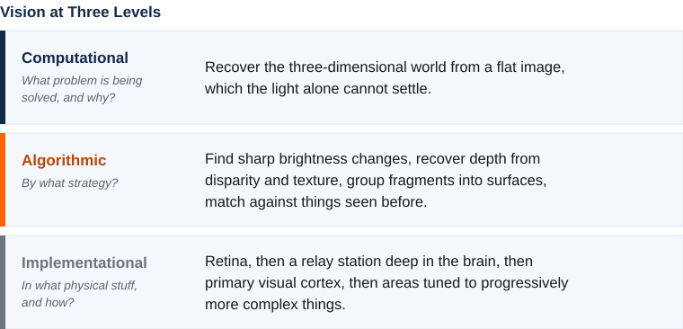{#fig-vision-three-levels alt="Titled Vision at Three Levels. Three stacked bands laid out exactly as the earlier heart figure, each with a colored rule down its left edge and the question it asks beneath its name. The first, dark blue, is Computational: what problem is being solved, and why? Its answer is to recover the three-dimensional world from a flat image, which the light alone cannot settle. The second, orange, is Algorithmic: by what strategy? Its answer is to find sharp brightness changes, recover depth from disparity and texture, group fragments into surfaces, and match them against things seen before. The third, slate gray, is Implementational: in what physical stuff, and how? Its answer is the retina, then a relay station deep in the brain, then primary visual cortex, then areas tuned to progressively more complex things."}

Worked this way, vision makes the three levels look clean. Almost too clean, as if each could be studied in perfect isolation. That is not quite right, and the next section takes up the complication: the levels are separable, but they are not independent.

### §1.2.5 — Separable, but Not Independent

Marr’s three levels are conceptually separable, in that each of the three questions can be asked and pursued in its own terms. But they are not independent, and cannot be studied completely independently of one another. Marr’s original description of the three levels emphasized how the computational level constrains the algorithmic level. The problem you are trying to solve implies certain types of algorithms and data structures are more likely to be the ones being used. The same holds one level further down: an algorithm that depends on stored associations demands machinery whose connections can change, which is a real demand on the wiring rather than a detail left to it. Others have noted, somewhat in contradiction to Marr, that the constraints work in the other direction as well, and arguably even more strongly .

First, the details at the implementational level constrain the algorithmic level. What a system is built from shapes which procedures are even available to it. Comparing brains and computers demonstrates this clearly. A neuron is slow. Its basic signaling operation takes roughly a millisecond, while a silicon transistor switches in far less than a billionth of a second, at least a million times faster. This has enormous consequences for what kind of programs and algorithms brains and digital computers can implement . The relative slowness of neurons means that they must, for example, prioritize computing many things in parallel rather than operating one step at a time.

: Two substrates, and what each one forces on the algorithm running in it. The speeds are orders of magnitude rather than measurements of any one device or any one chip, and the gap between them is at least a millionfold. {#tbl-neuron-transistor}

| | A neuron | A transistor |
|---|---|---|
| One signaling operation takes | About a millisecond | Tens of picoseconds, as one logic-gate delay on a modern chip |
| Connects to | About 7,000 other neurons, for an average neuron in the neocortex | A handful of other gates; circuits are designed around a fan-out of about four |
| So the algorithm must | Compute many things at once | Compute one thing at a time, extremely fast |

Second, the algorithms and representations a system has available constrain which problems it can solve. The tools a mind thinks with do not just fix *how* it solves a problem. They also bound which problems it can take on at all. A mind with no way to represent exact large quantities cannot solve exact large-number arithmetic, whatever the incentive. Give it a place-value notation and a few written procedures, and a whole class of once-impossible problems becomes routine. What a system can even attempt depends on the representations it already has.

These two ways in which the lower levels constrain the higher ones can be thought of from the perspective of evolution. Evolution does not begin with a clean problem specification and engineer the best solution. Evolution doesn’t directly design *at all*. Instead, different implementations (biological structures) compete in environments, with the most fit variants resulting in more copies in the next generation. In an abstract sense, the implementation that resulted in the best solution to a problem is selected, but the choice of solutions is incredibly limited and constrained by the biological structures that already exist. Evolution tinkers, reusing and repurposing whatever solutions already exist, and settles for what works well enough. This means a biological system is rarely the tidy implementation of an ideally posed problem. This means the clean top-down story is almost always an idealization rather than a rule. This can be contrasted with AI in some cases, where an engineer really *does* have a problem in mind, and can choose algorithms and even implementations that flow downward from the problem. But in the natural world, the constraints can be thought of more accurately as flowing the other direction. This is an issue we will take up in more detail in Module 2.

{#fig-constraint-arrows alt="Three stacked bands labeled Computational, Algorithmic, and Implementational, with four arrows in the gaps between them. The two downward arrows are aligned on the left and the two upward arrows on the right. Downward, from computational to algorithmic: the problem's structure narrows which algorithms are plausible. Downward, from algorithmic to implementational: an algorithm that stores associations demands connections that can change. Upward, from algorithmic to computational: the representations available bound which problems can be solved. Upward, from implementational to algorithmic: slow neurons force algorithms that compute many things in parallel. A separate dashed arrow in a band beneath records that discovery often runs upward, since which problem a system solves is itself something worked out by studying how it works — a point about the science rather than about the systems."}

The constraints so far have all been about the systems themselves, about how the real structure at one level shapes what is possible at another. There is one more kind of dependence, and it is of a different sort. It is not about the systems but about the scientific process, and about the order in which we can come to understand explanations at different levels. We often cannot state a system’s computational problem cleanly in advance and reason downward, because working out what problem it is really solving is itself part of the job.

This is the point we flagged in the vision example, and it cuts against Marr’s own claim that analysis should run top-down from a clean statement of the problem. To say vision’s task is to rebuild the three-dimensional world is already a theory, and a contested one. The leaner alternative, that vision extracts only what an animal needs in order to act, is a different specification of the problem. Which is right is not obvious from the armchair. Often we learn what problem a system solves only by studying how it works and behaves in specific contexts, so discovery runs bottom-up as much as top-down. The question is alive right now in artificial intelligence: whether today’s image and language systems build genuine internal models of the world, or only learn input-output mappings that succeed without one, is fiercely debated and unsettled. It is a standing reminder that a computational-level claim is a hypothesis, not a fact one may assume before the work begins.

Do these constraints and leakages across levels mean the Marr’s-levels framework is broken, or not a good way to approach the mind? Not at all. These constraints are in fact one of its greatest strengths. Because the levels constrain one another, narrowing down any one of them narrows the possibilities for the other two. A hypothesis about the computational problem tells you what to look for in the algorithms and the hardware. Knowledge of the physical machinery rules out algorithms it could never run, and the available algorithms in turn bound the problems that can be solved. Each level you come to a better understanding of makes the others easier to work out. Far from three sealed rooms, the levels are a scaffold in which progress on one part holds up the rest.

Seeing this also returns us to §1.1. The mind, we noted there, is a real property of the physical. The mind is dependent on the physical, yet it demands explanation in its own terms. Separable but not independent is exactly what a framework like Marr’s levels predicts. If the levels were fully independent, the mental level would float free of the brain. We would slide back toward something like dualism, with the mind as a thing apart. If mind and brain were not separable at all, the mental level would collapse into the physical, and we would be back at nothing-but-the-brain. The constraints between the levels are the visible sign that the framework has this relationship right.

One practical question remains. When does a higher level actually earn its place, rather than just adding a layer of talk? A useful rule is that a higher-level concept earns its keep when it buys prediction with less complexity. Take a concept like *thirst*. Suppose three things drive it: the time since the last drink, salt intake, and water lost. And suppose that thirst in turn shapes three behaviors: how much is drunk, how hard water is sought, and bodily signs such as a dry mouth. Tracked as separate connections between all three causes and all three effects, that is nine links to keep straight. But if you posit a single inner variable, thirst, fed by the three causes and driving the three behaviors, the nine collapse to six . The concept pays for itself in economy, as long as removing the complexity does not harm prediction. This is the same standard we met in §1.1. Mental explanations earn their place by doing predictive work that no molecule-by-molecule story could. A level, like a concept, is kept when it pays its way.

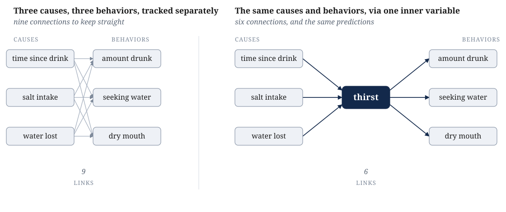{#fig-thirst-links alt="Two panels. The left panel shows three labeled boxes for causes, each joined by a line to each of three labeled boxes for behaviors, making nine lines in all. The right panel shows the same three cause boxes each joined to one central box labeled thirst, which is in turn joined to each of the three behavior boxes, making six lines in all."}

With the framework built, demonstrated, and honestly qualified, one task remains. In the final section, we will name the single arc this whole module has traced, review how it will structure the rest of the course going forward.

### §1.2.6 — The Shape of the Argument, and What to Carry Forward

As we conclude, let us step back from the details, and see that the whole module is a single line of argument . We began by asking what a mind is. We found that the answer that most of the field accepts is that the mind is *not* a separate kind of stuff. It is also not merely a redundant name for the brain. It is, instead, a real property of the physical. The mind is dependent on the brain, yet demands explanation in its own terms. A mind of that kind cannot be fully understood at any one level. So we need a way to study it at several levels at once. Toward this end, our course will adopt Marr’s three levels of analysis perspective: the computational, the algorithmic, and the implementational. Those levels line up with the disciplines that make up brain and cognitive science. They also line up with the evolutionary story that runs beneath them, and so they give the whole course its shape. Because the mind is dependent but separable, it must be explained at more than one level. Because it must be explained at more than one level, we need a framework of levels. And because the levels map onto the disciplines and the evolutionary structure of the mind and brain, the course is built around them.

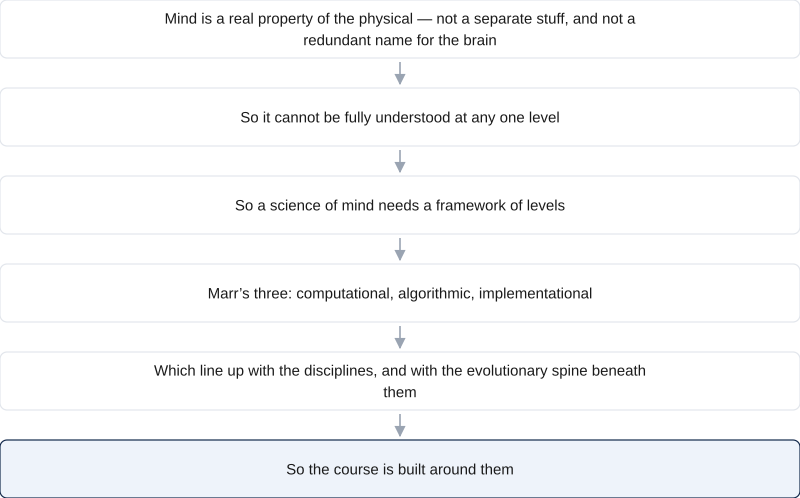{#fig-argument-chain alt="Six boxes in a single column, joined by downward arrows. Mind is a real property of the physical, not a separate stuff and not a redundant name for the brain. So it cannot be fully understood at any one level. So a science of mind needs a framework of levels. Marr's three: computational, algorithmic, implementational. Which line up with the disciplines, and with the evolutionary spine beneath them. So the course is built around them."}

What should you carry out of this module? Not, in the end, the roster of named positions. Dualism, identity theory, functionalism, and the rest are scaffolding. They are useful for seeing why the field landed where it did. What we want to focus on going forward is smaller and more durable. We want to focus on the three questions posed by each of Marr’s levels: 1) what problem is being solved and why, 2) by what procedure, and 3) in what physical stuff. And above all, we want you to instantiate a habit of mind. When you meet any claim about the mind in the weeks ahead, ask which level it is working at, and which question it is trying to answer. A surprising number of disagreements in this field turn out to be people answering different questions at different levels, and mistaking it for a fight.

We opened with two questions: what is the relationship between mind and brain, and what it would take for something other than a human brain to have a mind. We can now see they were one question with two faces. A mind is a real, high-level property of a physical system, dependent on the physical system but explained in its own terms, and explained at more than one level at once. So anything organized in the right way, brain or not, could in principle have a mind. And anything that has a mind can be asked the same three questions about it. Those questions are the tools we will carry into everything that follows.

## Further Reading

These are good next steps if you want to go deeper. They are starting points rather than the last word, and several of them argue with one another.

**Patricia S. Churchland, *Touching a Nerve: The Self as Brain* (2013).** A leading philosopher makes the case, for a general reader, that the self and the mind are the workings of the brain. The most accessible way into the brain-first view of §1.1.

**Daniel C. Dennett, *Intuition Pumps and Other Tools for Thinking* (2013).** Short, playful essays from a leading functionalist and materialist. This book discusses the “stances” toward a system introduced in §1.2. It is a clear entry to the functionalist view that §1.1.4 lays out as the field’s center of gravity.

**Carrie Figdor, *Pieces of Mind: The Proper Domain of Psychological Predicates* (2018).** When scientists say a bacterium “decides” or a neuron or brain “prefers,” are they speaking literally? Figdor’s answer bears directly on multiple realizability and on where the boundary of the mental falls — the worry we raised by the thermostat and chatbot cases in §1.1.1.

**David Marr, *Vision* (1982), Chapter 1.** The origin of the three levels of analysis that organize §1.2 and the rest of the course. Chapter 1 lays out the framework; the remainder of the book is a technical study of applying the levels approach to vision, which we summarized in this chapter.

**Mazviita Chirimuuta, *The Brain Abstracted: Simplification in the History and Philosophy of Neuroscience* (2024).** A study of how brain science explains by simplifying — and why a complete wiring diagram would still leave the explanation unfinished. The book is a sustained case for the “separable but not independent” picture we outlined in §1.2.5, and against the reflex that the physical story is the only real one.

**Catherine Stinson & Jacqueline Sullivan, “Mechanistic Explanation in Neuroscience” (2018).** A short, focused account of what it actually takes to explain a cognitive capacity in terms of neural mechanisms — the philosophy-of-science question running underneath §1.1.5 and §1.2.5. This article is a nice, direct treatment of how the levels explanation of a mind get tied together.

## Glossary

**adaptive why** — The evolutionary answer to the computational level’s “why” question, and the one that applies to a biological trait: what problem did the organism’s ancestors face, such that solving it aided survival and reproduction? It is a hypothesis to be tested, not a story to be assumed, and it is one of three sources of a computational goal, alongside a designer’s intent and a cultural practice. This is what connects Marr’s computational level to the course’s evolutionary organization.

**algorithmic level** — In Marr’s framework, the level that asks *how* a system solves its problem: by what procedure, and over what representations. Cognitive psychology and artificial intelligence largely work at this level of analysis.

**chauvinism problem** — The objection that if a mental state is identical to one specific physical state, then any system lacking that exact makeup, such as an octopus, an alien, or a computer, could not be described as having the state, no matter how it behaved.

**computational level** — In Marr’s framework, the level that asks what problem a system solves, and why. The “why” has three sources, one for each kind of system: a designer’s intent for an artifact, natural selection for a biological trait (an adaptive why), and a cultural practice for a learned human skill. A human mind draws on all three.

**consciousness** — broadly defined to refer to a range of properties of a mind, ranging from being awake and aware to knowing that one knows something to the notion that “there is something it is like” to have experiences of a certain kind. Closely tied to qualia but not simply the same thing. This module mostly sets consciousness aside as a hard, distinctive problem of its own.

**eliminative materialism** — The view that our everyday mental vocabulary is not merely incomplete, but mistaken. Eliminative materialists tend to believe that a mature brain science will discard mentalistic language like “beliefs” and “desires,” and replace it with a description based entirely on explicit descriptions of behaviors and physical systems like neurons and brains.

**emergentism** — The view that mental properties genuinely arise from the organization of physical matter, the way wetness arises from many water molecules although no single molecule is wet. One member of the “mind as a real property of the physical” family.

**explanatory separability** — The question of how far the mind can be studied in its own terms, rather than only through the details of the brain that realizes it. A question about method, distinct from the question of what the mind is made of.

**folk psychology** — The everyday conceptual framework of beliefs, desires, hopes, and fears we use to explain and predict behavior. Eliminative materialism predicts it will be discarded; most other views expect it to be useful at least in part.

**functionalism** — The view that a mental state is defined by the causal role it plays. In other words, a mental state is defined by what brings the mental state about, and what consequences the mental state has on the brain, body, and world. This stands in contrast to perspectives that define mental states in terms of what they are made of. Because a role can in principle be filled by different materials, functionalism is the position that most readily opens the door to machine minds.

**idealism** — The view that mental “stuff” is fundamental and the physical world is, in some sense, an appearance within a mind (often taken to be God’s). Idealism is the mirror image of materialism.

**identity theory** — The materialist view that each mental state simply *is* a particular physical state of the brain: one event under two names, as in the slogan “pain is the firing of C-fibers.”

**implementational level** — In Marr’s framework, the level that asks what physical machinery (such as neurons, silicon, or gears) carries out the algorithm, and how. This is the home ground of neuroscience.

**levels of analysis** — The idea that one system can be understood by asking several different kinds of question about it, each a legitimate explanation in its own right. With regard to the study of the mind and brain, this book adopts David Marr’s three: the computational, algorithmic, and implementational levels. It is the backbone of this course.

**materialism** — The commitment that the physical facts determine mental facts. Endorsing materialism means endorsing that “mind” is not a separate kind of stuff from the physical world, free to vary independent of its physical nature or implementation. The shared starting point of identity theory, eliminative materialism, and the “mind as a real property” view.

**mind** — In this book, the set of capacities a system has for taking in information about the world, holding it in some usable form, and using it to guide what the system does: perceiving, remembering, reasoning, deciding, and the like. The definition has deliberately blurry edges.

**mind as a real property of the physical** — The third main class of answers to the mind–body problem. According to this perspective, mind is neither a separate substance nor an illusion, but a real property that physical matter has when it is organized in a certain way or doing certain things. It is a family of views rather than a single view. Emergentism, functionalism, and the levels of analysis approach are all members. It is the position most contemporary brain and cognitive scientists adopt.

**mind–body problem** — The question of how the mind relates to the physical stuff it seems to arise from, and whether that stuff must be a brain at all.

**multiple realizability** — The idea that one and the same mental state can be realized in different physical systems and materials, just as one temperature can be realized by many different arrangements of molecules. It is the concept that ties the mind–brain question to the machine question.

**ontology** — The branch of philosophy concerned with what kinds of things exist and what their basic nature is. “What kind of thing is a mind?” is a question about the mind’s ontology.

**panpsychism** — The view that subjective experience is a basic feature of all matter, present in some faint degree even in something as simple as a rock or an electron. It differs from the view that mind is a property of suitably *organized* matter, which appears only where matter is arranged in a certain way.

**philosophical zombie** — A hypothetical being physically identical to a person and behaving exactly like one, yet with no inner experience at all. It is used to argue that subjective experience might be something over and above the physical facts.

**qualia** — The felt, qualitative character of a subjective experience: what it is *like* to feel pain, see red, or taste salt.

**radical behaviorism** — The early-twentieth-century perspective, associated with John Watson and B.F. Skinner, that urged psychology to study only observable behavior and to set aside talk of inner mental states as unscientific.

**substance dualism** — The view that mind and body are two different kinds of substances. This view typically endorses the idea that the mind, though it interacts with the brain, cannot be reduced to it.

