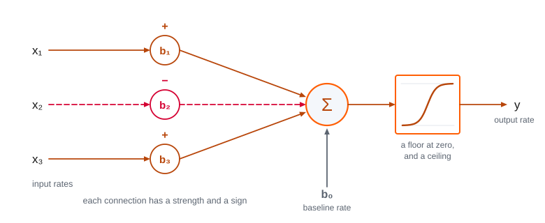

# 3. Neurons and Neural Communication

This module is about the neuron. It is the cell that turns an event into a fast, precisely aimed signal. And it is the first piece of biological machinery this course examines at all three of Marr’s levels. While reading, look for the beginnings of answers to these questions:

- What problem were neurons the solution to? And why did only some kinds of living things ever need to solve it?
- What does a single neuron actually compute, and how much of a mind could be built out of something that simple?
- If every signal a neuron sends is identical to every other one, where is the information?
- What does it cost to have this machinery for thinking, and how does the bill get paid?
- The unit at the center of modern artificial intelligence is named after the neuron. How close is the resemblance, and where does it break down?

By the end, we should have a working answer to each question. We will also have the beginning of a habit, a demonstration of how we can investigate a capacity at all three of Marr’s levels.

---

Most of us learn at some point that a cell has parts. A nucleus holding its DNA. Mitochondria supplying its energy. A membrane holding the whole thing together. And small machines inside it that build proteins and other molecules. The list is familiar enough that it is easy to stop finding it strange. But it is *very* strange!

Somewhere in this planet’s first billion years or so, lifeless chemistry became organized into something that maintains itself, powers itself, repairs itself, and makes more of itself. Nothing about chemistry suggests it should do any of that. Two questions grow out of the strangeness. First, where did that complexity come from? Second, why was this complexity worth all the effort?

Of all the kinds of cells that complexity eventually produced, one is primarily responsible for minds. The neuron senses, it signals, and in a small way, it decides. In a human mind, something like eighty-six billion of them, wired to one another, are reading this sentence right now.

In our first three modules, we built the structure we use in the course. Module 0 asked what brain and cognitive science is. Module 1 asked how mind relates to brain, and adopted Marr’s three levels of explanation for answering questions about both. It also said that from here on, the course would take one capacity at a time and work it at all three levels. Module 2 asked what can be learned by setting two systems side by side, and laid down the evolutionary narrative the rest of the course follows. Now, we are ready to start the narrative.

Our first step is the cell that makes minds physically possible. Two things about that cell organize this chapter. First, neurons are the animal’s answer to a problem: ordinary chemical signaling was not fast enough for many problems animals faced. Second, neurons are the body’s first great metabolic outlier. They are extraordinarily expensive to run.

This chapter has three sections, one for each level . §3.1 asks why neurons evolved. §3.2 asks what a neuron computes. §3.3 asks how a living cell physically manages it, and what it costs to run.

: Marr’s three levels, the question each asks, the discipline that asks it, and this module’s example. Every module from here on reprints this table with its own example in the last column. {#t-levels-neuron}

| Level | The question it asks | Discipline | This module’s example: the neuron |
|---|---|---|---|
| Computational | What problem is being solved, and why does solving it matter? | Evolution and ecology | Fast, long-distance, reliable signaling, for an animal that must sense, decide, and act before something else does |
| Algorithmic | What is represented, and by what procedure? | Cognitive psychology and AI | Receive, integrate, transmit; a threshold, and an all-or-nothing spike |
| Implementational | By what physical means, and at what cost? | Neuroscience | Ion gradients across a membrane, the sodium-potassium pump, and the action potential |

One thread runs through all three levels, and it is worth attending to. Neurons are expensive. Animals could afford them only after a revolution in the way living things capture energy, and the price of running them still shapes how brains are built today. The story that opens §3.1, about how life became rich enough to build neurons at all, is the same story that closes §3.3, about why the brain is the most expensive organ in the body.

A second thread starts here and runs to the end of the course: the comparison between natural and artificial minds. It begins at the smallest scale available, a single cell. This is because the unit at the heart of modern artificial intelligence is also called a neuron, and artificial neurons were built as stripped-down copies of biological neurons. We will set the two beside each other as we go, and look hardest at the place where they turn out to differ most. This is not what they compute, but what they are made of.

## §3.1 — Computational: Why Neurons Evolved

### §3.1.1 — The Computational Question

This chapter is the first place in the course where we take a single thing and ask all three of Marr’s questions about it, one section at a time. First, the computational question: what problem was being solved when neurons evolved?

Living things have no designer. So when we ask what a biological structure is for, the only answer available that does not appeal to magic is a historical one: the structure is here because the organisms that had it left more descendants than the organisms that did not. Asking what a neuron is for is therefore the same as asking what selective pressure favored building a neuron.

That gives us the question this section answers. What could a neuron do that earlier life could not do, and for whom did that difference matter enough to be selected? The disciplines that answer questions in this shape are evolutionary biology and ecology. Each of the three sections of this chapter names its level and its discipline as it opens, because the rhythm is new and worth feeling as it starts.

Recall the principles of natural selection we discussed in Module 2. Variation arises among individuals. Some of that variation is heritable. Some heritable variants leave more descendants than others. And so, over generations, the population changes.

Module 2 discussed that process with regard to the evolution of species, and of the traits those species have. Now, we discuss how that process changed something even more fundamental: the kinds of cells that an organism has. A neuron is an adaptation in exactly the sense Module 2 gave the word. And the same three-part logic that explains the coloring of a moth, also explains why some lineages came to build neurons, *and most never did*.

One misuse of natural selection that we discussed in Module 2 is important to us here. Module 2 was firm that evolution is not a climb toward anything, and that there is no ladder with human beings at the top of it. This section walks forward through time, from chemistry to cells to animals. This walk forward through time reads very easily as a walk upward. But it is not one. Neurons are not an achievement that some lineages managed and others failed at. They are an expensive solution to a problem, and this solution was the path taken by only some living things. Plants have no neurons. But they are not thereby behind. By every measure that matters to a plant, plants are doing just fine, thank you very much.

### §3.1.2 — The RNA-World Hypothesis and the Beginning of Life on Earth

A neuron is a cell, and an unusually elaborate one. Before we can ask how evolution produced such a thing, there first had to be cells. And a cell is not an obvious object. It is a bounded, organized system of chemistry that maintains and repairs itself, obtains energy and materials from its surroundings, and belongs to a lineage capable of making more cells. It is far from obvious how the chemistry of a lifeless planet crossed that threshold. So our story starts earlier than an introduction to the mind usually starts: on an Earth awash in chemistry, but without life.

One leading hypothesis about this transition is the RNA-world hypothesis. RNA, or ribonucleic acid, is a carbon-based polymer remarkable for its ability both to carry information in its sequence and, when folded into certain shapes, to accelerate chemical reactions. This does not mean that scientists know life began with RNA. RNA may have been preceded by simpler chemical systems, and precisely how it first arose remains unresolved.

The Earth formed approximately 4.5 billion years ago. During the hundreds of millions of years that followed, energy from sunlight, electrical discharges, impacts, geothermal heat, and chemical gradients drove innumerable reactions. Some produced increasingly complex organic molecules. Under certain conditions, RNA building blocks can form without life, and activated building blocks can join into short chains. Something like this may have happened on the early Earth, although no surviving evidence tells us exactly when or where.

Most early RNA molecules would presumably have broken down or lacked any useful activity. A few may have folded into shapes that accelerated particular reactions. Catalytic RNA molecules of this kind are called *ribozymes*. Eventually, according to the RNA-world hypothesis, RNA or a related molecule became involved in making copies of molecular sequences — perhaps through networks of molecules that helped replicate one another.

Once those copies resembled their templates, there was *inheritance*. Because copying was imperfect, there was *variation*. And if some variants survived or reproduced more effectively than others, there was *selection*. At that point, the basic ingredients of Darwinian evolution were present, even if nothing yet existed that everyone would agree to call an organism. Evolution may therefore have begun before cells — and perhaps before life had acquired a clear boundary.

### §3.1.3 — The Evolution of Cells

Replicating molecules are not yet cells. What they lack is a boundary. The next step may have begun when some of these replicating systems became enclosed. Simple fatty molecules existed in which one part interacts with water, while another avoids it. This caused them to assemble spontaneously into hollow, membrane-bound *vesicles*. Most vesicles would have contained little of consequence, but some may have trapped RNA and other useful molecules.

Their membranes could let small molecular building blocks pass in and out, while retaining the longer strands inside, keeping cooperating molecules together and shielding them from dilution. Vesicles could also acquire more fatty molecules, grow, and split under physical forces, passing some of their contents to each daughter. If a particular RNA system helped its vesicle grow, persist, or reproduce, selection could now act on the whole package, rather than on naked molecules alone. Such packages are called *protocells*. Over time, increasingly tight coordination among RNA replication, energy use, membrane growth, and division may have transformed protocells into the ancestors of true cells.

At some stage, protocells also changed how they stored information. In the standard RNA-world account, catalysts evolved that converted RNA building blocks into DNA building blocks and copied information from RNA into DNA. DNA was less vulnerable to spontaneous breakdown, and its complementary strands made damaged information easier to recover. Protocells using DNA could therefore preserve larger sets of instructions more reliably, although RNA and DNA may have coexisted from much earlier.

The instructions coded by DNA and RNA allowed cells to do more than replicate their genetic material. DNA stored them. RNA copied and used them to create proteins, while retaining some of its earlier catalytic roles. Proteins became the principal catalysts of cellular chemistry.

Together, DNA, RNA, and proteins formed a system that captured energy, built and repaired membranes, produced new molecular machinery, and coordinated the copying and division of the cell. Cells that constructed and maintained themselves more effectively left more descendants, allowing natural selection to improve increasingly elaborate cellular systems.

By the time of **LUCA** — the Last Universal Common Ancestor — this division of labor had probably become established. LUCA was not the first life, nor necessarily a single organism. But it was the ancestral population from which all cellular life alive today descends. It already possessed the genetic code, ribosomes, protein enzymes, and a complex metabolism. Considerable evolution had therefore occurred before LUCA. It marks not life’s beginning, but the deepest common ancestor that surviving organisms allow us to reconstruct.

One feature of this early cellular world matters more for our purposes than any particular piece of chemistry. Long before life had neurons, cells evolved ways of sensing their surroundings and acting on what they sensed. A swimming bacterium such as *E. coli* can compare the present concentration of a nutrient with the concentration it encountered a few seconds earlier. If conditions are improving, it continues in roughly the same direction. If they are worsening, it tumbles and sets off in another. This behavior, called **chemotaxis**, gradually carries the bacterium toward nutrients and away from harmful substances. The loop of receiving information from the world, transforming it internally, and changing behavior in response is therefore billions of years older than neurons. A single cell can already close that loop, using receptor proteins, molecular signaling pathways, and a protein motor.

The cell was also processing information in another sense. DNA was transcribed into RNA, and RNA sequences were translated into proteins, allowing stored information to direct the cell’s construction, maintenance, and reproduction. Genetic processing and sensory processing were different operations, but both were already present in cellular life. Neurons would not invent either information processing or the sensing-and-action loop. They would add a new layer: a specialized means for transmitting information rapidly between distant parts of a multicellular organism, allowing many cells to sense and act as a coordinated whole.

### §3.1.4 — The Energy Revolution

Everything a cell does costs something. Building a protein, moving a flagellum, repairing damage, and copying a genome, all cost a great deal. Cells pay all of these bills in the same currency: **ATP**, a small molecule that stores energy in a chemical bond and releases it where it is needed. A cell’s whole economy runs on making ATP and spending it.

ATP did not have to be invented for this job. Adenosine triphosphate is a nucleotide: adenine, a sugar, and three phosphate groups. It is one of the four building blocks that RNA is assembled from, and the phosphates are what “activated” those building blocks so they could join into chains. So the molecule was already there, already abundant, and already carrying energy in its phosphate bonds. Phosphate bonds are well suited to the role. They release a great deal of energy when broken, and they do not break on their own in water, so a cell can store energy in them and use it when it chooses. Why this nucleotide became the currency rather than one of the other three is still argued over. What is not in doubt is that once it was the currency, it was very difficult to replace, because by then everything else was built to use it.

Early cells made ATP in a way that is ingenious and meager at once. Energy from chemical reactions is used to pump protons across a membrane, so that protons pile up on one side. They then flow back through a protein that spins as they pass. Making ATP means pushing phosphate groups together, and they repel one another electrically. The spinning is the mechanical force that does the pushing.

Water behind a dam is the usual comparison, and it is a good one, because the arrangement stores energy as a difference across a barrier and collects it on the way down. The scheme works, and it works in essentially every cell alive today. What it did not do, in early life, was produce very much. Early life could produce energy. But it was energy poor.

Then a revolution occurred: some of these cells learned to capture sunlight. **Photosynthesis** uses light to build sugar out of carbon dioxide and water. The sugar could then be broken down, and its energy released, to power the creation of ATP. This turned a renewable and enormous energy source (sunlight) into a storable chemical one. The consequences for life were large. The consequences for the planet were larger, because photosynthesis has a waste product, and the waste product is oxygen.

For most life on earth, the “pollution” created by photosynthesis (the massive amount of oxygen released) was at first a catastrophe. Oxygen is chemically aggressive. It wrecks the molecules of organisms not built to handle it. And its accumulation is associated with one of the earliest mass extinctions in Earth’s history, known as the **Great Oxygenation Event**.

The consequence is one the rest of this chapter depends on. The same chemical aggressiveness that made oxygen a poison, makes it an unusually good acceptor of electrons. And a lineage that could make use of that could extract far more energy from the same food. This process, in which oxygen serves as the final acceptor of the electrons stripped from food, is called **aerobic respiration**. And it yields something like fifteen times as much ATP from a molecule of sugar as the older, oxygen-free methods do. Oxygen was a poison. But it became a windfall for the cells that happened to be able to make use of it. And everything expensive that life built afterward was paid for out of that windfall.

### §3.1.5 — What the Surplus Allowed

A large and reliable energy surplus makes arrangements affordable that were not affordable before. The history of life after oxygen is largely a history of newly affordable adaptations.

The word *affordable* invites a misreading worth heading off. It can sound as though life had been waiting for the money to arrive, holding plans it could not yet pay for. There were no plans, and nothing was waiting. Before oxygen, mutations pushing toward greater complexity would have arisen as mutations always do: a larger cell, an extra internal compartment, more machinery to build and maintain. Those variants appeared, and they died out. What they cost in energy was more than what they returned, so the cells carrying them left fewer descendants and the variation did not spread. Then some lineages happened onto a way of using oxygen, and the arithmetic changed underneath them. The very same variation that had been too expensive to keep was now worth its price, and the cells carrying it left more descendants rather than fewer. Nothing about the mutation had changed. What changed was the energy available to pay for it. Selection never looked ahead. It only ever compared the variants that already existed, and the new energy surplus changed which of them was worth keeping.

One of the first major adaptations after the evolution of aerobic respiration was that some lineages evolved larger, more elaborate cells. A **eukaryote** is a cell with its DNA enclosed in a nucleus, and its chemistry divided among internal compartments. It is the kind of cell that plants, fungi, and animals are built from. Eukaryotes appear to have arisen through *endosymbiosis*. One cell engulfed another and, instead of digesting it, kept it. The engulfed oxygen-users became **mitochondria**, compartments dedicated to aerobic respiration. A cell with its own internal power plants can pay for a great deal more machinery than one without them.

Another major adaptation was **multicellularity**, the arrangement in which cells that could live independently instead stay together and function as a single organism. Multicellularity has arisen many separate times. What it allows is *division of labor*. If every cell must do every job, then every cell will probably be mediocre at all of them. But if cells can specialize, some can be built for movement, others for digestion, and others for sensing. Each can be far better at its one job than any generalist cell could be at any job. Bones, muscles, skin, and other organs are what specialization looks like once it has run for a while.

Specialization and multicellularity also creates a problem that did not exist before. A colony of identical cells has nothing much to coordinate. A body of specialized cells has to act as one thing. The cells that sense are not the cells that move, and the cells that move are not the cells that digest. So information gathered by one kind of cell has to reach a different kind entirely, and in time for it to be useful. The cells that must act on what a sensor detects cannot detect it themselves. Call this the **coordination problem**. Every complex multicellular organism has some version of it, and how urgently it needs solving turns out to depend entirely on how the organism makes its living.

### §3.1.6 — Three Ways to Be Complex

Complex multicellular life did not solve the coordination problem once. It solved it at least three times, differently, and setting the three side by side isolates exactly the variable we are looking for .

: Three strategies for complex multicellular life, and what each one demands of a body. Only one of the three makes fast, whole-body coordination worth paying for. {#t-three-strategies}

| | Plants | Fungi | Animals |
|---|---|---|---|
| How it gets energy | Makes its own food from sunlight | Grows into its food and absorbs it | Finds food, and eats other organisms |
| What the body does | Stays put; grows toward light and water | Stays put; grows through the material it feeds on | Moves through the world, and is moved through by others |
| What can go wrong in a second | Very little | Very little | Being eaten; losing prey; a bad step |
| Coordination it needs | Slow and chemical is enough | Slow and chemical is enough | Fast, aimed, whole-body |

Reading across the table is Module 2’s comparative method, applied not to two species but to three whole ways of making a living. Module 2’s more common move asks why two things are alike. The useful move here is the mirror of it: these three are all complex, all multicellular, all descended from the same eukaryotic beginning, and only one of them evolved neurons. What separates that one from the other two is the thing we are looking for.

The separating variable is speed, and the reason is that animals eat other organisms and are eaten by them. A plant threatened by drought has hours or days to respond, and it responds with growth and chemistry, which is enough. An animal being hunted has a fraction of a second. In a predator–prey arms race, the animal that senses, decides, and acts slightly faster than its opponent is the animal that eats or the animal that escapes, and both outcomes get written into the next generation. So the animal way of life puts a premium on speed that the other two strategies simply do not have.

That premium is worth naming, because it is the thing the rest of this chapter is about and the thing much of the rest of the course is about. Call it the **sense → decide → act loop**: take in information about the world, do something with it, and produce an action, fast enough for the action to still be the right one. It returns at the algorithmic level, where we ask what the neuron computes, and at the implementational level, where we ask what it costs to run. It is also not a problem unique to living things. Any system that has to operate on its own in a changing world faces some version of it, and a robot or a self-driving car in a later module needs its own answer to it. The neuron is evolution’s answer.

The animal solution shows up early in development, and in one piece. Very early in the development of an animal embryo, at gastrulation, the cell layers that will become gut, muscle, and nervous system are laid down together, which is what we should expect given that none of the three is much use without the other two.

### §3.1.7 — Why Chemistry Was Not Fast Enough

Cells had been signaling to one another for billions of years before animals existed. And animal bodies still use chemical signaling constantly. A hormone is released into the bloodstream by one tissue, travels through the body, and changes what other tissues do. Chemical signaling is cheap, it reaches everywhere, and it does not require any special apparatus beyond the ability to make the molecule and respond to it.

Its limitation is that it moves by diffusion, and diffusion is slow in a way that gets rapidly worse with distance. A small molecule crosses a micrometer, roughly the width of a bacterium, in about a millisecond. It crosses a millimeter in several minutes. It would cross a meter, the length of a large animal, in something on the order of a decade. The time does not grow in proportion to the distance; it grows with the square of the distance, so every doubling of distance quadruples the wait. Diffusion also spreads in every direction at once, which means a chemical signal cannot be aimed at one destination. And it lingers, which means it cannot easily be switched off. For a message like *grow* or *get hungry* or *begin reproducing*, that might be fine. For a message like *the left side of the body should contract, now*, these limitations could be fatal.

So it is worth being careful about what neurons actually contributed. They did not invent communication between cells, and they did not invent behavior. Both were in place long before them. What they did was make a trade. Chemical signaling is cheap and reaches everything; neural signaling gives up the cheap broadcast reach and buys speed, distance, and aim in return. The two coexist in every animal body, doing the jobs each is suited to. Animals still run on hormones for everything that can afford to be slow.

A **neuron**, then, is the cell specialized to make that trade. It takes an event, whether in the world or elsewhere in the body, and converts it into a signal that travels fast, travels far without weakening, and arrives at a specific destination rather than everywhere. That is the computational-level answer to what a neuron is for. And it is why neurons took hold in the animal lineage and not in plants or fungi. The lineages whose sense → decide → act loop ran faster, were the lineages that ate rather than were eaten.

Fast, aimed, long-distance signaling comes with a cost attached, and the cost is the other thread of this chapter. Speed of that kind is not free. And the surplus that made animals possible in the first place, is the same surplus that neurons spend in order to signal.

We have stated the problem early multicellular life solved via neurons. The next question is not why but how. Granting that a neuron’s job is to take signals in, combine them, and pass one along, what exactly is it computing? That is the algorithmic level.

## §3.2 — Algorithmic: What a Neuron Computes

### §3.2.1 — The Algorithmic Question

The previous section asked what neurons are for, and answered with a problem: animals need to sense, decide, and act faster than diffusing chemicals allow. This section asks a different question about the same cell. If a neuron’s job is to take signals in and pass a signal along, how exactly is it doing that? That is Marr’s algorithmic level, and it is a question about procedure rather than purpose.

Answering it requires a process that is worth performing deliberately, because it will happen in every module from here on. We are going to set the biology aside. Not deny it, and not postpone it forever. Set it aside, for the length of one section, and describe the neuron as though we did not know what it was built from. This is the abstraction Module 1 said makes comparison between brains and machines tractable, and this chapter is where the reader sees the price and the payoff of it: a functional description here, a physical one in §3.3.

Described that way, a neuron does three things, and the rest of this section elaborates one of them at a time. It **receives** signals from other cells. It **integrates** them, combining many inputs into a single verdict. It **transmits** one signal onward. Receive, integrate, transmit. Everything else in this section are details fleshing out those three verbs.

### §3.2.2 — The Neuron’s Four Parts, by the Role Each Plays

A neuron has four parts worth naming, and it is worth naming each one by the job it does before naming the part that does it, because the job is the algorithmic fact and the part is merely what fills the role.

Something has to be the input surface, the place where signals from other cells arrive. In a neuron that is the **dendrites**, a branching spray of processes reaching out from the cell body, often thousands of them, each carrying signals from a different source. Something has to be the integrator, where arriving signals are pooled and a verdict is reached. That is the **soma**, the cell body. Something has to be the output line, carrying the verdict away. That is the **axon**, a single long fiber that may run a millimeter or, in a large animal, a meter. And something has to be the junction where the output of one cell becomes the input of the next. That is the **synapse**, the narrow gap between an axon’s ending and the next cell’s dendrite.

One feature of that arrangement matters more than any of the parts. The flow is one-way. Signals come in at the dendrites, are pooled at the soma, and leave down the axon, and they do not run backward. A cell with a distinct input end and a distinct output end can be wired to other cells in a definite direction, and that is what makes it possible to build a circuit rather than a puddle. Module 4 is entirely about what happens once that becomes possible.

### §3.2.3 — Integration and Threshold

The middle verb is the interesting one. A neuron does not pass along what it receives. It receives from many cells at once and produces one output, which means something has to happen in between, and what happens is **integration**: the arriving signals are added up.

What the neuron does with the total is the crux. It does not report the total. It compares the total against a **threshold**, a level the summed input has to reach. Below threshold, the neuron does nothing at all. At or above it, the neuron acts. So a single neuron is not a wire and not a relay. It is a small evaluator, pooling evidence from many sources and answering one question with it: given everything arriving right now, do I act or not?

That is a real computation, performed by one cell, and it is worth registering how modest the cell’s means are. It has no memory of what it did a second ago, no view of the animal’s situation, and no idea what any of its inputs mean. It sums numbers and compares the sum against a level. Almost everything in this book is built out of that operation, repeated in enormous numbers and wired together well.

### §3.2.4 — The All-or-Nothing Spike

When a neuron does act, what it produces is an **action potential**, commonly called a *spike*: a brief, stereotyped electrical event that travels down the axon. §3.3 shows how the cell physically makes one. What matters here is its shape, which is to say the fact that it does not have a variable one.

An action potential is **all-or-nothing**. Cross the threshold and the neuron produces a full spike. Fall short and it produces nothing. There is no such thing as a small action potential, or a large one, or one that trails off partway down the axon. This is the single most counterintuitive fact about neurons for most readers, and it is worth stating the misconception it corrects directly: a stronger stimulus does not produce a bigger spike. Every spike a given neuron fires is essentially identical to every other one.

Ask Marr’s question about that design. Why would a signaling system throw away the obvious option of letting the signal’s size carry the message? The answer is exactly the demand §3.1 established. A graded signal, one whose size means something, degrades as it travels. It fades with distance, blurs in time, and picks up noise from everything around it, so by the time it has crossed a meter of animal there is no way to tell how much of what arrived was the message. An all-or-nothing signal has none of those problems, because it is regenerated at full strength all the way along the axon. What arrives at the far end is exactly what left. The signal is fast, it is sharply timed, and it is as reliable at a meter as at a micrometer, which is the combination §3.1 said the animal way of life demanded and chemistry could not supply.

It is worth noticing that human engineers made the same choice, independently and for the same reason. Digital signals are all-or-nothing for precisely this purpose: a value that is only ever fully on or fully off can be cleaned up and passed along without accumulating error, and a value that varies continuously cannot. Two very different kinds of system, facing the same problem of getting a message somewhere intact, arrived at the same solution. Module 2 gave us the vocabulary for noticing that and the caution about over-reading it.

### §3.2.5 — Two Ways to Describe an Output

The all-or-nothing spike raises a question that has to be answered before we can go further, because on its face it looks like it makes neurons useless. If every spike is identical, how can a neuron say anything except *yes*? A cell that can only produce one signal can only carry one message.

The answer is that the message is not in any one spike. It is in how many, and when. A neuron presented with a faint stimulus fires occasionally. Presented with a strong one, it fires far more often, and the spikes come closer together. Nothing about any individual spike has changed. What changed is the number of them in a stretch of time, which is the neuron’s **firing rate**, and the sequence itself is called a **spike train**. So the correction to the misconception above has a second half: a stronger stimulus does not produce a bigger spike, it produces more spikes, faster.

That resolves an apparent contradiction that runs through the rest of this chapter, and it is worth being explicit about it, because the two descriptions are about to be used side by side and a reader who takes them for competing claims will be lost. A neuron’s output is all-or-nothing, and a neuron’s output is a rate that can take many values. Both are true. They are descriptions at two different time scales, not two theories fighting over one fact. Look at a single millisecond and there is either a spike or there is not, and if there is one it is the same size as all the others. Look at a hundred milliseconds and there is a count instead, and a count is a number that can land anywhere in a range. A rate is not an alternative to all-or-nothing signaling. A rate is what a lot of all-or-nothing events look like when they stop being looked at one at a time.

Which description is the right one depends entirely on the question being asked, which is Marr’s point arriving in a new place. Ask what a cell contributes to an animal’s behavior over a stretch of time long enough for behavior to happen, and the rate is the quantity that matters. Ask how the cell physically produces one event, and the individual spike is the object of study. This section, working at the algorithmic level, will describe neurons in terms of rates. §3.3, working at the implementational level, will describe a single spike in terms of ions crossing a membrane. Both will be models of the same cell, and the fact that they look nothing alike is not a problem to be resolved. It is what having three levels is for.

There is more in a spike train than its rate. The precise timing of spikes carries information too, in some systems a great deal of it, and the study of what is encoded in timing rather than in count is an active area we will not pursue here. The load-bearing point is the one already made: meaning rides on patterns of identical pulses, never on the size of any one of them.

### §3.2.6 — Excitation, Inhibition, and Modulation

So far the inputs arriving at a neuron have all been pushing the same way, as though integration were a matter of adding up votes in favor. It is not, and the reason it is not is what makes a neuron capable of computing rather than merely accumulating.

Signals cross the synapse chemically. The arriving spike causes the sending cell to release a **neurotransmitter**, a chemical that drifts across the gap and binds to the receiving cell. What the receiving cell does about it depends on which chemical arrived. An **excitatory** input pushes the receiving neuron toward its threshold, making a spike more likely, and in the brain the dominant excitatory neurotransmitter is **glutamate**. An **inhibitory** input pushes the neuron away from threshold, making a spike less likely, and the dominant inhibitory neurotransmitter is **GABA**.

Because the soma sums both kinds together, a neuron can do considerably more than register how much is arriving. It can fire only when one input is active and another is silent, which is the beginning of *this and not that*. It can stay quiet unless several inputs arrive close enough together in time, which is a coincidence detector. It can be shut down entirely by a single well-placed inhibitory connection, which is a veto. None of these is a matter of relaying anything. The balance between excitation and inhibition is what turns a chain of cells passing messages along into an assembly that computes something, and Module 4 is where that observation gets cashed.

A third category exists, and this chapter will name it and go no further. Some signals do not push a neuron toward its threshold or away from it. They change how strongly it responds to everything else, turning the whole cell’s sensitivity up or down. Call this **modulatory signaling**. It is how an animal’s internal state — hunger, alarm, whatever it was doing a moment ago — reaches into a circuit and changes what that circuit does with the same inputs. The specific chemicals that do this work, and the account of internal states and value that they make possible, belong to Module 4.

### §3.2.7 — Writing a Neuron Down

Everything said so far has been said in words, and words are where an account like this usually stops in an introductory course. It is worth going one step further, because a great deal of what brain and cognitive science actually does with a description of this kind is write it down as something that can be computed with. Module 2 called that the synthetic method: understanding by building. A description in words can be agreed with. A description precise enough to compute with makes predictions, including predictions about cases nobody has tested, and it can be wired to other descriptions like it and run.

Start from the rate description, since that is the one that varies. Our neuron receives from several others, each of which has its own firing rate. Call those input rates x₁, x₂, x₃, and so on. Each connection also has a strength, and a sign: an excitatory synapse pushes the receiving cell up, an inhibitory one pushes it down, and connections differ in how much of either they do. That strength-with-a-sign is a connection’s **weight**, written b₁, b₂, b₃. Finally, most neurons are not silent when left alone; they fire at some low background rate. Call that baseline b₀. Then the neuron’s own output rate, y, is

y = b₀ + b₁x₁ + b₂x₂ + b₃x₃

and that is a model of a neuron. It says: take each input’s rate, multiply it by how strongly and in which direction that input connects, add up the results, add the baseline, and the total is what this cell does.

Numbers make it concrete. Suppose a neuron sits at a baseline of 5 spikes per second and has two inputs: the first excitatory with a weight of 2, the second inhibitory with a weight of −3. If the first input fires at 10 spikes per second while the second is silent, the output is 5 + 2(10) + (−3)(0), which is 25 spikes per second. Now let the second input come on at 5 spikes per second, and leave the first exactly where it was. The output is 5 + 20 − 15, which is 10 spikes per second. The excitatory drive did not change at all, and the cell’s output fell by more than half. That is inhibition doing arithmetic, and it is worth sitting with, because it is the mechanism behind every claim in Module 4 about circuits making decisions.

Push the same example a little further and the model shows us its own edge. Let the inhibitory input rise to 15 spikes per second: 5 + 20 − 45, which is −20. A neuron cannot fire a negative number of times per second. So the sum cannot be the final answer; it has to pass through one more step, a function that holds the output at zero whenever the total falls below zero, and that in a real cell also imposes a ceiling, since no neuron can fire faster than a few hundred times a second. Module 4 gives that step its name and puts it to work.

A model is a deliberate simplification, and the honest way to present one is to say what it leaves out. This model ignores timing entirely, treating a hundred spikes as a hundred spikes whenever they arrived. It assumes the inputs simply add, when a real dendrite does something considerably more complicated to signals arriving on different branches. It has no refractory period, no history, and no noise. Every one of those omissions is a way the model is wrong, and it is wrong in those ways on purpose. What we get in exchange is an account precise enough to predict what the cell will do for input combinations no one has tried, and simple enough that thousands of these units can be wired together and the behavior of the whole assembly can be worked out. That trade is why the model is worth having.

And it is worth pausing on what has just been written down . Take numbers in, multiply each by a weight, sum them, pass the total through a function. That is the model of a biological neuron we arrived at by describing a cell. It is also, almost exactly, the unit at the heart of an artificial neural network, where positive and negative weights play the roles that excitation and inhibition play here. The resemblance is not a coincidence and not a discovery. The artificial “neuron” is called that because it was built as a stripped-down copy of this cell, and it is a caricature, deliberately. But it is the most concrete case we have yet met of Module 1’s **multiple realizability**: the same receive-integrate-threshold function, running in wet tissue in one case and in silicon in the other. What happens when many such units are wired together, and what happens when the weights are allowed to change with experience, are the subjects of Modules 5 and 7.

{#f-neuron-model alt="Three arrows enter from the left, labeled x subscript one, x subscript two and x subscript three. Each passes through a small circle labeled with a weight, b subscript one, b subscript two and b subscript three. The three weighted paths converge on a summation symbol, which receives a fourth input labeled b subscript zero from below. A single arrow leaves the summation symbol and enters a box containing a curve that runs flat along zero on the left and rises steadily to the right. The arrow leaving the box is labeled y."}

### §3.2.8 — From One Neuron to a Behaving Animal

One cell that sums its inputs and answers a yes-or-no question is a long way from an animal doing anything. The gap is smaller than it looks, and the cheapest way to see that is to look at the simplest animal anyone has fully mapped.

*Caenorhabditis elegans* is a soil worm about a millimeter long whose adult hermaphrodite form has exactly 302 neurons, and it was the first animal whose entire wiring diagram was worked out — every cell, and every connection between them, a map now called a **connectome**. A worm with 302 neurons behaves. It steers toward the smell of food and away from substances that would damage it, it reverses when its nose meets an obstacle, and it changes what it does when it has not eaten.

What produces that behavior is nothing but the arrangement this section has been describing, repeated and connected. Sensory neurons at the animal’s front end respond to chemicals in the water around it. Their axons run to interneurons, which receive from several sensory cells at once and do exactly what §3.2.3 described: sum, compare against a threshold, and produce a verdict. Those interneurons connect to motor neurons, which drive the muscles that bend the body. Sense, integrate, act, in an animal, using three or four cells in a row. §3.1 argued that the animal way of life demanded a fast sense → decide → act loop. Here is that loop, made out of neurons, in an animal too small to see without a microscope.

The worm can do considerably more than that sketch suggests, and most of what it can do depends on how its neurons are organized rather than on what any one of them computes. It weighs a good smell against a bad one and crosses a barrier only if the food is worth it. It behaves differently when hungry. Those are questions about circuits and about internal states, and they are Module 4’s.

We now have an account of what a neuron computes, and a model precise enough to calculate with. Both were built with the biology deliberately set aside, and both describe the cell in terms of rates. That leaves the question we postponed at the start of the section, and it is the largest one: how does a living cell, made of fat and salt water and protein, physically produce any of this? What is an action potential, made of? And what does it cost to run? That is the implementational level.

## §3.3 — Implementational: The Biology of Neurons, and What It Costs

### §3.3.1 — The Implementational Question

§3.2 described a neuron with the biology deliberately set aside, and promised to give it back. This section is the repayment. The implementational question is the third and last of Marr’s: what physical stuff actually does this, and by what means? The discipline is neuroscience, and the answer is a cell made of fat, salt water, and protein doing something quite specific with electricity.

There is a second reason to be careful here, beyond keeping a promise. §3.2 worked at the scale of firing rates, over stretches of time long enough for behavior. This section works at the scale of one event lasting about a thousandth of a second. Those are different questions about the same cell, exactly as §3.2.5 said they would be, and they will produce two descriptions that look nothing alike. That is not a failure of either. It is what having three levels is for, and by the end of this section we will have two models of one neuron and a clear account of why we want both.

### §3.3.2 — The Membrane, the Gradients, and the Pump

A neuron, like any cell, is wrapped in a membrane made of two layers of fatty molecules with their water-repelling ends facing each other. Charged particles cannot cross an oily sheet on their own, which is the fact everything else rests on. So whatever is dissolved inside stays inside, and whatever is outside stays outside, unless something lets it through.

What is dissolved on either side is not the same. Sodium ions are concentrated outside the cell and potassium ions inside it, and the inside carries a net negative charge relative to the outside. An imbalance of charge across a barrier is a voltage, and the voltage across a resting neuron’s membrane is its **resting membrane potential**, roughly seventy thousandths of a volt, with the inside negative. The number matters less than what it means. A neuron at rest is not a neuron that is switched off. It is a neuron held under tension, like a charged battery or a drawn bow, with everything already in place for something to happen fast.

Nothing about that arrangement is stable on its own. Ions leak, and left alone the imbalance would run down to nothing within minutes. It does not run down because the cell continuously pushes ions back where they came from, using a protein called the **Na⁺/K⁺-ATPase**, or sodium-potassium pump. The pump drives sodium out and potassium in, against their concentration gradients, which is the direction they do not want to go, and it pays for each cycle by spending a molecule of ATP.

Register what that means before going on, because the second half of this section is built on it. A neuron doing absolutely nothing — receiving no input, sending no signal, sitting quietly in the dark — is spending energy continuously, and it is spending it in order to remain ready. The readiness is the product being bought.

### §3.3.3 — How a Spike Happens

The membrane is not uniformly sealed. Studded through it are **ion channels**, protein pores that let particular ions through when they are open and not when they are closed, and what opens them divides them into two kinds that matter here. A **ligand-gated** channel opens when a particular chemical binds to it. A **voltage-gated** channel opens in response to the voltage across the membrane itself.

The ligand-gated channels are §3.2’s inputs, made physical. A neurotransmitter released at a synapse binds to receptors on the receiving cell’s dendrite, channels open, ions trickle through, and the membrane voltage shifts slightly. An excitatory input lets in positive charge and nudges the voltage upward, toward zero; an inhibitory input pushes it back down. The summation §3.2.3 described as adding up inputs is, physically, these small voltage shifts arriving at the cell body and combining.

The voltage-gated channels are what turn that sum into a spike, and they do it through a runaway . If the combined inputs push the membrane voltage up past a critical level, around fifteen thousandths of a volt above rest, voltage-gated sodium channels begin to open. Sodium rushes in, which pushes the voltage further up, which opens more sodium channels, which lets in more sodium. Once that loop starts it cannot be stopped partway, and the voltage shoots from negative to positive in about a millisecond. That is **depolarization**, the rising phase. The sodium channels then shut themselves off automatically, and slower potassium channels open and let potassium flow out, carrying positive charge with it and driving the voltage back down. That is **repolarization**. For a short interval afterward, the sodium channels have not yet reset, and no amount of input can make the cell fire again. That interval is the **refractory period**.

That mechanism is the answer to a question §3.2 raised and could not settle. Why is a spike all-or-nothing? Because the rising phase is a positive feedback loop, and a positive feedback loop has no intermediate settings. Either the threshold is crossed and the loop runs to completion, producing a full spike, or it is not crossed and nothing happens. There is no way for the cell to produce half of one. The refractory period settles two more of §3.2’s assertions: a spike travels in one direction down the axon because the stretch it just left is briefly unable to fire again, and a neuron has a maximum firing rate — a few hundred spikes per second at most — because it must wait out the refractory period between events. That ceiling is exactly the one §3.2.7’s model had to impose by hand.

{#f-action-potential alt="A line graph with time in milliseconds along the horizontal axis and membrane voltage in millivolts along the vertical axis. The line runs flat near negative seventy millivolts, rises gradually to a marked threshold near negative fifty-five, then climbs almost vertically to a peak above positive forty before falling just as steeply, dipping below the resting level, and returning slowly to it. The rising segment is labeled depolarization, the falling segment repolarization, and the shallow dip at the end is labeled the refractory period."}

### §3.3.4 — Hodgkin and Huxley: A Second Model of the Same Cell

Everything in §3.3.3 is a story about invisible particles crossing a barrier we cannot watch. Stories like that are easy to tell and hard to believe, and it is worth knowing how this one came to be believed, because the answer is one of the best demonstrations in science of a habit this course keeps returning to.

In the late 1940s and early 1950s, Alan Hodgkin and Andrew Huxley worked on the giant axon of the squid, a nerve fiber up to a millimeter thick — large enough to thread a wire down the inside of it, which no ordinary axon permits. Using that access they held the membrane voltage at fixed values and measured the currents that flowed at each one. Then they did something more ambitious than measuring. They wrote down a set of equations describing how the membrane’s permeability to sodium and to potassium changes with voltage and over time, and fitted the constants in those equations to what they had measured.

Then they used the equations to calculate what an action potential should look like. Out came a curve with the right shape, the right height, the right duration, and a conduction speed matching the real axon — none of which they had fitted the equations to. They had not summarized their measurements. They had built something that behaved like a neuron, and it behaved like one in ways they had not put in by hand.

The part worth dwelling on is what they did not have. Nobody had seen an ion channel. There was no direct evidence that the membrane contained discrete protein pores at all, and individual channels would not be observed for another two decades. Hodgkin and Huxley’s equations described the *behavior* of whatever was letting ions through, inferred entirely from the outside, and when the physical channels were finally found they were largely as the equations required them to be. This is Module 2’s synthetic method — understanding by building — working at the implementational level, and it is why the account in §3.3.3 is a description of a mechanism rather than a plausible tale. Hodgkin and Huxley shared a Nobel Prize for it in 1963.

It is also the second model of a neuron this chapter has built, and setting the two beside each other is the clearest view of Marr’s levels the chapter can offer. §3.2.7 wrote down a neuron as a weighted sum of input rates. Hodgkin and Huxley wrote down a neuron as a set of currents crossing a membrane over the course of a millisecond. Neither is a simplified version of the other, and neither is more true. They answer different questions, at different time scales, at different levels. Ask what a cell contributes to a circuit and the first model is the one to reach for; wire ten thousand of the second together and the result would teach very little at enormous cost. Ask how a cell physically produces one event and the first model has nothing whatever to say. Both are wrong in the way that all models are wrong, deliberately and in stated respects, and both are indispensable.

### §3.3.5 — Down the Axon and Across the Gap

A spike at one end of an axon is useless unless it arrives at the other. It arrives because it is not really one event traveling but a chain of events regenerating: each patch of membrane, as it depolarizes, pushes the patch ahead of it past threshold, which fires in turn. Nothing is transmitted in the way a wire transmits, and nothing weakens along the way, which is the physical basis of §3.2’s claim that what arrives is exactly what left.

Regenerating a spike at every point along a meter of axon is slow and expensive, and vertebrates largely avoid doing it. Many axons are wrapped in **myelin**, a fatty sheath laid down by supporting cells in segments with small bare gaps between them. Ion channels cluster at the gaps, so the spike is regenerated only there and the stretches in between are crossed passively. The signal effectively jumps from gap to gap, a mode of travel called **saltatory conduction**, and it is both far faster and considerably cheaper, since far fewer ions cross the membrane and far fewer have to be pumped back.

At the axon’s end the signal changes form. The arriving spike opens calcium channels, calcium entry causes **vesicles** — small membrane packets holding neurotransmitter — to fuse with the cell’s surface and spill their contents into the synaptic gap. The transmitter crosses, binds the ligand-gated receptors described above, and the cycle begins again in the next cell. It is then cleared away, largely by **reuptake**, in which the sending cell pulls the transmitter back in to be repackaged. Every stage of that sequence costs energy: the ions that crossed must be pumped back, the transmitter must be manufactured and loaded into vesicles, and the vesicle membrane must be recovered and reused.

### §3.3.6 — What Signaling Costs

Everything described so far has a price, and the rest of this section is about the price. The study of how an organism gets, stores, and spends energy is **bio-energetics**, and the brain is the most interesting subject it has.

The reason neural signaling is expensive follows directly from how it works. A spike happens by letting ions run down gradients that were built at a cost. The signal is the spending, not the earning. Every ion that crossed the membrane during an action potential has to be hauled back across it afterward, one ATP at a time, by the pump from §3.3.2. So the cost of computing with neurons is dominated not by the computing but by the cleanup: restoring the gradients that signaling ran down.

Putting numbers on that is harder than it sounds, since one cannot easily meter a working brain, and the standard figures come from a careful accounting by David Attwell and Simon Laughlin, who costed each step of signaling in ATP and added it up. Their budget for the brain’s gray matter concluded two things worth keeping separate. About three-quarters of the energy goes to signaling rather than to housekeeping such as building proteins and maintaining the cell. And almost all of that signaling cost goes on the sodium-potassium pump. Within the signaling share, at an assumed average firing rate, action potentials account for roughly half, effects at the receiving side of synapses for about a third, and simply holding the resting potential for a further one-eighth. That last figure is the one to notice: a substantial slice of the brain’s budget is spent by neurons that are doing nothing at all, staying ready.

A single spike, on Peter Lennie’s estimate, costs on the order of two and a half billion molecules of ATP. That is the unit price of one bit of neural activity, and the rest of this section is what follows from it.

### §3.3.7 — The Brain as a Metabolic Outlier

An adult human brain is about two percent of body weight and consumes about twenty percent of the body’s oxygen at rest. Expressed as power rather than as a share, the same measurement comes to roughly twenty watts — which is the figure Module 0 used, arrived at here by a route that shows where it comes from. The two numbers are one fact stated two ways, not two facts agreeing.

Twenty percent is a striking share of a **basal metabolic rate**, and it is not evenly distributed across a life. In the middle of the first decade of childhood, when the brain is still being built, its share of the body’s oxygen use reaches as much as half. A growing child is, metabolically speaking, mostly a brain with a body attached.

The share is also unusual across species. Humans devote something like twenty to twenty-five percent of their daily energy budget to the brain. Other primates devote eight to ten percent, and non-primate mammals three to five. So the human brain is genuinely an outlier, and it is worth being careful about what kind of outlier it is. The cost of running a single human neuron is not remarkable; it is about what a primate neuron costs. What is unusual is how many of them there are. The bill is large because the brain is large, on an ordinary primate plan, rather than because human neurons are special.

That distinction is worth holding onto, because this is the section of the chapter where Module 2’s warning is easiest to forget. A number like twenty percent invites reading as an achievement, evidence that we are the animal that invested most heavily in thinking. It is better read as a constraint. A brain that expensive has to be fed every day, which limits what else an animal can be and what it must eat, and every lineage that did not build one was not failing to; it was solving its own problems at a price it could afford.

### §3.3.8 — Energy as a Design Constraint

If the bill were merely large, it would be a fact about brains. What makes it interesting is that it is also a design pressure, visible in how brains are built.

Consider what the budget permits. Lennie’s accounting runs the arithmetic backward: given what the brain has to spend and what a spike costs, the sustainable average works out to a fraction of a spike per neuron per second, which means that only a small proportion of cortical neurons can be strongly active at any one moment — on the order of one in a few hundred. Activity that thin is called **sparse coding**, and the point is that it is not an accident or an inefficiency. A brain in which most neurons fired most of the time is not a better brain that evolution failed to build. It is a brain that could not be fed. Myelin is the same logic in a different place, since insulating an axon cuts both the delay and the ion traffic, and so does the balance a brain strikes between the cells that compute and the fibers that connect them: wiring costs energy too, and a brain has to buy both out of one budget. Energy, in short, is a **metabolic constraint** — one of the forces that determines what a nervous system can look like.

Return now to §3.2.7’s model, and to the thread this chapter has been carrying. The equation written there described a biological neuron and an artificial one about equally well, which was the point of writing it. Set the two implementations side by side and the resemblance vanishes completely. One is protein pores in an oily membrane, moving salt against concentration gradients in warm water, paying for every ion with a molecule of ATP. The other is voltage on a silicon transistor. Module 1 called this multiple realizability and argued for it with thought experiments; here it is, in a single cell, with both realizations built and running. And it locates the divergence precisely. Natural and artificial systems came out nearly identical at the algorithmic level, where the same short equation served both. They could hardly be more different at the implementational level. That is not an incidental detail about hardware. It is where the comparison between minds and machines actually strains, and this course will return to it.

The energy figures make the divergence concrete. Eighty-six billion neurons run an entire human mind on about twenty watts, which is less than a dim light bulb, while artificial systems trained to do far narrower things consume orders of magnitude more. The comparison should not be pushed too hard, since the two are not doing the same job and the accounting is not really commensurable. But it is enough to reframe the brain’s metabolic budget one last time. Twenty percent of a body’s energy is an enormous bill. Measured against any other way anyone has found to do the same work, it is astonishingly cheap.

Which closes the arc this chapter opened. Two questions were asked at the start: where the complexity of a cell came from, and why that complexity was worth the effort. §3.1 answered the first. Complexity was not assembled in one step. It accumulated: molecules that copied themselves imperfectly, membranes that enclosed them, DNA and RNA and proteins each taking on different work, and finally cells that could maintain and reproduce themselves. The second question took the rest of the chapter, and it has two halves. Oxygen answered one of them, by making expensive cells affordable for the first time. This section answers the other, and the answer turns out to be an accounting.

Neurons cost more to run than anything else an animal builds, and animals have gone on building them ever since, because what the outlay buys is the ability to sense, decide, and act before something else does. The bill is enormous, and it has been worth paying every time it has come due. So it is one continuous story: neurons exist because life became rich enough to run them, they persist because what they do is worth what they cost, and they are built the way they are because even now, life cannot quite afford to run them carelessly.

That cost is not only a constraint on brains, either. It is also how we see them working, since functional brain imaging does not detect thought or activity directly. What the *BOLD* signal in an fMRI scan tracks is blood delivering oxygen to regions that are spending it, which means every image of a working brain is, underneath, a picture of where the energy is going.

We have now built a neuron three times over: once as a solution to a problem, once as a function, and once as a physical machine with a running cost.

## Close — From a Neuron to a Nervous System

One cell, examined three times. We asked why it evolved, and the answer was a problem: animals make a living by moving through a world that moves back, and the animal that senses, decides, and acts a fraction of a second sooner is the one that eats rather than being eaten. We asked what it computes, and the answer was three verbs and a threshold — receive, integrate, transmit, then fire or stay silent. We asked how biology manages it, and the answer was a set of gradients held under tension by a pump that never stops, and a self-propagating collapse that runs the length of an axon in a millisecond. Three questions, one cell, three answers that do not resemble one another in the slightest and do not compete. That is a full turn of the wheel Module 1 promised, and it will now turn once per module for the rest of this course.

Energy ran the whole length of it. Neurons became affordable only after oxygen made life rich enough to pay for them, and the brain still spends a fifth of the body’s resting budget staying ready and cleaning up after itself. The artificial parallel ran the whole length of it too, from a unit named after this cell and modeled on it to the one place where the comparison genuinely strains, which is not the algorithm but the substrate.

A neuron on its own, though, does very little. It sums what arrives and answers a single yes-or-no question, and even a loose net of such cells can do no more than connect a sensation to a movement. It cannot weigh two goals against each other. It cannot hold a state that outlasts the input that caused it. It cannot treat one thing as worth approaching and another as worth fleeing, and it has no way to change that verdict when the animal grows hungry. None of those abilities comes from building a better neuron. They come from arranging ordinary ones into circuits.

Which is where Module 4 begins: neurons wired into the first nervous systems, and the origin of value — how an arrangement of cells comes to treat some things as good and others as bad, and to act differently depending on the state it is in. Further out, Module 5 asks how a synapse changes with experience, Module 6 scales this plan up into a vertebrate brain, and Module 7 asks what a nervous system built this way is able to perceive.
