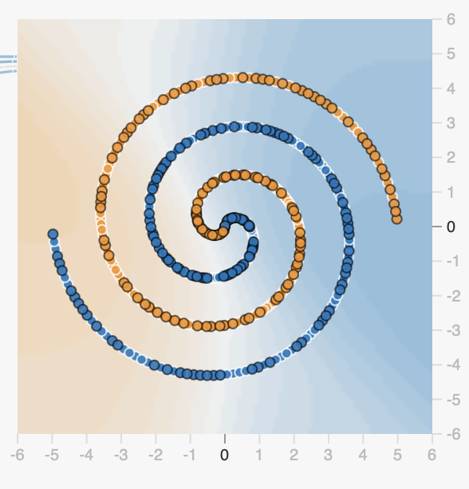

# Pattern Recognition Lab

This week's lab will explore pattern recognition abilities in artificial neural networks,
and draw parallels to pattern recognition abilities in humans and animals. 
For this lab, we will use the website [Tensorflow Playground](https://playground.tensorflow.org/#activation=tanh&batchSize=10&dataset=circle&regDataset=reg-plane&learningRate=0.03&regularizationRate=0&noise=0&networkShape=4,2&seed=0.13862&showTestData=false&discretize=false&percTrainData=50&x=true&y=true&xTimesY=false&xSquared=false&ySquared=false&cosX=false&sinX=false&cosY=false&sinY=false&collectStats=false&problem=classification&initZero=false&hideText=false).
Go to the link, and then use these instructions to orient yourself to what you can use this website to do.

Tensorflow Playground is a neural network simulator, 
where we are training a network to classify input experiences using supervised learning.
It is a **_classifier_** because we are training a neural network to respond +1 or -1 (yes or no) 
to an input represented by the activation of two different input sensory neurons (x1 and x2).
It is a **_supervised_** classifier because the way we are training it is by having it guess its answer to each input,
and then we are telling it the right answer, and it has to use this feedback to get better at making classifications
in the future.

## Tensorflow Playground Tutorial
Tensorflow Playground is very powerful.
It allows you to play with many different properties of neural networks and datasets.
It can be a little intimidating at first, but don't worry we'll walk you through it.
We will show you:
- how you can change the data a network is learning from
- the architecture of the neural network
- various other parameters about the network or learning algorithm that you can alter
that affect its performance

In this tutorial, you won’t need to understand any programming or calculus. 
We’ll focus on how to manipulate the controls and interpret what you see. 
Your goal is to understand how network structure and learning parameters change behavior.

Let's start with the data.

### Data
On the left side of the screen, you should see a column with the label data at the top. 
It shows four datasets, representing four kinds of classification learning problems.
You can click on the different pictures of datasets.
That will change the bigger picture on the right, showing you which dataset is activated.
Let's choose the bottom-left dataset, with a blue cluster in the bottom right, 
and an orange cluster in the top left.

In this dataset, each dot represents a different possible experience the network will have during training.
The x1 and x2 value of each dot represents the effect of that input on the network's two input neurons.
In this dataset, the inputs shown in orange tend to inhibit the two neurons, with average (x1,x2) scores of (-2,-2).
The inputs shown in blue tend to excite the two neurons, with average (x1,x2) scores of (+2,+2).
The colors of each dot reflect the feedback the neural network will be given about 
what the correct answer for the output was supposed to be.
A blue dot means the network is supposed to learn to respond +1, and an orange dot that it should respond -1.
So this dataset generally represents a situation where there are experiences from two categories that vary 
in two perceptual dimensions, but in a very simple way, with the blue category centered around (2,2), and the orange 
category centered around (-2,-2).

One important parameter we can vary in the playground is the noise of the dataset.
You should see a **_Noise_** slider below where you can click on the dataset.
The noise slider affects how much, on average, each data point differs from the category's (-2,-2) or (2,2) average.
When noise is low, the instances of the two categories do not overlap at all and are very easy to distinguish.
When noise is high, the instances of the two categories do overlap a lot, and it will be very hard for the neural network
to have perfect performance guessing the output value based on the (x1,x2) value.
For now, leave the Noise value to 0, reflecting a relatively easy, perfectly classifiable scenario.

The second property of the data we want to familiarize ourselves with 
is what is called the _**Ratio of Training to Test**_.
In supervised learning, one important principle is that we make a distinction 
between what we call the training data and the test data.
The train dataset is the data points the network sees and gets to learn from.
The test dataset is a different set of datapoints that follow the same generative rules 
(e.g., +1=(2,2) and -1=(-2,-2)) as the train dataset, but are different specific examples.
This distinction is very important, because it allows us to see how well the neural network will 
generalize what it has learned to new experiences that are not identical to those on which it has been trained.

In Tensorflow Playground, in the big image on the right, it is only displaying the items in the train dataset by default.
But below that big image, you can see a checkbox labeled "Show Test Data". 
If you click it, it will show you the test items as well.
Leave it unchecked for now, but we will return to this later.

### Network Architecture
Next we show you how the Playground allows you to change and inspect the network's architecture.
The playground shows you three types of units:
1) The Output
2) Features (the input units)
3) Hidden Units (the interneurons that can come between input and output).

**Output Layer**

The Output shows how the neural network's output unit will currently respond to any input that it is given.
Each item in the training dataset is displayed, with the dot's color showing that item's correct answer.

The background color of this output shows what the neural networks current tendency to respond to any input will be,
given its current weights. 
Where the background is blue, the network will respond +1; where it is orange it will respond -1. 
Where it is white, it is unsure and will respond 0.
Right now the network has random weights and hasn't learned anything, and so the background is probably 
mostly white, but may have patches of light blue or orange.

Above the output, you can see the "test loss" and "training loss".
A network's loss score is the average difference between its actual output activation values and what they should have been.
So a loss of zero means the output activation is always exactly what it should be (-1 or +1), and a loss of 1
means the network's outputs are exactly backwards of what they should be.
The loss score will be highly related to the model's classification accuracy in binary terms, but not identical.
A network could be directionally correct about every item, with a positive activation when the output should be +1,
and a negative value when the output should be -1. But if its scores were .8 and -.8, 
then it would still have a loss of 0.2. If it was at 0.99 and -0.99, it would still have a loss of 0.01.
A network's loss score is a good guide to how it is doing.

Right now, because of the random weights, it is probably close to random chance performance (≈0.50).

**Feature Layer (Inputs)**

The feature layer defines a set of input units that respond to the values of x1 and x2 in the dataset.

By default, there are two units activated, labeled X1 and X2.
These are units that respond non-linearly to the value of x1 and x2, using a function similar to tanh.
Tanh is a function like sigmoid. Its output is 0 when its input is 0.
Its output quickly approaches 1 as its input becomes positive.
Its output quickly approaches -1 as its input becomes negative.

This varies from sigmoid, whose output ranges from 0 to 1 instead of -1 to 1. 
But otherwise it is very similar.
This means that if x1's value is 0 (the value of x1 in the actual input is 0), then the input unit X1's value will also have a value of 0.
But as x1 becomes more positive, the value of the input unit will very quickly reach its maximum value of +1.
When x1=0.5, X1=0.8; when x1=0.8, X1=0.95; when x1=1 or 2 or 3 or anything greater, X1=1.

_Visualizing Activations_

You can see the X1 and X2 units are color-coded inside them. 
X1 is orange on the left and blue on the right.
X2 is orange on the bottom and blue on the top.

This reflects what we said about how those units work and what they respond to.
X1 only cares about x1, and is 1 when x1>0, and is -1 when x1<0.
That is why this unit is blue on the left and orange on the right, because each input's x1 value is
on the horizontal axis. And so X1 responds with +1 to (3,2) and also to (5,-2). 
X1 cares about the value of x1, and doesn't care about x2 at all.
X2 is the opposite, only caring about x2, which is reflected by each point's position on the vertical axis.

You can move your mouse over the X1 and X2 units.
If you do so, the Playground will change the background color of the output unit to be the same as the color
inside the specific unit over which you are hovering.
This can help you see how that particular unit is contributing to the network's final decision.

_Different Kinds of Input Features_

Tensorflow Playground also allows you to have input features that activate in different ways 
in response to x1 and x2, such as:
- squaring its value (meaning x1=-3 and x1=+3 would both lead to X1 being 9)
- having an input that is x1*x2, i.e., the product of x1 and x2
- having inputs that transform x1 and x2 sinusoidally, meaning that X1 will vary rhythmically 
between having a negative and a positive value as x1 gets more positive.
For now, we are going to stick with our two simple linear X1 and X2 input units.

**Hidden Layers**

Tensorflow Playground also allows you to create hidden layers, each with different numbers of hidden units.
You can create up to 6 hidden layers, with up to 8 neurons per layer.

By default, the page opens with a network that has two hidden layers, of size 4 and 2.
The playground shows you the current connection weight between each neuron in the network,
starting with the input units connecting to the first hidden layer, then the first hidden layers 
connections to the second hidden layer, and finally the second hidden layer's connections to the output unit.
At the beginning before training, each of these weights are random.
You can hover over each weight to see its actual value.
As with the unit activations, blue means positive and orange means negative.

The inside of each hidden unit is color coded as well.
The colors reflect how that unit's decision boundary is weighted function of its inputs.
You can see how this works by manually changing the weights of the network.
You can do this by hovering over the weight until you see the value, and then clicking on it.
You can edit the weights. The first part of the assignment will ask you to do this and explain what's
happening, and will help you understand how to interpret these hidden unit activations.

Before we go further, we want to make the network much simpler. 
Press the minus sign on the number of layers until there are zero hidden layers.
This will make the input units connect directly to the output unit.

### Training the Network
Now that we have a simple network and a simple dataset, we are ready to train the network.
There are three buttons at the top. There is a big play button.
To its right is a smaller "forward" button, and to its left a backward circle "reset" button.
The reset button resets the networks weights back to a random state.

The forward button trains the network for one epoch. 
The play button trains the network continuously for epoch after epoch until you press the button again.
An epoch (usually pronounced "eh-puck") means the network has seen every item in the training dataset.

If you press the forward button once, you will see the network's loss score go down to close to zero, 
its weights change, and the classification boundaries (the background color of all the units) change, 
as the network learns.

The way the network learns is through error-driven learning.
For each item, the network made its classification guess, by setting the activation of the output unit 
according to the forward propagation of the activation through the weighted connections.
The network was then told the right answer.
It computed the loss (error) of that guess (the difference between its guess and the real answer),
and used an error-driven learning like the Delta rule to adjust its weights to minimize its
error in the future to that item. 

For this architecture and training problem the network will very quickly get to 100% accuracy and zero loss
on all training and test items. Remember the loss will not totally zero unless the network has exactly outputs
of 1 and -1 in the correct situations. Outputs of 0.99 and -0.99 will lead to a loss of 0.01.
The background color will reflect a boundary in the output unit that classifies all inputs correctly.
The weights from X1 to Y (output) and X2 to Y will both end up positive (blue).
This is because the network will have learned that blue outputs tend to have positive values of x1 and x2.
So it learns to have a positive activation from X1 and X2 to Y.

### Next Steps
That does it for our tutorial. There are other things we can alter in the Playground,
like learning rate, activation function, batch size, and regularization.
We are not concerned with those for now. Let's move on to our questions.

You now know how to interpret the Playground’s visual language: 
how data, architecture, and learning interact. 
In the next part of the lab, we’ll use these same controls to explore why some problems 
are easy for networks—and others are not.

## Lab Exercises (Total: 80 points)

---

### Part 1. Understanding the Simple Network  — *8 points total*  
*Concept: Linear separability — what single-layer systems can and can’t learn.*

1. (3 pts) This simple neural network, with two inputs and one output, had no trouble learning this particular dataset.  
   Explain why this network succeeds, using the concept of *linear separability*.

2. (5 pts) You can change the network’s weights manually by moving your mouse over a weight and clicking on it.
Change the weights from X1 → Y and X2 → Y to the following values. 
For each (x1,x2) pair, explain how and why it changes the output unit’s classification boundary:  
   - (1, -1)  
   - (-1, 1)  
   - (-1, -1)  
   - (1, 0)  
   - (0, -1)

---

### Part 2. The XOR Problem  — *20 points total*  
*Concept: Nonlinearity and hidden layers — why some categories can’t be learned by a single-layer network.*

Choose the “XOR” dataset (the top-right dataset with diagonally opposite colors).  
Keep the network the same, but hit the **Reset** button to randomize the weights.  
Then press the **Train (Play)** button and let it run for a while.

1. (3 pts) Explain why this data represents an “XOR” problem.  
2. (3 pts) What is a real-world situation from your life that resembles this dataset?  
3. (4 pts) Describe and explain what happens to the single-layer network’s weights, decision boundary, and performance (loss).  
4. (5 pts) Now add one hidden layer with 4 neurons, reset the network, and train again.  
   Describe and explain what happens to the network’s weights, decision boundary, and performance (loss).  
5. (5 pts) Staying with a single hidden layer, repeat the experiment with 1, 2, 3, and 6 hidden units.  
   Reset the network between each experiment.  
   When does the network succeed, and when does it fail?  
   Explain what you observe in terms of our three interpretations of what a hidden layer does (from Lecture 2 of this module).

---

### Part 3. Learning Prototypes  — *16 points total*  
*Concept: Feature transformations and geometric representation.*

Now choose the “Circle” dataset (the bottom-right one with a cluster in the center and a ring around it).  
Reset the network, and set it back to a network with no hidden layers.

1. (3 pts) What is a real-life situation that this dataset represents?  
2. (3 pts) Can it learn to classify this problem without hidden layers? Why or why not?  
3. (5 pts) What is the simplest network you can find (fewest number of hidden layers and hidden units) that can learn this dataset?  
4. (5 pts) Why does it make sense that this network can solve the problem, but a network with no hidden units cannot?  
   Again, think about it in terms of our explanations of what hidden units do.  
   *Hint:* What is the relationship between the number of hidden units and the shape of the blue space in the output unit, and what does that tell us?

---

### Part 4. Generalization, Noise, and Overfitting  — *20 points total*  
*Concept: The tradeoff between flexibility and stability.*

Stay with the Circle dataset, and change the network to a single hidden layer with 8 hidden units.  
On the **Data** panel, change the *Noise* setting to **35%**.  
Under the output unit, check the box that shows the *Test dataset*.

Answer the first two questions before training the network.

1. (3 pts) What does “noise” represent, if we were thinking about this as a real dataset?  
2. (3 pts) What do you notice about the pattern of training and test items?  
   Describe how the distribution of items differs from when the noise was set to 0.  
3. (3 pts) Do you think the model with 8 units will be able to correctly classify the training and test items? Why or why not?  
4. (4 pts) Now train the model — for a long time (thousands of epochs).  
   What happens? Did the model succeed or fail on the training items? How about the test items?  
5. (3 pts) Your model probably did better on training items than on test items. Why?  
6. (2 pts) Now change the network to have only 4 hidden units, reset the network, and train again.  
   How did its performance compare? Was it better or worse?  
7. (2 pts) If performance differed, what is your best explanation for why?  
   If it did not differ, what is your best explanation for that outcome?

---

### Part 5. Generalization Outside the Training Distribution  — *16 points total*  
*Concept: Distribution shift and the limits of learned representations.*

Now choose the **Spiral** dataset and set the noise back to 0.  
In this dataset, there is clearly a spiral pattern that defines whether an item is blue or orange.  
Make sure the *Show Test Data* box is checked so you can see the test items.

Click the **Regenerate** button at the bottom of the Data column until you get a version where the **outermost loops** of the blue and orange spirals belong to the *test dataset* (you’ll see them as faintly colored points), like this:

1. (4 pts) Try to find a network that can accurately classify the *training data* for the spiral.  
   You may need many hidden layers or additional input features (e.g., x1², x2², x1×x2, sin(x1), sin(x2)).  
   It may also need to train for a while.  
   When you find one that works, describe your network: what input features, what hidden layer sizes, and roughly how many training epochs?  
2. (4 pts) At a general level, describe what you see happening in the classification space and the decision boundaries of the different units.  
   Do your best to explain it in terms of the three explanations of what hidden units do.  
3. (4 pts) Now consider the *test performance*. Based on the classification boundaries (the background color of the output unit), does the network correctly classify the test items at the furthest extent of the spiral?  
   Imagine extending the spiral even further. How would the network perform on those new, more distant points?  
4. (4 pts) What is your best explanation of this (probably poor) performance?  
   How is this an example of the network struggling to *generalize outside its training distribution*?

---

### Wrap-Up Reflection  — *Extra credit (Up to 5 pts)  
*Connecting it all together.*

1. (2 pts) Across all five exercises, what general pattern do you see in how adding hidden layers or noise affects generalization?  
2. (3 pts) What do these experiments suggest about how biological brains might represent complex perceptual categories?  

---

**Total: 80 points**