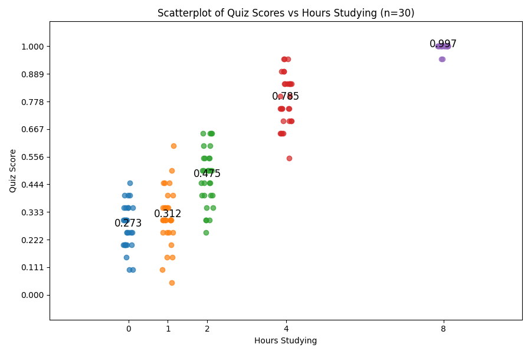

# Lab: An Experiment About the Effect of Studying

In this lab, we are going to look at the way scientists might go about creating a model of human behavior.
As an example, we are going to simulate a fictional study about how well people do on quizzes they take.
Some people do well on their weekly quizzes. Some people do poorly. 
Try to come up with a scientific explanation for the variation. 

First, a little bit of background. We can broadly divide up scientific research into two kinds of studies: Experimental
studies and Observational studies. 

**_Experimental studies_** are studies where we are manipulating some variable (or set of variables) and observing 
their outcome on some other variable or set of variables. 
We call the variables we are manipulating _**independent variables**_, and the variables we are observing the 
_**dependent variables**_.

In **_Observational Studies_**, researchers are not manipulating any variables. Instead, they are measuring different 
variables and often looking at relationships or correlations between variables. For this reason, observational 
studies are also sometimes called correlational studies. In observational/correlational studies, we are still sometimes
interested in looking at relationships between the variables, and trying to predict one or more variables from the 
values of other variables. In observational studies we typically call our variables predictor variables and outcome 
variables.

Predictor variables are like the independent variables in experimental studies, and outcome variables are like the 
dependent variables in experimental studies. But we typically use different words for the variables in experimental and 
observational studies. This is because the words _independent_ and _dependent_ carry with them the connotation of 
causation, which we _can_ study with experimental studies. The words _predictor_ and _outcome_ are more neutral about 
causality, which we _cannot_ firmly establish in an observational/correlational study.

So in this lab activity,  we will simulate a study that is looking at people's quiz performance.
Imagine we have a 20 question multiple choice test, with questions about basic neuroscience. 
A person's percent correct on a weekly quiz with 20 questions would be the dependent or outcome variable (depending on
whether the study was an experimental or observational study). 
And the things manipulated to affect, or observed to predict, the grade would be the independent or predictor variables.
With that in mind, let's jump into our activity.

## Part 1: First Impressions
1. What are some variables that you think might affect the outcome/dependent variable?
2. Describe an observational study to test the hypothesis that your variable predicts the outcome.
3. Describe an experimental study to test the hypothesis that your independent variable predicts the dependent variable.

## Part 2: Interpreting the Results
Now, imagine you run an experimental study where you assign participants to study for a particular 
number of hours (0, 1, 2, 4, and 8). You have 30 participants in each of those conditions. The results
of the study look like this:

1. Describe and interpret the results.
2. What is your conclusion from the study?
3. What are some limitations to the study? What are some ways you could overcome those limitations.

## Part 3: Creating a Linear Model
In science, we sometimes want to create mathematical models of our data to summarize and aid in the prediction of 
new data. For example, we might make a linear model y = mx + b, where:
- y is the score on the quiz
- x is the number of hours studied
- b is the y-intercept, (i.e. the score when number of hours studied is 0)
- m is the slope, the effect on y of each unit change in x (i.e. the change in score as a function of each hour of study)

1. Try to estimate a line for the data in our study. In a real study, we would do this using computers, but just eye-ball it.
Draw a line on the figure that "goes through" each cluster of points, trying to make the line go through the middle of the data
as much as you can. You can do this by pasting this figure into your lab report, and using the "add shape" feature of your word processor if you want.
Alternatively, literally print the image and draw a line, and then take a picture and add it to your lab report.
2. Once you have inserted a line, try to actually estimate its parameters (the slope and the intercept). Remember your algebra 1?
Pick the point on the line where x=0. What is the value of y there? That's the y-intercept (b). Then pick any other point and estimate its
x,y values. Then compute the slope as m = (y2 - y1) / (x2 - x1), where x1,y1 is your y-intercept, and x2,y2 is your other point. When you have both 
points, right your equation as y = mx + b, subbing in your values of m and b.
3. In everyday english terms, interpret the parameters of your model. Give a definition of what x, y, m, and b "mean". 
4. Is this a good model? Why or why not.
