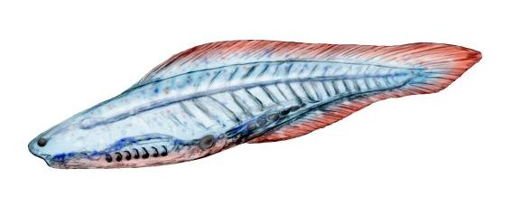
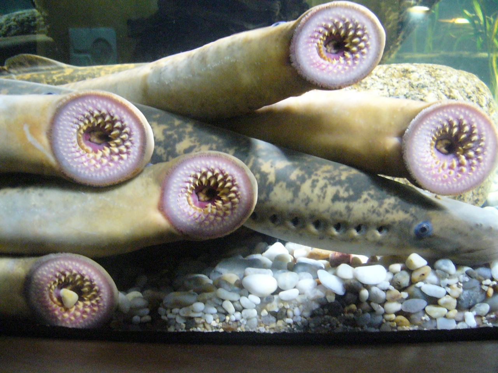
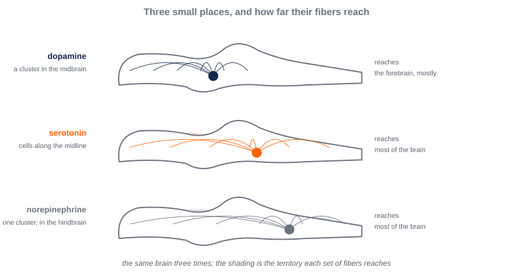
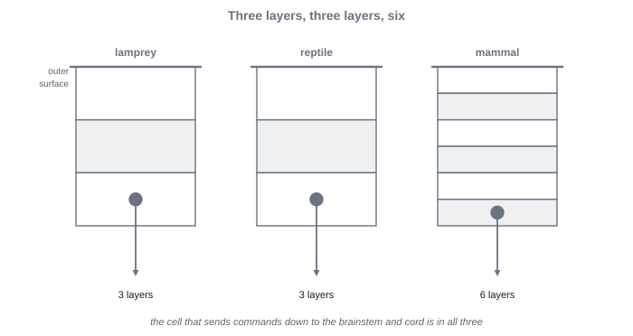
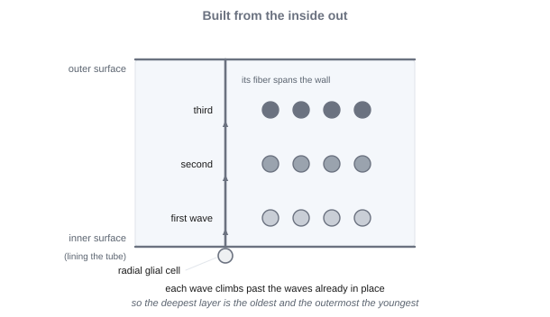
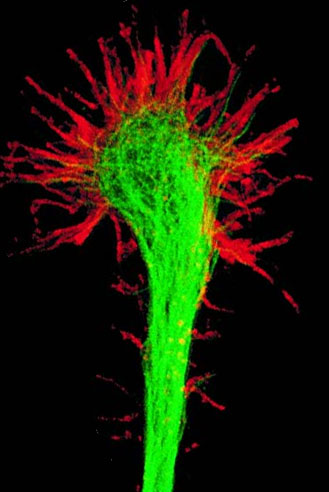

# 6. Vertebrate Neural Architecture

This module is about the parts a vertebrate brain is made of, and why there are parts at all. At the end of Module 5, one set of machinery was doing every job. A lamprey has a brain divided into pieces, most of which a human being also has, and it has had them for more than five hundred million years. While reading, look for the beginnings of answers to these questions:

- One mechanism that does everything is specialized for nothing. So which demands on an animal actually pull a single mechanism in two directions, hard enough that separating them is worth the trouble?
- Two jobs conflict. Does it follow that a nervous system will have two structures for them? What would settle that, one way or the other?
- Four kinds of learning were described in Module 5, and the vertebrate brain is said to have three structures for learning. Where did the fourth one go?
- Nothing in the basal ganglia is switched on to produce a movement. Every action is held back, and choosing is releasing one so that it can go. Why would a nervous system be built that way round?
- A brain has far more cells than a genome has genes to place them with. So how does a structure with this much detail get built without a plan that specifies it?
- Every capacity in this book now has an address. Why is having one so much less than an explanation?

By the end, we should have a working answer to each one. We will also find the three levels behaving differently from one another for the first time: one of them standing almost still while another is rebuilt repeatedly on top of it.

---

A sea lamprey looks at first like an eel. It is long and slender, with no paired fins. It swims by sending a wave down its whole body, similar in some ways to the way a nematode moves. The difference between a lamprey and an eel is at the front. A lamprey has no jaws. In place of a jaw, it has a round sucking disc lined with small, hard teeth. An adult sea lamprey feeds by fastening that disc to the side of a larger fish and drawing off its blood.

Lampreys and hagfishes are vertebrates. A vertebrate is an animal with a skull and a backbone, or at least the beginnings of a backbone. All other fish, amphibians, reptiles, birds, and mammals are vertebrates too. But lampreys and hagfishes are the only jawless fishes still alive. Their branch was the first to separate from the rest of the living vertebrates, more than 500 million years ago. Living lampreys are not ancestors of anything. They are modern animals, and their lineage has been evolving for exactly as long as the lineage that led to human beings.

But a lamprey and a human being do share a common ancestor, the last animal from which both lineages descend. A part that both of their brains have was most likely present in that ancestor. A part the human brain has, and the lamprey’s brain lacks, most likely arose after the split, on the human side. So a lamprey gives us clues about what the brain of that common ancestor was like. And most of the parts that a human brain is organized around are already present in a lamprey’s brain. One part is conspicuously missing.

Why those parts matter goes back to a problem we left open at the end of Module 5. We had described four kinds of learning. All four run on one principle, in the same kind of tissue, wherever there are synapses. They all use a principle general enough to be reused anywhere. But for that very reason, it is specialized for nothing. A nervous system that does everything in one place may not be very good at any one thing. And it may struggle to do two incompatible things at once.

Dividing the work requires something to divide. The nematode of Modules 4 and 5 has 302 neurons in its whole body, and its nervous system offers little to divide. An animal with vastly more neurons can set some of them aside for one job and others for another. Whether that is ever the better arrangement is not obvious. Separate parts need wiring between them. They also need some way of settling what happens when they disagree. So the first question is, when are separate structures favored at all, and why ?

<!-- pin: t-levels-architecture -->

: Marr’s three levels, the question each asks, the discipline that asks it, and this module’s example. {#t-levels-architecture}

| Level | The question it asks | Discipline | This module’s example: a brain divided into parts |
|---|---|---|---|
| Computational | What problem is being solved, and why does solving it matter? | Evolution and ecology | The demands on a nervous system when an animal must do many things at once, and some of them conflict |
| Algorithmic | What is represented, and by what procedure? | Cognitive psychology and AI | How the labor is divided: what each structure does differently, and how one action is chosen when several are proposed |
| Implementational | By what physical means, and at what cost? | Neuroscience | The parts of the vertebrate brain, and how an embryo builds them |

## §6.1 — Computational: Why Build Specialists

### §6.1.1 — The Quiet Seafloor

The first large fossils that include animals come from the Ediacaran period, which began about 635 million years ago. Before then, nearly all life was single cells, and what survives of it is mostly the traces of microbial mats. The Ediacaran seafloor held something new: bodies big enough to see, some of them up to a meter long .

Paleontologists divide the Ediacaran fossils into three assemblages, one after another. The oldest, from about 575 million years ago, formed in deep water, too dark for photosynthesis. Its organisms were anchored in place and shaped like fronds, and some of them may not have been animals at all. The second, from about 560 million years ago, lived on shallow seafloors carpeted with microbial mats. Its fossils include animals that could move. *Dickinsonia*, flat and oval like a bath mat, grazed on the mat and then moved on, leaving a row of faint body-shaped impressions behind it. *Kimberella*, probably related to mollusks, scraped the mat as it crawled. The third assemblage, at the end of the period, is quieter again. The crawlers disappear, and no one knows why.

Many of these bodies look like nothing alive today, so it was long unclear whether any of them were animals. In 2018, researchers found fossils of *Dickinsonia* that still carried traces of cholesterol, a molecule that is a hallmark of animals. At least some of the Ediacaran organisms, then, were animals.

The same shallow seafloors preserve the first trails that head toward something. Tracks left by small burrowing animals run to the bodies of other animals, including *Dickinsonia*, and stop there. These tracks are the earliest fossil evidence of scavenging. They are also the first physical trace of movement aimed at something the animal sensed, the kind of aimed movement we followed in Module 4.

What the Ediacaran lacks is as telling as what it does have. There are almost no signs of predation. There are no half-eaten bodies, and no claws, spines, or shells. Even where many animals are packed together on one surface, they do not seem to have had much to do with each other. Food lay still on the seafloor, and nothing was hunting. An animal in that world faced a small control problem. It had to find food that did not move, but it didn’t have to worry about trying to escape.

### §6.1.2 — The Cambrian Rupture

The Cambrian period began about 540 million years ago, and its fossils look like a different world. Over what is, geologically, a short stretch of time, a great diversity of different animals appeared, in what is sometimes called the **Cambrian explosion**.

These new animals appeared with hard parts: shells, jointed legs, claws, and eyes that form images. Arthropods, the group that today includes insects, crabs, and spiders, led the change. An arthropod’s skeleton is on the outside of its body, and it does more than protect. It gives the muscles a rigid frame to pull against, so that the movements of many jointed parts can be organized and repeated. Arthropods also had claws, and image-forming eyes to aim them. *Anomalocaris*, a swimming predator with a pair of grasping limbs at its front, and *Opabinia*, with five eyes and a long clawed snout, are the animals most often used to picture the period .

{#f-early-animals alt="A two-by-two grid of pictures. Top left, a photograph of a flat, rounded fossil impression in pale sandstone, with fine ridges running outward from a groove down its long axis like a ribbed bath mat. Top right, an oval, soft-bodied animal seen from above, with a humped back and a frilled edge. Bottom left, a color illustration of a segmented, flattened swimming animal with overlapping flaps along each side, two large stalked eyes, and two curved spiny limbs extending forward from beneath its head. Bottom right, a small segmented swimming animal with flaps along its sides, five stalked eyes on top of its head, and a long flexible snout ending in a grasping claw."}

In the Cambrian period, animal bodies were changing dramatically, and the change that matters most for nervous systems is a sequence. On the Ediacaran seafloor, animals moved slowly toward food that lay still. Once several animals were after the same food, moving faster helped. The boundary between scavenging and predation is blurry, since sometimes the easiest food to find is another living animal. And once animals were hunting each other, better senses and faster movement helped the hunted, as much as the hunters. In Module 3, we called this a predator–prey arms race. What is new is where the race started: with food that stopped lying still. Other animals became some animals’ main source of food, but also one of their biggest threats .

{#f-vertebrate-timeline alt="A horizontal time axis running from about 650 million years ago on the left to the present on the right. Shaded bands mark the Ediacaran period and the Cambrian period. Point marks along the axis are labeled, in order: first vertebrate fossils, in the early Cambrian; first jawed fishes; most jawless fishes gone; first four-limbed vertebrates; first mammals. A line for the jawless fishes that survive, the hagfishes and lampreys, continues to an arrowhead at the present."}

Why the Cambrian explosion happened when it did is still argued. Rising oxygen, changes in ocean chemistry, and the new ecology of predators and prey have all been proposed. Some researchers doubt that it was an explosion at all. On their view, animals had been diversifying for a long time, and the Cambrian is when they began building hard parts that fossilize well. Either way, the animals of the early Cambrian lived in a world the Ediacaran animals never faced.

### §6.1.3 — What the Cambrian Asked of a Nervous System

A nervous system in the Cambrian world faced demands it had not faced before. Three stand out.

The first new demand of Cambrian animals is that senses became arrays. An image-forming eye is not one sensor, but a sheet of many. And what mattered was not just that animals had an array of sensors, but how the sensors were arranged. Where on the sheet of sensors a spot of light lands says where in the world its source is. A patch of skin covered in touch receptors works the same way. But the arrangement carries information only if something downstream can use that information. Is there a system for comparing neighboring receptors, finding edges, and following a shape as it moves across the sheet? A thousand receptors wired to a single cell would tell the animal little more than one receptor could. So an array is useless without processing given over to understanding it.

The second new demand of Cambrian animals is that a moving animal has to tell its own doings from the world’s. The problem itself is not new. Any animal that moves changes what its own senses report, and the worm of Modules 4 and 5 faces a version of it. What changed in the Cambrian was the scale. A slow animal with a simple body produces a trickle of self-caused signals. A fast animal with jointed limbs, a head that turns, and eyes that sweep across a scene, produces a flood of them, from many parts of the body at once.

Self-caused signals come from nearly everything a moving animal does. Swimming makes water rush past the body. Turning the head sweeps the whole visual scene across the eyes. Brushing a rock with a limb stimulates the same receptors that a predator’s touch would. Every movement floods the senses with signals the animal caused itself. Those have to be separated from the signals the world caused. The problem is also an opportunity. An animal that acts on the world can poke at it, and see what comes back, which is a way of finding things out that a motionless animal lacks. How nervous systems separate self-caused sensation from the rest is a question we take up in Module 8.

The third new demand of Cambrian animals is that the demands arrived together. A Cambrian animal had to find food, watch for predators, keep its body upright and moving, and keep its heart and gills working. They had to do these things all at the same time. Each of those jobs sends the nervous system its own stream of signals. Each calls for its own kind of response. And much of the time, several of them call for a response at the same moment.

So the question about a Cambrian nervous system is not whether it can meet one of these demands. The worm of Modules 4 and 5 meets a few of them, one at a time. The question is what kind of nervous system can meet all of them at once.

### §6.1.4 — When One Mechanism Cannot Do Two Things

In Modules 3 to 5, we asked why a signaling cell, a circuit, and an adaptable circuit would each be favored. The same question can be asked of an arrangement of parts. Why would an animal build separate structures, rather than one general mechanism that runs everywhere?

The answer starts from a simple observation. Some pairs or sets of demands pull a single mechanism in opposite directions, so that improving it for one makes it worse for others. Three of them matter for a Cambrian animal.

The first pair of competing demands is between the demand to *keep going*, and the demand to *change course*. Breathing, the heartbeat, and the posture that keeps a swimming body upright cannot stop, not even briefly. Behavior, meanwhile, switches constantly: toward food, away from a shadow, into a crevice. A mechanism that switches easily is easy to interrupt. And a mechanism that is hard to interrupt is slow to switch. One mechanism doing both jobs has to compromise between them. Two mechanisms, one that runs steadily, and one that switches, avoid that particular compromise.

The second set of competing demands is the demand to *choose one action when several are called for*. The need to choose is not new. In Module 4, we listed it among the demands of steering, the need to *sharpen and commit*. A steering animal needs to turn a near-tie into a clear difference, and collapse many competing votes into exactly one action. In the worm, two groups of motor neurons that inhibit each other were enough to do it. But the worm’s choices were few. What changed in the Cambrian was the number of proposals competing at once, and the number of parts of the body they came from.

A fish cannot turn left and right at the same moment. Yet at almost any moment, some part of the animal is proposing a movement. The eyes move toward something bright. The nose is moved toward a smell. The skin moves away from something touching it. If every proposal drove the muscles directly, the result would be a tug of war between half-made movements. Something has to compare the proposals and let only compatible movements proceed at the same time. That job conflicts with the job of making proposals in the first place. A part that proposes a turn toward food is working well when it proposes strongly. The comparison has to be made in a way that is not biased toward any one proposal.

The third pair of competing demands is a trade-off in learning we encountered in Module 5: the trade-off between *plasticity* and *stability*. Some things an animal learns should be kept for good, like the look of a predator. Others should be updated constantly, like where food was a moment ago. A mechanism that learns quickly also overwrites quickly, and one that keeps what it learned is slow to learn anything new. Managing these two demands is a serious challenge.

In Module 5, we also said that a computational problem earns its own name when it changes what a solution must have, not when it is merely a harder example of the same problem. The same logic can be applied to the parts of a nervous system. When two problems demand incompatible things of a solution, one natural answer is to give each problem its own structure, rather than ask one structure to compromise.

It is worth being careful about what kind of claim that is. The demands themselves are computational facts about a Cambrian animal’s world. The animal must keep breathing while it changes course. It must end up doing one thing when several are proposed. And it must keep some of what it learns while updating the rest. Those demands exist for any animal in that world, however its nervous system is built. Separate neural structures are one possible answer to those demands, one kind of algorithmic and implementational solution to the problem. They are not the only possible answer.

One alternative is to solve competing problems within a single, richly interconnected network that meets many demands at once. In a network like that, each demand acts as a soft constraint, pushing the network’s activity toward some states and away from others. The network settles into the state that best satisfies all of the constraints together. On this view, which researchers call *constraint satisfaction*, a compromise is not a failure. When the constraints are weighted well, the compromise is the solution. A single network can also keep two demands from interfering, by giving them patterns of activity that overlap very little, even though the same neurons carry both.

Each answer has strengths and weaknesses. Separate structures keep two jobs from interfering, and each structure can be tuned to its own job. But separate structures need wiring between them and something to coordinate them. And they cannot easily share what each has learned. A single structure shares everything it learns, and it can weigh many considerations at once. But its demands can interfere with one another, and settling on an answer can take time. Real nervous systems also sit between the two extremes. A region can lean toward one job while sharing inputs and connections with its neighbors. And some specialization emerges through learning and development, rather than being laid down in advance.

So whether a nervous system separates two jobs into two distinct structures is not settled by the argument that it would be good if it did. It is an empirical question, answered by looking at anatomy, physiology, and behavior.

For the structures we discuss in this module, the evidence of real separation is strong. It is clearest for choosing among actions, where vertebrates have a distinct circuit that has been conserved since before the lamprey’s lineage split from the lineage leading to mammals. Even those structures are densely connected to one another, and work in loops. So at the scale of the whole brain, behavior still comes from many constraints combined at once. And the debate cuts both ways. For the problem of stability versus plasticity, researchers from the constraint-satisfaction tradition themselves argued that two interacting learning systems were needed, one that learns quickly and one that learns slowly.

The argument about conflicting demands has one more limit. It is not a claim that every division in a brain was favored for a reason. Some features of brains are side effects of something else. In ray-finned fishes, for example, the front of the brain develops folded outward rather than inward, apparently because the larvae’s large eyes leave too little room inside the skull. Nothing about the folding itself seems to have been favored.

### §6.1.5 — What Specialists Cost

Separate structures are not free. Neural tissue is expensive to run. In Module 3, we saw that an adult human brain is about two percent of body weight but consumes about twenty percent of the body’s oxygen at rest.

A newer finding concerns where that cost comes from. In the mammals where it has been measured, from mice to monkeys to human beings, the energy a brain uses rises in step with its number of neurons. Each neuron costs roughly the same to run, whether it is large or small, and whichever brain it belongs to. So the cost of a brain is set mainly by how many neurons it has, not by how much it weighs. Adding a specialist structure usually means adding neurons, and each added neuron adds to the bill.

Those measurements all come from mammals. Nobody has measured the cost per neuron in a lamprey or a Cambrian fish, and applying the mammalian result to them is our inference, not a finding. But it is a reasonable inference, because much of what makes a neuron costly is the same in every animal that has neurons. After every signal, ions have to be pumped back across the membrane.

Separate structures also raise two problems that are about more than energy. One is wiring. Structures that exchange signals need connections between them, and connections take up space and add delay, the more so the longer they are. The other is coordination. Specialists that each do their own job can each produce an output at the same moment, and something has to settle which output wins. Both problems have an energy side as well, since wires and the circuitry that settles a conflict are made of neurons, and neurons are billed one by one. But both also cost space and time, which no amount of energy buys back. Both shape where the specialists end up in the body, and how they are made to agree.

### §6.1.6 — A Body That Moves as One

Another question we could ask about brains is why the specialized systems sit together in one organ, instead of being spread through the body where the jobs are. For example, a lot of a human body’s touch sensation and muscle are not in the head. So why not put systems for controlling them closer to where that information is needed?

If a brain were designed from scratch for the job, that might be the arrangement. But that is not how evolution works. Natural selection describes the process by which differences that are more fit are more likely to lead to survival and reproduction. This means evolution is stuck building from what came before. And the evolution of the human brain started from a progenitor that was something a lot more like a lamprey or a fish. And the shape of a fish helps us understand why all the specialized parts of a brain are in one place.

Think about a fish’s shape. It has no arms, claws, or tentacles to act with separately. Nearly everything a fish does is done with the whole body. A fish turns, it darts forward, it strikes prey, it escapes. Its nervous system is organized around a single body acting as one, and it is centered in the head, between the eyes. The octopus of Module 2 is a useful contrast, since each of its arms carries a large share of its neurons, and runs much of its own control. Unlike an octopus, nothing in a fish’s body works that independently.

In Module 4, we followed the bilaterians to a point where neurons had gathered at the front of the animal, near the senses, into fewer and larger clusters. The vertebrate step goes from gathering to differentiation. The same concentration of neurons at the front is divided into distinct parts, each specialized for some jobs more than others .

{#f-gather-then-divide alt="A row of simple animal outlines seen from above, each with its nervous system drawn in dark lines. Toward the right, the nervous systems concentrate more and more at the head end into a few clusters. The last outline, a fish, has a single brain at the head end divided into several regions shaded in different colors, joined to a cord running down the length of the body."}

Two things favor putting those parts in one organ. Specialists that constantly exchange signals are better off close together, because short connections take less space and carry signals sooner. And when specialists propose competing actions, the proposals have to meet in one place to be compared, before one of them is chosen. The arrangement suited a fish, and later vertebrates inherited it. Limbs that can be moved independently came much later, and they are still controlled from the same kind of brain, centered in the head.

The senses feeding that organ came as a package. Early fishes had good camera eyes, and the old chemical senses of smell and taste. They also had a sense with no close equivalent in human beings. The **lateral line** is a line of small sensory organs running along each side of a fish’s body, which respond to movements of the surrounding water. It works like touch at a distance. A fish can feel the water displacement caused by another fish that passed by minutes earlier. And like every other sense in a moving animal, the lateral line has to separate the fish’s own disturbances from the world’s. Its nerves include fibers that turn the sensory signal down when the fish’s own swimming is making the disturbance.

### §6.1.7 — Slivers in the Sea

Among the animals of the early Cambrian were the first vertebrates. A **vertebrate** is an animal with a skull and a backbone, or at least the beginnings of a backbone. The earliest vertebrates did not rule the seas in which they swam. They were a few centimeters long, slender, and toothless. They were most likely prey for the arthropods around them. The oldest fossils that most researchers accept as vertebrates come from early Cambrian rocks in southern China, and belong to animals named *Haikouichthys* and *Myllokunmingia* .

{#f-haikouichthys alt="A color illustration of a small, slender, fish-like animal with no jaws and no paired fins, a low fin running along its back, a row of gill openings behind a small head, and a pair of eyes at the front."}

These animals had a stiff rod running along the back, the **notochord**. They shared it with their closest invertebrate relatives. And in most later vertebrates, it is largely replaced by the backbone. What was new was the head. Worms and insects have heads too, and in Module 4 we followed neurons gathering at the front of a bilaterian, alongside the senses. So having sense organs and neurons concentrated at the front was not itself new. What is distinctive about the vertebrate head is the particular package: paired camera eyes, a nose, ears, and a front end of the nervous system enlarged to serve them, all enclosed in a braincase or skull. The anatomists Carl Gans and Glenn Northcutt called that package a *new head*.

Much of that new head is built by a population of cells that only vertebrates have in full, the **neural crest**. In the embryo, these cells form along the edges of the developing nervous system. Then they leave it and migrate through the body. They become cartilage and bone of the face and skull, pigment cells, and most of the nerve cells that lie outside the brain. Invertebrate relatives of the vertebrates have cells with some of these features, but only vertebrates have the full set.

The vertebrates that came after grew larger. From the Ordovician period onward, beginning about 485 million years ago, jawless fishes up to a meter long carried plates of bony armor. Some looked fearsome, but they had no way to bite. They probably fed by scooping, sucking, or filtering. Jaws evolved more than 420 million years ago, building on the supports of the front gills. By around 360 million years ago, jawed fishes had diversified, and most jawless fishes were gone. Today only two lineages survive, the hagfishes and the lampreys.

It is easy to read *vertebrate* as another word for *complex*. It is not. Octopuses and honeybees are not vertebrates, but they are quite complex. In Module 2, we warned against reading the tree of life as a ladder with human beings at the top. The first vertebrates were small prey animals in a sea full of very complex and very formidable arthropods.

### §6.1.8 — The Lamprey, and the Parts of a Vertebrate Brain

The lamprey belongs to one of the two jawless lineages that survived . What a lamprey’s brain shares with a mouse’s brain is our best evidence for what the brain of their common ancestor contained. So the lamprey’s brain is the place to meet the parts of a vertebrate brain for the first time .

{#f-lamprey alt="A photograph of several eel-like fishes with smooth mottled skin, attached by the fronts of their heads to aquarium glass, so that the round mouth discs face the viewer. Each disc shows concentric rings of small pointed teeth around a central opening. One animal lies across the middle of the picture in side view, with a row of small round gill openings behind its head and a small eye."}

{#f-lamprey-brain alt="A side-view line drawing of a small, elongated brain, with the front at the left. A narrow cord extends to the right as the spinal cord. Moving left, labeled regions are the hindbrain, then the midbrain with a rounded roof labeled tectum, then the forebrain. Within the forebrain, labels point to the hypothalamus at the bottom, the thalamus above it, the basal ganglia inside, and the pallium forming the top surface. A bracket spanning the hindbrain and midbrain is labeled brainstem. Behind the midbrain, a dashed empty outline is labeled as the place where a cerebellum sits in jawed vertebrates, with the note that a lamprey lacks this form."}

A vertebrate nervous system has a long tail end and a swollen front end. The tail end is the **spinal cord**, a cord of neural tissue running along the back, which carries signals between the brain and the body and runs some movements on its own. At its front, the cord widens into a brain with three main divisions.

The **hindbrain** is the rearmost division, continuous with the spinal cord. It controls the jobs that keep an animal alive, such as breathing and the heartbeat. The **midbrain** lies in front of the hindbrain. Its roof is the **tectum**, which holds a map of the space around the animal, built from what the eyes and other senses report, and turns the head and eyes toward what appears there. The tectum is where, in Module 2, most of a frog’s visual input went. Together, the midbrain and hindbrain form the **brainstem**, the stalk that connects the spinal cord to the front of the brain.

The **forebrain** is the front division, and it holds several structures with distinct jobs. At its base, the **hypothalamus** keeps the body’s internal conditions, such as temperature, water, and energy, near their set points. It drives the animal to act when they drift. Above it, the **thalamus** relays signals from the senses into the roof of the forebrain, and carries signals back out. Deep in the forebrain, the **basal ganglia** are a group of connected clusters of neurons that determine which of the actions being proposed at a given moment is released, and which are held back. The roof of the forebrain is the **pallium**, a sheet of neurons that receives signals relayed from the senses and sends commands down to the brainstem and spinal cord. In a lamprey, the pallium is thin and has three layers. In mammals, the same structure grew into the six-layered **neocortex**, which makes up most of the mammalian brain by mass.

One structure found in every jawed vertebrate is missing from the lamprey, at least in the form jawed vertebrates have it. The **cerebellum** is a large structure attached to the back of the hindbrain, which in jawed vertebrates adjusts movements by learning from their errors. Lampreys and hagfishes do not have a cerebellum like that. A study published in 2026 found a small region in the same place in the lamprey’s brain, containing cells much like some of those in a fish’s cerebellum. But the region lacks the layered structure and the characteristic cells of a jawed vertebrate’s cerebellum, and whether it counts as a simple cerebellum is still debated. Either way, the cerebellum that jawed vertebrates have arose with, or shortly before, the jawed fishes, after the lamprey’s lineage had already separated from theirs. That is the conspicuous absence in the lamprey’s brain.

A lamprey’s brain is not a rough draft of a mammal’s. In recent experiments, stimulating a lamprey’s pallium made the animal move its eyes, its mouth, or its body, much as stimulating the corresponding part of a mammal’s neocortex does. And its basal ganglia match a mammal’s almost connection for connection.

The job description we have given for each of these structures is a first approximation. Every one of these structures does more than one thing, and most of what an animal does involves several of them at once. We say more about what each of them does in §6.2, and a great deal more in §6.3.

### §6.1.9 — New Structures, Old Parts

Vertebrates did not invent approaching and avoiding. They did not invent arousal, internal states that outlast their causes, learning from reward, or choosing one action over another. We saw every one of those in Modules 4 and 5, in animals far simpler than a lamprey. What vertebrates added was structures specialized for them. They have parts of the nervous system given over largely to one kind of job, assembled at or near the origin of the vertebrates, and kept in every vertebrate lineage since.

The structures were new. The material they were built from was not. The genes that mark positions along the body from head to tail, the kinds of cells that neurons are, and the ways cells divide, move, and connect, were all present in the invertebrate relatives of the first vertebrates. The neural crest is the clearest case. A cell turns into cartilage, or into a pigment cell, by switching on a particular set of genes. Those sets of genes are old. So is the set that marks the border of the developing nervous system, which is where crest cells come from. The invertebrate relatives of vertebrates have all of them. What vertebrates added is a further set of genes that links the two. It switches on in cells at that border, starts them migrating through the body, and then lets one of the older sets take over wherever they end up. A new population of cells was assembled mostly out of old instructions.

The vertebrate brain added new structures, built from old parts.

## §6.2 — Algorithmic: The Division of Labor

### §6.2.1 — The Wrong Question

Now that we have named the parts of a vertebrate brain, the obvious next question is what each part is for. The question turns out to be harder than it sounds, and the evidence does not answer it cleanly.

Recordings find the cerebellum and the basal ganglia active during movement. They also find both active during perception, during planning, and during thought. Damage to either one affects more than movement. And when researchers record from a small piece of one of them, what they find tends to resemble the stretch of pallium that piece exchanges signals with. A structure whose activity looks like whatever it is wired to is not telling us what it is for.

The reasoning being attempted here has a name. Going from “this region was active during the task” to “therefore, the task involved the process that region does” is **reverse inference**. We first encountered the problem in Module 2, where it arose for brain imaging: a region that becomes active during fear becomes active during a great many other things as well, so its activation is weak evidence that fear was what mattered. We encountered it again in Module 5, where it arose for a mechanism rather than a region. The coincidence detection and the gating that change a synapse during learning also wire a nervous system during development, so finding the mechanism at work does not establish which job is being done. Now we see the same problem arise with regard to defining brain function. A region that is active during many different things licenses very little on its own. And the structures of this module are active during many different things.

The neuroscientist Kenji Doya proposed a different question. Ask not what each structure does, but how each one learns. Each structure would then be specialized in a method, rather than in a job. That is a *division of labor*, an arrangement in which different parts of a system take on different work, rather than each part doing everything.

The change of question is worth pausing on, because of where it sits among Marr’s three levels. The computational level has been clean so far in this module. The demands of the Cambrian world are facts about what an animal had to manage, and they hold whatever its nervous system is made of. The other two levels are harder to keep apart once the parts have names, because naming a part is already half an answer about implementation.

We can use a test to help keep the algorithmic and implementational levels distinct. A claim is algorithmic if it would hold of a system built out of something else entirely. A claim is implementational if it turns on which cells are involved, what chemicals they use, and where they sit. *Hold every action back, and release one* is algorithmic. A robot could work that way, and so could a simulation. *The basal ganglia do it with dopamine and two opposed pathways* is implementational. Most of what follows is the first kind of claim, stated over parts named in the second.

### §6.2.2 — Two Levels of a Single Change

In Module 5, we sorted four families of learning by a single question. What has to reach a synapse, before the synapse will change? But we also pointed out that knowing what a weight change requires says nothing about whether an animal has any way of delivering that information. Doya’s proposal helps provide this information for biological systems, naming for each family the place in a vertebrate brain where the required information actually arrives .

We have one point of caution before going through them. Two different things get called learning that we want to keep distinct. A *family of learning* is usually named for what the whole animal ends up able to do: find food, keep its eyes on target, avoid what hurt it last time.

The change itself happens at individual connections, and a single connection cannot be told what the animal should have done. This is because a single synapse doesn’t have a way to understand the meaning of anything that complex. Whatever reaches a synapse has to be about its own inputs and its own output. So each family of learning is a pairing: an animal-level problem, and the particular information that has to turn up at a synapse for it to contribute in solving the animal-level problem. The anatomical question is about the second half of the pairing. To ask where reinforcement learning happens, is to ask where the machinery is that gets a verdict delivered to the synapses that produced the action.

{#f-three-systems alt="Three panels side by side, each showing one brain structure as a simple circuit diagram with arrows for its inputs and outputs. The first panel, the cerebellum, has a single arrow labeled error signal entering from a source below it, alongside a very large bundle of ordinary inputs. The second panel, the basal ganglia, has a single broad arrow labeled reward signal spreading from a small cluster of cells below onto the synapses where its inputs arrive. The third panel, the pallium, is drawn as layers with many arrows running between and within them, and has no incoming teaching arrow; a caption line beneath it reads no teaching signal."}

### §6.2.3 — Learning Without a Teaching Signal

*Unsupervised learning*, the family we called Hebbian in Module 5, needs nothing but the two cells a connection joins. What an animal gets out of a rule that local is worth working through. Take the case from Module 5: a rat, a tone, and food arriving a moment later. Food already produces a response without any training. This means the cells driving that response are firing when the food arrives. The cells carrying the tone contact those same response cells, and they are firing at that same moment. Both ends of the tone connection are therefore active together, which is the entire condition Hebb’s rule requires. So the tone connection strengthens. Enough pairings, and the tone alone will drive the response. That is classical conditioning. It is *unsupervised*, because nothing in the rat had to “know” that the tone predicted food, or that any learning was going on.

Notice also what the mechanism makes of a definition from Module 5. An unconditioned stimulus is one that already produces a response without training. At a synapse, this is the requirement that matters. Something has to make the postsynaptic cell fire, or there is no co-occurrence to detect, and nothing changes. Run the same rule across everything an animal senses, and its connections come to mirror which things in its world turn up together. This is why learning what goes with what, and learning the statistics of the input, are one event described at two levels. Module 5’s stated limits on Hebb’s rule arrive along with the mechanism. The same rule also strengthens the connection carrying the sound of the ventilation fan that happened to be running. And the blocking result showed that *actual* conditioning only tracks what was not already predicted. A rule that learns about co-occurrences in the world is the beginning of an account of conditioning, rather than the whole of one.

Because nothing other than local information has to be delivered, no extra circuitry or structures are needed to deliver it. Co-occurrence-sensitive synapses are found throughout a vertebrate brain, rather than in one structure. Despite coincidence detection occurring everywhere, Doya still singles out the pallium as a place where unsupervised learning is particularly important. This is not because coincidence detection only occurs there, but that nothing *else* arrives there. The pallium is layered, heavily recurrent, receives information from everywhere, and has no dedicated teaching pathway that anyone has found. What it has to learn from is the statistics of its own input.

### §6.2.4 — Learning from an Error, Output by Output

*Prediction learning* needs the next input, which the world delivers on its own. Take a rabbit, a tone, and a puff of air delivered to the eye a quarter of a second later. The rabbit predicts the puff of air when the tone occurs, and can learn to respond by closing its eye at just the right time, so that the eye is closed when the puff arrives. What had to be learned was not whether to blink, but exactly when. There is no “teacher” to tell the rabbit when to blink, as would be the case in supervised learning. Instead, the rabbit must learn through prediction learning.

The situation shares something in common with unsupervised learning: a tone followed by another event in the world. At the animal level, both are classical conditioning. What differs is what had to change. For unsupervised learning, an association between two events, which a co-occurrence rule can deliver. For prediction learning, the timing of one output, which it cannot.

But the puff itself provides the information the rabbit needs. Blink too soon, or too late, and the puff lands on an open eye. The information from the puff is specific, because it reaches the cells whose output determines the blink, and it tells those cells that their own timing was wrong. The cerebellum is the brain structure that is built to receive exactly that information. Each of its output cells gets, alongside roughly two hundred thousand ordinary inputs, a single climbing fiber from one source. And that fiber’s firing reports the error for that cell in particular. One fiber, one cell, one instruction. Silence the climbing fibers, and the learned blink never develops.

Notice what an error delivered cell by cell requires. An animal watching a leaf drift past is also predicting what it will see next, and nothing in that prediction involves an output. There is no command that can be wrong. And this means there is nothing for an error addressed to a commanding cell to be about. Predicting the next sensation happens inside the pallium’s own recurrent circuitry, from the statistics of what arrives, with no signal delivered from anywhere. Which is why the sorting is by what has to be delivered rather than by what is being computed. Predicting the next sensation requires nothing to be carried between structures, because the prediction and the input that tests it are already in the same tissue. Predicting the outcome of a movement does require it, because the cells that issued the command are not the cells that find out how it went. The cerebellum’s share of prediction learning is the part where the animal’s own output is what the prediction is about.

*Supervised learning* needs the same thing, but from a different information source. Supervised learning needs a statement of what the output should have been, held by something that already knows the answer. At the level of the animal, this almost never exists. For a teacher to exist inside an animal, some part of it would have to hold the correct output already, and be positioned to deliver it to the connections that produced the wrong one. The nearest thing vertebrates offer is a memorized model of another animal’s performance, as when a young songbird that has heard an adult sing practices against its memory of the song. Even in that case, no part of the bird holds the right motor command. The bird has to produce an attempt, compare the result against the remembered song, and work from the mismatch. This makes the target one the animal manufactured, rather than one it was given by an external teacher.

In Module 5, we ranked a teacher as the exotic case. But it is worth pointing out that a synapse cannot tell the difference between prediction learning and supervised learning. What arrives along a climbing fiber is an error for one output cell. The fiber does not report whether a teacher or the world supplied the target. So the two families share a structure, and most of what the cerebellum learns from is the second kind: a slipping image, a reach that missed, a swallow that went wrong.

### §6.2.5 — Learning from a Verdict

*Reinforcement learning* needs a report of how things went. Take Module 5’s rat again, in a chamber with a lever on one wall, and a food opening on another. Pressing the lever is what causes a pellet to arrive, and the rat has to cross the chamber to eat it. What the rat has to end up doing is pressing that lever more often in that chamber. At the animal level that is the whole of the problem. What arrives at a synapse when the pellet is eaten is a broadcast signal, reporting only that things went better than expected. Nothing about it is addressed to a particular output, and it carries no statement of what would have worked instead. The rat groomed and sniffed along the way, and sorting those from the lever press is the work of the traces and the estimates of future outcomes we described in Module 5.

A body can generate a signal of that kind easily, from a full stomach or an injury. Dopamine neurons of the midbrain carry the information, and their fibers arrive at the synapses where the pallium meets the **striatum**, the input stage of the basal ganglia. At the algorithmic level the signal is usually written as a single number, and the anatomy is less tidy than that: the dopamine cells are a population, and what they report is not identical everywhere their fibers land. What matters for the argument is the part that survives either description. The signal is not addressed to particular outputs, so it cannot say what any one of them should have done. Module 5’s third factor, the signal broadcast from elsewhere that settles whether the eligible synapses change at all, now has an address. What makes so thin a signal useful at those particular synapses is what they connect. On one side is the pallium’s report of the situation the animal is in. On the other are the units that propose actions, which we will discuss more in §6.2.9. Strengthening a connection there corrects no output. It makes one action more likely to win in one kind of situation, which is exactly what the rat has to end up doing.

### §6.2.6 — Three Structures, and How Firm the Mapping Is

Four families, three structures. The arithmetic works because prediction learning and supervised learning differ in where the target comes from, and not in what has to reach the synapse . Predicting the consequences of a movement is a case we take up in Module 8.

<!-- pin: t-learning-structures -->

: The four families of learning from Module 5, with one column added: where a vertebrate brain delivers what each family requires. Two of the four make the same demand of a synapse, which is why four families need only three structures. {#t-learning-structures}

| Kind of learning | What has to reach the synapse | Where that information comes from | Where it arrives in a vertebrate brain |
|---|---|---|---|
| Unsupervised (*Hebbian*) | The activity of the two cells the connection joins | Nowhere else; both quantities are already at the connection | Synapses everywhere. Doya’s candidate for specialization is the pallium, on the grounds that nothing else reaches it |
| Prediction (*self-supervised*) | An error, computed separately for each output | The world, which delivers the answer a moment later | The climbing fibers of the cerebellum, one to each output cell |
| Supervised | An error, computed separately for each output | A teacher that already holds the correct answer | The same climbing fibers; the wiring does not distinguish the supplier |
| Reinforcement | One number reporting how things went | A verdict generated by the body or by the outcome itself | Dopamine fibers from the midbrain, arriving where the pallium meets the striatum |

We can see these learning systems deep in evolutionary history. A lamprey has two of the three. The structure specialized for errors delivered output by output is the one that arrived later, with the jawed fishes.

Doya is careful about how much of this is settled, and the three cases are not equally strong. The cerebellar case is the best supported, by the anatomy, by what the climbing fibers fire for, and by what happens to learning when they are silenced. The case for the pallium rests on the weakest evidence of the three, which is partly the point: there is no dedicated teaching pathway to find. And the mapping is not exclusive. Reward-related activity is well established where the pallium meets the striatum. But it also turns up in parts of the cortex.

### §6.2.7 — Working Together

No behavior uses one of the three alone. The cerebellum and the basal ganglia have no direct connections to each other at all. Both exchange signals with the pallium, by way of the thalamus, and the pallium supplies the shared representation that both of them work on.

Module 5’s actor and critic are one case. The critic learns to predict how well things will go from here, and the actor holds the policy and adjusts it using the critic’s errors. Both sit in the striatum, in two intermingled compartments. And both work through the loop that runs out to the pallium and back.

A skill handed from one system to another is a second case. Mental arithmetic is worked out slowly at first, and so is a new sequence of movements. With practice, the same mappings can be copied into the cerebellum, which runs them as fast shortcuts rather than working them out again. That is part of why a practiced skill stops demanding attention.

### §6.2.8 — A Few Wiring Plans, Used Many Times

Module 4 built small circuits out of a handful of motifs: convergence and divergence, inhibition of several kinds, and loops that keep running. The vertebrate brain reuses a few large-scale arrangements built out of them. Each one is an algorithmic idea, and each turns up many times over.

*Maps.* In a **topographic map**, neighboring points in the world are handled by neighboring cells, so that the arrangement of the tissue mirrors the arrangement of what it represents. The *tectum* is one: an ordered copy of the space around the animal, which is what makes it possible to turn the eyes toward the right place . Maps keep wires short, since cells that need to compare nearby points sit near each other. They also make comparison easy, because the circuitry that sharpens a difference between neighbors can be the same everywhere on the sheet.

{#f-tectum-map alt="At the top, the animal seen from above as a small oval. The space in front of it and to its sides is divided into a fan of five sectors, labeled A to E. Below, the surface of the tectum is drawn as a row of five patches, also labeled A to E. An arrow runs from each sector to the patch with the same letter, so that neighboring sectors connect to neighboring patches."}

*Loops.* Signals leave the pallium, pass through the basal ganglia, return by way of the thalamus, and arrive back at the pallium. A second loop runs from the pallium through the cerebellum and back, again by way of the thalamus . Neither loop is single. Each is a bundle of parallel loops, and different loops serve different stretches of pallium, which is how the same arrangement can serve movement in one channel and something quite different in another.

One caution about the picture. In a lamprey, most of what the basal ganglia send out goes down to the brainstem rather than back up, and much of what returns to the pallium in a mammal may be a copy of the command that was sent down. A loop drawn with the pallium at the top of it is an incomplete mammal’s version of the story.

{#f-two-loops alt="A diagram with the pallium drawn as a band across the top. Two circuits leave it and return to it. The left circuit passes down through a box labeled basal ganglia, then through a box labeled thalamus, then back up to the pallium. The right circuit passes down through a box labeled cerebellum, then through the same thalamus box, then back up. Each circuit is drawn as three thin parallel paths side by side, and each set of paths returns to a different part of the pallium. A short arrow also leaves the basal ganglia box downward, labeled to brainstem motor centers."}

*Broad projections.* A few thousand cells in the brainstem and midbrain reach most of the rest of the brain. These are the sources of Module 4’s modulators, and what they do is set global conditions rather than carry specific content. They affect how strongly the whole animal responds, and how readily it tries something new. The word *broadcast* is only approximately right, though. Most of these systems divide into subsystems with separate targets, so that different regions get different signals. Norepinephrine comes closest to reaching everywhere at once.

*A hierarchy of control.* In a lamprey, circuits in the spinal cord generate the swimming rhythm on their own. Centers in the brainstem start those circuits, stop them, and steer. The basal ganglia settle which program is allowed to run. The pallium sits above all of it. What makes the arrangement a hierarchy is that the lower levels run whole behaviors by themselves. The upper levels choose among them and adjust them. A cat whose neocortex is removed still walks, grooms and explores, so long as its basal ganglia are intact.

### §6.2.9 — If Specialists Propose, Something Must Choose

Specialists create the problem we described in §6.1.4. Several parts of an animal can propose an action at the same moment, and the body can only do so many things at once. Something has to settle it. **Action selection** is the name for that job: choosing which of the available actions is performed now.

The vertebrate answer is a peculiar one. Nothing is switched on. Instead, everything is held back by default . The output cells of the basal ganglia fire steadily at rest, and what they do is inhibit the brainstem centers that would otherwise run each motor program. Choosing is releasing the inhibition for a single action. The **direct pathway** runs from the striatum to those output cells, and silences the ones holding back a particular program, which frees that program to run. *Disinhibition* is the name for the two-step arrangement: inhibiting an inhibitor, which is one of Module 4’s motifs used at the scale of whole structures.

{#f-selection alt="Three motor programs are drawn as boxes in a row, each with a brake symbol on it. In the first panel, all three brakes are engaged and none of the programs is running. In the second panel, an arrow from the striatum labeled direct pathway switches off the brake on the middle program, which is shown running, while a second arrow labeled indirect pathway tightens the brakes on the two programs on either side."}

Meanwhile the **indirect pathway** does the opposite for the competitors. It runs through two further stops, and ends by strengthening the inhibition on everything else, so that releasing one program presses the others down. A third, faster route can stop a movement that is already underway.

Dopamine sets how easily anything is released at all. With too little, movements are hard to start, which is what happens in Parkinson’s disease, and what happens to a lamprey whose dopamine is depleted. With too much, unwanted movements break through.

This circuitry is also where Module 5’s fourth tier of learning acts in the earliest vertebrates we can study: an animal that can bridge a delay between an action and a reward needs somewhere for the reward signal to change what gets released later, and the striatum is that place.

The arrangement explains something about how vertebrate movement is organized. There is no walking organ, no eating organ, and no talking organ. Actions like those compete for the same muscles and the same body, so parts that ran them independently would be pulling in different directions. Shared machinery, with something to settle which program is released, is the arrangement that works when one body has to do one thing at a time.

### §6.2.10 — More Copies of the Same Unit

A lamprey’s selection circuitry and a mouse’s are nearly the same. They have the same transmitters, the same connections, the same cell properties, and the same two pathways. What differs is how many copies there are. The basal ganglia are built from one unit per motor program — one for locomotion, one for eye movements, one for posture, and one for chewing. Each has its own direct and indirect pathway. A mammal has more programs than a lamprey, and more units to match, plus further units serving parts of the pallium that are not about movement at all. The design was not improved. It was copied.

That is a case of **modularity**: a system built out of units that each do their own job, connect to the rest through a limited set of connections, and can be copied or altered without redesigning everything else. Three lines of evidence arrive at this independently. The basal ganglia repeat one selection unit. Duplicating a piece of circuitry and then modifying the copy is a fast route to a new arrangement, and evolution takes it often. And all three of Doya’s systems are built from repeated pieces of the same kind. *(Two notes on the word module. We avoid calling a unit of a brain a module in this book, because the book’s own chapters are Modules. But it is a term you may encounter elsewhere. And modularity in this sense is a claim about wiring, not the stronger claim, which we do not make here, that a mind is built from separate independent faculties.)*

Modularity is a matter of degree, and the caution we raised in §6.1.4 applies to every case of it. The question there was whether competing demands are met by separate structures, each with a job of its own, or by one richly connected network that settles into whichever state best satisfies all the demands at once. Neither answer is right in general, and which one a nervous system took is settled by looking. The basal ganglia are a case where the evidence for separation is good, and even there the separation is partial. What is repeated is the selector, not a whole organ for each behavior. The programs it chooses among run on brainstem and spinal circuitry that all of them share.

Large language models make an instructive case, because both answers are visible in one system. Some of the division is deliberate. Such a model is built from many repeated layers, and the layers are of more than one kind, each doing a different sort of work. But none of the designed divisions corresponds to what the model has to get right. There is no grammar part, no meaning part, and no part that keeps track of who is speaking. Those demands compete with one another, and one network meets all of them at once. Where something like specialization does appear, in groups of units that behave alike or pieces of the network that seem to do one identifiable job, it was not built in. It emerged from training. It is also partial: the same units take part in many jobs, and most jobs are spread across many units. Two cautions. Research on what the parts of these models do is active and contested, and the best supported part of it is exactly that finding, that the same units serve many purposes. And nothing here says that brains and language models solved the problem in the same way. What the comparison shows is that the same choice arises whenever one system has to meet many demands at once.

One question the vertebrate answer does not settle is worth naming before we leave it. Choosing among actions is well understood. Choosing among whole strategies — whether to work a problem out step by step or to fall back on what usually works — is not.

## §6.3 — Implementational: The Vertebrate Brain, and How It Is Built

### §6.3.1 — Hindbrain and Spinal Cord: Running the Body

The parts of the brain that look oldest do the jobs that cannot stop.

The spinal cord carries signals between the brain and the body, and it also runs a good deal of behavior by itself. Some of its circuits produce a rhythmic output without needing a rhythmic input to drive them. A circuit of that kind is a **central pattern generator**. The wave that travels down a swimming lamprey is generated that way, segment by segment along the cord. Cut the connection to the brain and the rhythm can still be produced.

The hindbrain continues from the spinal cord and controls what keeps an animal alive: breathing, heart rate, blood pressure, swallowing. The cranial nerves leave from it and from the midbrain in front of it, carrying signals to and from the face, mouth, ears and eyes. Running the length of the brainstem is the **reticular formation**, a loose network of cells that sets how awake an animal is, and takes it in and out of sleep.

In Module 4, we left arousal without an address. It has one here. Most of the norepinephrine in a vertebrate brain comes from one small cluster of cells in the hindbrain, whose fibers reach nearly the whole brain. In Module 4, we named norepinephrine as the vertebrate’s arousal dial, and the dial is turned from there.

There is something worth noticing about this level of the nervous system, given the argument of §6.2.10. Down here, dedicated circuitry for a particular behavior really does exist. Breathing has its own pattern generator, and so do chewing, swallowing and locomotion. Each of those behaviors is stereotyped, each has to keep running while everything else changes, and each has a circuit of its own. That is the *keep going* half of the first conflict in §6.1.4, built into anatomy. Higher up, where actions are chosen rather than generated, the picture was different: shared machinery with something to select among the options.

### §6.3.2 — The Midbrain: Orienting, and Where the Broadcasts Start

The roof of the midbrain is the tectum, and it does one thing we were prepared for in Module 4. It holds maps of the space around the animal, built from what the eyes report and, in many animals, from hearing and touch as well. The maps are in register with one another, so that a position in one is the same position in the others. What the tectum does with a position is turn the animal toward it: the eyes, the head, and in a fish the whole body.

That is Module 4’s problem of aiming, solved again at a larger scale. Module 4’s worm aimed by comparing a signal now against a signal a moment ago, with no map anywhere in it. A vertebrate aims by finding a place on a map and orienting to it. In Module 2 the frog’s retina sent most of its output here. In mammals the same structure is called the superior colliculus, and it still turns the eyes.

The midbrain is also where two of Module 4’s modulators come from. The dopamine neurons sit here, in two clusters, and their fibers run forward into the striatum and the pallium. The serotonin neurons sit in a series of clusters along the midline of the brainstem, extending back into the hindbrain. With the norepinephrine cluster of §6.3.1, that accounts for three of the four molecules we placed on the valence–arousal plane in Module 4, and all three sources are small, old, and positioned to reach almost everything. The broad projections of §6.2.8 start in a few little places .

{#f-brainstem-sources alt="A side-view outline of a vertebrate brain with three small shaded clusters marked low in the brainstem and midbrain. From each cluster, fine lines fan forward and upward into a lightly tinted region showing how widely its fibers spread. The three tinted regions overlap across most of the brain but are not identical, and each cluster is labeled with the molecule its cells release."}

One more midbrain structure is worth naming, because it does for defense what the tectum does for orienting. The periaqueductal gray organizes whole defensive responses: freezing, fleeing, and the analgesia that comes with either. Stimulating it in a rat produces the entire pattern rather than a fragment of it.

### §6.3.3 — The Forebrain’s Old Core

Three structures at the base and center of the forebrain are the organs of capacities the reader has already met.

The hypothalamus keeps the body’s internal conditions near their set points. Temperature, water balance, blood sugar, salt: the hypothalamus has cells that detect how far each has drifted, and circuits that act to correct it. Some of that action is behavioral, which is why an animal short of water looks for water. Some of it is physiological, and works by way of the pituitary gland hanging below, which releases hormones into the blood that reach the rest of the body. The general name for keeping internal conditions within limits is **homeostasis**. Module 4’s internal states, which set how a circuit treats the same input, are regulated from here.

The basal ganglia sit deeper in, wrapped around the sides of the forebrain, and §6.2.9 has already described what they do. The striatum is their input stage, receiving signals from almost the whole pallium and from the thalamus, with the dopamine fibers of §6.3.2 arriving among them. In Module 5, we distinguished habits from goal-directed actions, and the two map onto different parts of the striatum, with habits leaning toward one end and goal-directed action toward the other.

The **amygdala** is a cluster of nuclei at the front and base of the forebrain, and it evaluates what matters, quickly, before much else has happened. In Module 4, we gave valence to circuits without saying where valence lives in a vertebrate. Part of the answer is here, and more literally than one might expect: populations of amygdala neurons respond selectively to outcomes that are good, and other populations to outcomes that are bad, intermingled in the same tissue. Reptiles, birds and jawed fishes have a region of this kind with similar circuitry. Whether a lamprey has one is not settled, so the claim here is about jawed vertebrates. Its selection circuitry, by contrast, matches a mammal’s part for part .

{#f-lamprey-vs-mouse-bg alt="Two circuit diagrams, one above the other, labeled lamprey and mouse. The lamprey diagram is drawn slightly smaller. In each, a band labeled pallium runs across the top, with an arrow down to a box labeled striatum. Two arrows lead from the striatum to an output stage: a solid one labeled direct and a dashed one labeled indirect. From the output stage, an arrow leads on to the brainstem. In the lamprey the output stage is a single box, labeled one nucleus. In the mouse it is two stacked boxes, labeled two nuclei. A note beneath reads: same transmitters, same connections, same two routes, and what differs is how many copies."}

### §6.3.4 — The Pallium, and the Thalamus That Serves It

Every vertebrate has a pallium, which we introduced in §6.1.8 as the roof of the forebrain. What it is made of differs.

In a lamprey the pallium is thin, with three layers. It already has output cells that reach the basal ganglia, the tectum, the brainstem and the spinal cord, and it already receives visual signals relayed through the thalamus as well as smell arriving directly. Recent evidence suggests this arrangement, and it comes largely from one laboratory, so the resemblance to a mammal’s cortex should be held as a promising result rather than a settled one. In mammals the same structure grew enormously and acquired six layers, which is the neocortex .

{#f-pallium-layers alt="Three vertical strips side by side, each a cross-section through the roof of the forebrain with the outer surface at the top. The first two strips, labeled lamprey and reptile, are divided into three bands. The third, labeled mammal, is divided into six thinner bands. In each strip, a cell body is drawn with an axon leaving the deepest band and running off the bottom edge toward the brainstem."}

Birds took a different route, which we come to in §6.3.5.

The thalamus sits above the hypothalamus, in the middle of the forebrain, and almost everything that reaches the pallium passes through it. It is where the loops of §6.2.8 return, and it relays the output of the basal ganglia and the cerebellum back up. A thalamus is not a passive relay station, but what it does to the signals it passes is a question for later modules.

One more part of the pallium should be named here and left alone. The hippocampus is an old region of the pallium, curled along its medial edge. What it does is the subject of Modules 9 and 10.

A convention, since three words are in play. *Pallium* is the structure in any vertebrate. *Neocortex* is the six-layered mammalian form. *Cortex* on its own is loose usage for the neocortex, and this chapter does not apply it to a fish.
### §6.3.5 — What Came Later

Set a lamprey’s brain beside a mouse’s and the same parts are there, in the same order, with one exception. What changed is mostly proportion and number .

{#f-one-plan-many-brains alt="Seven horizontal bars of equal length, one per animal, labeled lamprey, shark, bony fish, frog, lizard, bird and mammal from top to bottom. Each bar is divided into colored segments in the same order, with the front of the brain at the left: forebrain roof, basal ganglia, thalamus and hypothalamus, midbrain roof, cerebellum, and hindbrain. The widths of the segments differ markedly from one animal to the next, and the forebrain roof grows largest in the bird and mammal. The lamprey's bar has no cerebellum segment, and is labeled no cerebellum of the jawed kind."}

Several things were added after the lamprey’s lineage separated from the one leading to mammals. The cerebellum arrived with or shortly before the jawed fishes, and then enlarged independently in sharks, in bony fishes, in birds and in mammals. The output nucleus of the basal ganglia divided into two in mammals, which is why a mammal’s indirect pathway runs through more stops than a lamprey’s. More basal ganglia units were added, as we described in §6.2.10. The front of the forebrain acquired many more distinct cell groups: six of them in a lamprey against sixty-six in a rat. And the pallium acquired its six layers in mammals, along with kinds of inhibitory neuron that a lamprey does not have .

<!-- pin: t-conserved-elaborated -->

: What a lamprey already had, and what came later. A structure present in the lamprey was most probably present in the common ancestor of living vertebrates. {#t-conserved-elaborated}

| Structure | In the lamprey | In jawed fishes | Elaborated later |
|---|---|---|---|
| Spinal cord, with pattern generators | Yes | Yes | More limb circuitry in four-limbed vertebrates |
| Hindbrain, reticular formation, cranial nerves | Yes | Yes | Little changed |
| Tectum, as a map that orients the animal | Yes, layered | Yes | More layers in fishes and birds than in mammals |
| Hypothalamus, with its link to the pituitary | Yes | Yes | Little changed |
| Basal ganglia, with direct and indirect pathways | Yes | Yes | Output nucleus divided in two; many more units |
| Pallium, three-layered, with output cells | Yes | Yes | Six layers and new inhibitory cell types in mammals; clustered organization in birds |
| Amygdala-like region | Not settled | Yes | Present in reptiles, birds and mammals |
| Cerebellum | Not in the jawed form; a small candidate region is debated | Yes | Enlarged independently in sharks, bony fishes, birds and mammals |
| Corpus callosum | No | No | Placental mammals only |

Brains also got bigger, more than once. Across living vertebrates, brain size for a given body size varies about thirtyfold, and it increased independently in some members of every major group: in sharks, in bony fishes, in birds, in mammals. Larger brains generally have more distinct parts rather than simply more of the same tissue. So the vertebrate plan was elaborated many times over, in parallel, rather than climbed once toward mammals.

The clearest case of independent elaboration is the bird pallium. It is large, and in some species it supports behavior as flexible as a mammal’s, but it is organized in clusters rather than in layers. Whether particular parts of it correspond to particular parts of the mammalian neocortex has been argued for decades, which makes it a good illustration of how hard the homology of Module 2 can be to establish when two lineages have been separate for three hundred million years.

### §6.3.6 — Two Halves

A vertebrate brain is paired. Nearly every structure named so far comes in two, one on each side, and for most of them the two are near mirror images. The departures from that symmetry are real, they are widespread across vertebrate groups, and they are old. The general name for them is **lateralization**: a difference between what the left and right sides of a brain do.

The domestic chick is the case worked out in most detail. A chick uses its right eye, and therefore mainly its left hemisphere, to peck for grain scattered among pebbles, which takes a fine visual discrimination. It uses its left eye, and mainly its right hemisphere, to watch for a predator overhead .

{#f-chick-dual-task alt="A chick drawn from above, with a scattering of grain and pebbles to its right and a hawk silhouette in the sky to its left. Lines run from the right eye to the left side of the brain and from the left eye to the right side, each labeled with its job. Below, two eggs are drawn, one in light and one in darkness, each with an arrow to a bar showing how well chicks from that condition performed when doing both tasks at once; the bar for the lit egg is taller."}

The division can be tested against itself. A chick embryo lies turned so that only its right eye is exposed to light through the shell, and eggs left in the light develop a stronger asymmetry than eggs kept dark. Chicks from lit eggs do better at both jobs at once: they find the grain and they spot the hawk. Chicks from dark eggs do just as well on either task alone, and get worse at the discrimination when they have to watch for the predator at the same time. That is the argument of §6.1.4 at a smaller scale, and with an experiment attached.

But notice what the result explains and what it does not. Advantages of that kind explain why an individual chick is lateralized. They say nothing about why most chicks are lateralized the *same way*, since how well one animal divides its own work has nothing to do with which side its neighbors favor. Population-level alignment is a separate puzzle, and it carries a disadvantage of its own: a predator can learn which way a population escapes.

The proposed answer is social. When animals have to coordinate with each other, matching the majority is worth more than being unpredictable, so alignment can be stable in a group-living species and absent in a solitary one. There is evidence for the idea: across sixteen fish species, the schooling ones were lateralized as populations, and several solitary ones were lateralized only as individuals. But the hypothesis is contested, and several researchers have proposed other explanations for population alignment. It is taught here as a proposal with support, not a settled result.

The two halves are not independent, and something has to connect them. In placental mammals the great bridge between the hemispheres is the **corpus callosum**, a bundle of roughly two hundred million fibers. Other vertebrates, including birds, fishes and the mammals that are not placental, connect their hemispheres through smaller commissures instead. So the chick of this section has no corpus callosum, and neither does the lamprey.

The human case is the one most students have heard about, usually in the form of claims about logical and creative hemispheres that the evidence does not support. Human lateralization, including what language has to do with it, we take up in Module 13.
### §6.3.7 — A Sheet Becomes a Tube

A human brain has on the order of eighty-six billion neurons and many trillions of connections among them. Nothing could specify them one at a time. There is no list anywhere of which cell goes where and what it connects to, and there is not remotely enough information in a genome to hold one.

What there is instead is a small set of rules, applied over and over by cells that can only respond to their immediate surroundings. Read a gradient. Listen to the neighbors. Follow a cue. Compete for a limited supply. Those rules, run in the right order, produce a brain whose overall structure is reliable enough that the parts of §6.3.1 through §6.3.5 can be named at all, and whose details differ from one individual to the next. In Module 2, we introduced Tinbergen’s four questions, and the one about ontogeny — how a trait develops within an individual — was answered there only in outline. What follows is the mechanism behind that answer, for the vertebrate brain.

One convention: all ages here are counted from conception, which is not the convention a pregnancy is usually dated by.

In Module 3, we covered gastrulation, the stage at which the embryo becomes three layers of cells. What matters here is what happens to the outermost layer, the one that will become skin. About eighteen days after conception, the tissue lying underneath its midline begins releasing molecules that block a signal the outer layer would otherwise receive, and the signal that gets blocked is the one that makes skin. Left alone, the cells above the midline become neural instead. The nervous system is, in this sense, what the outer layer defaults to.

That strip of cells is the **neural plate**. Its edges rise into folds, a groove deepens between them, and the folds lean in and fuse, converting the plate into the hollow **neural tube** that every vertebrate nervous system is built from .

{#f-neurulation alt="Four cross-sections of an embryo in sequence, left to right. In the first, a flat sheet of cells lies across the top with a rod of tissue beneath its midline. In the second, the edges of the sheet have risen and a groove runs down the center. In the third, the raised edges have nearly met above the groove. In the fourth, they have fused into a closed hollow tube beneath a continuous layer of skin, and small clusters of cells labeled neural crest are leaving the top of the tube on both sides and moving outward."}

Fusion starts near the middle and zips in both directions, so the two ends close last, during the fourth week after conception. The hollow interior becomes the ventricles and the canal running down the center of the spinal cord. When closure fails at the tail end, the result is spina bifida; at the head end, anencephaly. Folic acid before and during early pregnancy prevents a large fraction of these, by a route that is still not fully understood.

The neural crest of §6.1.7 is made at this moment. As the folds meet, the cells at their very edges leave the tube, lose their attachments to one another, and migrate out through the body along several routes. Which of them becomes cartilage, or a pigment cell, or a sensory neuron is settled by the signals each one meets along the way. They build most of the peripheral nervous system, including the sensory and autonomic ganglia and the nervous system of the gut, along with pigment cells and much of the face and skull. The new head is assembled by cells that leave the nervous system on their way to becoming it.

### §6.3.8 — Position Before Identity

The front of the tube swells into three bulbs, and then five. The three are the forebrain, midbrain and hindbrain of §6.1.8. The five come from two of them dividing: the forebrain into the part that becomes the pallium and basal ganglia and the part that becomes the thalamus and hypothalamus, the hindbrain into the part that becomes the cerebellum and the part that becomes the rest. The parts named earlier in this section are visible as swellings within the first two months .

{#f-vesicles alt="Two side-view diagrams of an early embryonic brain. The left one shows the front of a neural tube with three labeled swellings in a row: forebrain, midbrain and hindbrain. The right one shows the same tube later, with five swellings: two derived from the forebrain, the unchanged midbrain, and two derived from the hindbrain. Each of the five is annotated with the adult structures it gives rise to."}

What decides which of them a given cell belongs to, and what it becomes, is where it sits. Two signals are released from opposite sides of the tube: one from the floor, along the belly side, and one from the roof, along the back. Each spreads and falls off with distance, so the mixture a cell receives depends on its position between them. A molecule that carries positional information this way is a *morphogen*. The cells read the mixture and switch on a corresponding set of genes, and that combination is what makes one cell a motor neuron and another an interneuron. It is why the motor neurons of the spinal cord all sit toward the belly side and the cells that relay sensation sit toward the back.

Position along the length of the tube is marked a second way. A family of genes is switched on in overlapping bands along the hindbrain, and the order of those genes along the chromosome matches the order of the bands along the body. The same gene family marks position along the body in insects. In Module 2, we warned against reading development as a replay of ancestral adults, and the warning applies exactly here: what is shared between a fly and a fish is a mechanism for marking position, not a stage of ancestry being re-run.

The same principle patterns the pallium, and this is the clearest case of a rule standing in for a blueprint . Two more signals form opposing gradients across the sheet of cells that will become the cortex: one strongest at the back and inner edge, the other strongest at the front and outer edge. Where a cell sits in that pair of gradients determines whether it will belong to motor cortex, to somatosensory cortex, or to visual cortex. The evidence that this is really what sets the map is that changing one gradient in a mouse moves every areal boundary together, shrinking some areas and expanding others. There is no list of areas anywhere. There are two gradients, and the areas fall out of them.

{#f-arealization alt="Two panels. In the first, a flat oval representing the early cortical sheet carries two overlapping shaded gradients, one darkest at the back and inner edge and one darkest at the front and outer edge, with dashed lines marking where the future motor, somatosensory and visual areas lie. In the second panel, one of the two gradients is drawn weaker, and all three area boundaries have shifted together, enlarging two of the areas and shrinking the third."}

### §6.3.9 — Made, Moved, and Layered

The cells lining the hollow center of the tube are the progenitors of everything the brain will contain. At first they divide symmetrically, each division producing two more progenitors, which multiplies the pool. Then they switch to dividing asymmetrically: each division yields one progenitor and one cell that will become a neuron and never divide again. At the peak of the process a human embryo is producing new neurons at an estimated rate of about two hundred and fifty thousand per minute.

The progenitors are themselves a kind of glial cell, **radial glia**, whose long fibers stretch from the hollow center out to the surface of the growing wall. They are the source of the neurons and also the scaffold for them: a newborn neuron attaches to the fiber of its parent and climbs. The production of new neurons is **neurogenesis**, and in a human being nearly all of it is finished before birth.

Because each wave of neurons climbs past the waves already in place, the cortex is built from the inside out. The deepest layer is laid down first and the outermost layer last, which means that a neuron’s birthday determines which layer it ends up in. A signal released by cells at the surface tells arriving neurons where to stop ; without it, the layers do not form at all, and the cortex ends up scrambled.

{#f-inside-out alt="A vertical section of the developing wall of the brain, with the hollow inner surface at the bottom and the outer surface at the top. A single long radial glial fiber spans the wall. Three groups of neurons are shown in different shades at different heights, with arrows indicating that the earliest group settled just above the inner surface, the next group climbed past it, and the most recent group has climbed highest of all, just beneath the outer surface."}

Two complications are worth keeping. Most neurons are not made where they end up, and the inhibitory neurons of the cortex are the extreme case: they are born in a different region entirely, at the base of the forebrain, and travel sideways into the cortex to take their places among cells that arrived by a different route. And the scaffolding itself is temporary. Radial glia, and other cell populations that guide this process, are largely gone from the adult brain. Some of what builds a brain is not in the brain it builds.
### §6.3.10 — Finding the Way

A neuron with an axon to grow has to get it somewhere, sometimes a long way, through tissue full of other cells. The tip of a growing axon is a **growth cone**, a flattened, restless structure that extends fine processes in several directions, samples what it touches, and pulls itself toward some things and away from others . The general name for how an axon finds its target is *axon guidance*.

{#f-growth-cone alt="A microscope image of the end of a single nerve fiber, spread into a flattened fan with several fine thread-like extensions radiating from its edge into the surrounding space. Two fluorescent labels separate the parts by color: one fills the length of the fiber, and the other fills the fan and its extensions."}

The cues are molecules, some fixed on surfaces and some diffusing, and a growth cone is drawn toward some and repelled by others. The same molecule can do either job, depending on which receptor the growth cone carries, which is one reason a small set of cues can produce a large amount of wiring. The midline is the standard example. Axons that will cross from one side of the nervous system to the other are drawn toward the midline by an attractant released there, and then, once across, become sensitive to a repellent that keeps them from crossing back.

The historical turning point in this story is an experiment on a frog. Roger Sperry rotated a frog’s eye in its socket and let the cut optic nerve regrow. The axons found their original targets in the tectum again, which meant the map was restored in its original orientation, and the frog struck to the wrong side of a fly. Sperry concluded that each target cell carries its own chemical label and each axon a matching one . That is a blueprint: one address per cell.

{#f-sperry alt="Two panels. The first shows a frog with one eye rotated, an arrow from the eye to the midbrain roof indicating that regrown fibers reach their original target positions, and the frog striking to one side of a fly. The second panel shows the same connection explained by gradients: a shaded gradient across the sheet of retinal cells and an opposing shaded gradient across the target, with several fibers running between them so that each fiber ends where its level of one gradient matches the other."}

What was found instead was a pair of opposing gradients, one across the sheet of arriving axons and one across the tectum, so that each axon has a position rather than an address. A gradient takes very little information to specify, and it scales: a bigger tectum needs no more information than a small one. Activity then sharpens the map into its final precision, which is the process we described in Module 5.

### §6.3.11 — Too Many, Then Competition

Two things happen when a growth cone arrives. First, a synapse is assembled, and it is assembled jointly: molecules on the two cells bind each other across the gap, and that binding recruits the release machinery on one side and the receptors on the other. Partners are not matched by a lock and key. They have graded preferences, and a good deal of what forms at first is provisional.

Second, and more striking, most of what was built is destroyed. Far more neurons are produced than survive, and in many regions half or more of them die. The survivors are selected by competition for something in limited supply. Target cells release small amounts of molecules that arriving neurons need in order to stay alive, and neurons that get enough persist while those that do not die by *programmed cell death*, an orderly process that the cell runs itself rather than an injury. A molecule of the kind that keeps them alive is a *neurotrophic factor*.

The proof is an experiment in chick embryos, done in both directions. Remove a developing limb and the motor neurons that would have supplied it die, leaving far fewer than normal. Graft on an extra limb and more motor neurons survive than usual — and crucially, they are not newly made cells, but cells that would otherwise have died. The supply of survival signal, not a count kept somewhere, is what sets the final number .

{#f-limb-bud alt="Three chick embryos drawn side by side. The middle one is untreated, with a cluster of motor neurons of moderate size drawn in the spinal cord beside its limb. The left one has had a limb removed and its corresponding cluster of neurons is much smaller. The right one has an extra limb grafted on and its cluster is larger than the untreated one."}

Rita Levi-Montalcini identified the first of these molecules, nerve growth factor. She began the work in a bedroom laboratory after Italy’s 1938 racial laws barred her, as a Jewish scientist, from the university, and she shared a Nobel Prize for it in 1986 with Stanley Cohen.

The consequence is a principle that runs through this whole section. The number of neurons in a population ends up matched to the size of what they serve, without anything having counted either one. Overproduce, then let the target settle it. What happens next we described in Module 5, as experience strengthens some connections and eliminates others during the critical periods of early life.

### §6.3.12 — Sex Differences as Development

Sex differences in vertebrate brains are real and common. The largest and most reliable of them are in circuits that serve reproduction, and they follow from the same developmental processes as everything else in this section.

The classic account has two parts, and the vocabulary is worth having. The process by which a body and brain develop along one of two paths is *sexual differentiation*. A hormone present early in life has an *organizational effect*, a permanent change in how a circuit is built. A hormone present in adulthood has an *activational effect*, a reversible change in how that circuit runs. A circuit organized early can then be switched on and off for the rest of an animal’s life by hormones that would do nothing to a circuit that had not been organized.

A worked pair from rats shows the mechanism, and it is the competition and cell death of §6.3.11, with a hormone acting on it. One small cluster of cells in the preoptic area of the hypothalamus is three to five times larger in males than in females. It is present in both. What makes the difference is that early hormone exposure prevents cells there from dying. A neighboring cluster, which controls the hormonal cycle that leads to ovulation, is larger in females — and in males, the same hormone that saved cells in the first cluster *causes* cell death in this one. One signal, opposite effects, a short distance apart, because each region responds in its own way.

That last point is what has changed about the classic account. Three findings have reframed it. Genes on the sex chromosomes act on brain cells directly, and not only by way of the hormones the gonads release. Each region has its own mechanism, so the same hormone promotes cell survival in one place, cell death in another, and new synapses in a third. And some sex-specific mechanisms exist to *cancel* differences rather than create them, so that two animals arrive at the same behavior by different routes. Sameness of outcome does not imply sameness of mechanism.

Put those together and a prediction follows. If each region is shaped by its own mix of signals, then a whole brain should not come in two versions. It should be a mosaic, with some features toward one end of the range and others toward the other end, in a combination unique to that individual.

That prediction has been tested in human brains, and it holds . In a study of more than fourteen hundred brains, the researchers took the features showing the largest average difference between the sexes, and asked two questions of each brain. Were the distributions separate? They were not: every feature showed extensive overlap. Was any one brain consistently at one end across features? Almost none was. Depending on the dataset, between nothing and about a tenth of brains were internally consistent, while a much larger share had some features at each end. The same pattern appeared in personality and activity measures.

{#f-mosaic alt="An upper panel with two pairs of overlapping distribution curves, one pair per brain feature, the curves of each pair drawn in different shades for females and males and overlapping across most of their width. A lower panel shows a grid of many rows and about ten columns; each cell is shaded light, medium or dark according to where that brain falls for that feature. Most rows contain a mixture of light and dark cells, and only a very few rows are uniformly light or uniformly dark."}

The honest summary is that mechanism predicts a mosaic, and the mosaic is what we find. Both halves matter, in both directions. Sex differences in the brain are real, they matter for medicine, and ignoring them has done harm, since a great deal of research has used males only. They do not add up to two kinds of brain, and they license nothing about any individual’s abilities. One boundary, stated once: in any human measurement, biological sex and a lifetime of different social experience are intertwined, and no imaging study separates them.

### §6.3.13 — An Address Is Not an Account

Every capacity the reader has met since Module 3 now has a location. Arousal has one. Valence has one. Choosing among actions has one. The temptation at this point is to treat the location as the explanation, and the end of this section is about why it is not.

The amygdala is the best case, and it comes back from Module 1, where a small structure buried in the brain drove the whole cascade of a frightening moment: the heart rate, the freezing, the turn of attention. That sentence holds. What fails is the step from *drives the threat response* to *is where fear lives*, and the step from *one region* to *one function*.

Two findings break the first step. The amygdala is needed for learning about rewards, not only about threats, and the neurons tuned to each are mixed together in the same tissue, so this is not a case of two neighboring structures being confused for one. And the circuits that produce a defensive response are not the circuits that produce the feeling of being afraid. The researcher who did more than anyone to establish the amygdala’s role in threat now rejects the phrase *fear center* for that reason. Neither finding contradicts Module 1, which was careful to describe a cascade rather than a feeling.

The general lesson is the one we named in §6.2.1. Structures and functions map many to many. One structure takes part in many capacities, and one capacity draws on many structures .

<!-- pin: t-one-region-many-jobs -->

: Two structures, and some of the jobs each has been credited with. Neither list is a list of separate functions carried out by separate parts. {#t-one-region-many-jobs}

| Structure | Jobs it has been credited with |
|---|---|
| Amygdala | Learning that something predicts a threat; learning that something predicts a reward; responding to whatever is salient, good or bad; adjusting attention; influencing what is remembered |
| Striatum | Releasing one action and holding back others; learning which actions lead to reward; habits, as behavior becomes automatic; keeping track of how well things are going |

In Module 1, we taught multiple realizability, the idea that the same function can run on different physical arrangements; this is the same looseness found inside a single brain. And it is why reverse inference is a mistake rather than a shortcut: naming the address of a capacity is the beginning of an account of it, not the end.

## Close — Old Problems, New Parts

Nothing in this chapter is a new problem. An animal that has to keep breathing while it changes course, end up doing one thing when several are proposed, and hold on to some of what it learns while updating the rest, is an animal facing the same three demands we described in Module 4 and Module 5. What changed between those chapters and this one is not the demands. It is what meets them.

That is the first thing worth carrying out of the chapter, because the three levels have not behaved like this before. The computational level has barely moved. The demands on a Cambrian animal are the demands on a lamprey, and on a mouse, and they would be the demands on anything that has to move through a world with other animals in it. Meanwhile the implementational level has been rebuilt over and over: a cerebellum arrives with the jawed fishes, an output nucleus divides in two, a pallium acquires six layers in one lineage and clusters in another, and the whole plan is scaled up independently in sharks, in bony fishes, in birds and in mammals. A problem can stand still for half a billion years while the machinery that answers it is remade several times over.

The second thing is what follows from that, and it is the reason §6.1.4 was so careful. If one demand can be met by many arrangements, then finding an arrangement does not tell us which demand it answers. Separate structures are one solution to conflicting demands and a single network settling among constraints is another, and which one a given animal took is a question about that animal, answered by looking. This is the same caution as Module 2’s about adaptation, arriving now from the inside of a brain rather than from the outside of an organism.

The third is the thesis the chapter was built around. The structures are new; the parts they are built from are not. The genes that mark position along a body, the kinds of cells that neurons are, the rules by which a growth cone finds its way and by which too many neurons are made and then reduced — all of it was in place before there were vertebrates. Even the learning rules are old, which is what §6.2 found: what the cerebellum and the basal ganglia add is not a new kind of synapse but a way of getting a particular signal delivered to one.

And we end on the caution raised in §6.3.13. Every capacity in this book now has an address, and an address is not an account. A structure takes part in many capacities and a capacity draws on many structures, so naming where something happens is the beginning of explaining it.

Which leaves one part unaccounted for. Of everything named in this chapter, the pallium is what grew most, and in mammals it grew into something peculiar: a large, nearly uniform sheet, running one kind of circuit over and over across its whole extent, with the same six layers whether the signals arriving are from the eyes, the skin or the ears. We have said where that sheet is, what it is made of, how it is laid down from the inside out, and how its areas are staked out by gradients. We have not said what the circuit computes. A structure that does the same thing everywhere, to whatever reaches it, is either doing something very general or doing nothing in particular. Which of those it is, and what a sheet like that can extract from a stream of signals, is Module 7.

## Further Reading

Six places to go next, each one taking up a thread this chapter could only pull on briefly.

**Annette Karmiloff-Smith, *Beyond Modularity: A Developmental Perspective on Cognitive Science*, MIT Press, 1992.** The book to read against §6.2.10. Karmiloff-Smith takes the modularity question out of the adult brain and puts it into development, and argues that where a mind ends up with something like specialized components, those components are the outcome of a developmental process rather than its starting point. The argument is about minds rather than about wiring, which is the distinction we insisted on in §6.2.10, and reading it is the fastest way to see why that distinction is worth keeping.

**Kenji Doya, “Complementary roles of basal ganglia and cerebellum in learning and motor control”, *Current Opinion in Neurobiology* 10(6), 2000, pages 732–739.** The entry point to §6.2’s framework. Doya’s fuller statement of the three-system proposal is the 1999 paper in *Neural Networks* 12(7–8), pages 961–974, which is where the claim itself belongs in a citation; this shorter review is the one to read first, since it carries the same argument without assuming the machine-learning vocabulary in advance. Both are behind a paywall, so a library route is needed.

**Sten Grillner and Brita Robertson, “The basal ganglia over 500 million years”, *Current Biology* 26(20), 2016.** The evidence behind §6.2.9 and §6.2.10, from the laboratory that produced most of it. The lamprey work is what turns the claim that action selection is ancient from a plausible story into a result, and this review is where the anatomy, the transmitters and the behavior are set out together. It is also a good example of how much rests on one animal, which is worth noticing.

**Giorgio Vallortigara and Lesley Rogers, “Survival with an asymmetrical brain: advantages and disadvantages of cerebral lateralization”, *Behavioral and Brain Sciences* 28(4), 2005, pages 575–589.** The source of §6.3.6’s chicks, and of the distinction that section turns on: why an individual is lateralized is a different question from why a whole population leans the same way. It is a *BBS* target article, which means it is printed with two dozen commentaries and the authors’ reply, and the disagreement is more instructive than the article alone.

**Margaret McCarthy and Arthur Arnold, “Reframing sexual differentiation of the brain”, *Nature Neuroscience* 14(6), 2011, pages 677–683.** The paper §6.3.12 is built on. McCarthy and Arnold pull apart the older account in which hormones do everything, and set out the several routes — hormonal, genetic, and epigenetic — by which a difference can arise. The point that survives into this chapter is that a mechanism acting on one feature at a time predicts mosaics rather than two kinds of brain.

**Rana Jokhai and colleagues, “Two parallel neural ectoderm progenitors contribute to the developing brain”, *Nature Neuroscience*, 2026.** A result that arrived while this chapter was being written, and a good illustration of how unfinished §6.3’s account is. The paper reports that the cells giving rise to the brain are not one population but two, contributed in parallel. It circulated as a preprint in 2025 under a different title and with Carolyn Dundes as first author, which is worth knowing if the earlier version is what turns up in a search.

## Glossary

**action selection** — Choosing which of the actions available to an animal is the one performed now. In vertebrates the basal ganglia do it by releasing one motor program from inhibition.

**amygdala** — A cluster of nuclei at the front and base of the forebrain that evaluates quickly what matters, good or bad. Populations of its neurons respond selectively to good outcomes and others to bad ones, intermingled in the same tissue.

**basal ganglia** — A group of connected clusters of neurons deep in the forebrain that determine which of the actions being proposed at a given moment is released and which are held back. Every vertebrate has them, including the lamprey.

**brainstem** — The midbrain and hindbrain together: the stalk that connects the spinal cord to the forebrain.

**Cambrian explosion** — The appearance of a great diversity of animals over a geologically short stretch of time beginning about 540 million years ago, many of them with hard parts, jointed legs, claws and image-forming eyes. Whether it was a true explosion, or partly a change in what fossilizes, is still argued.

**central pattern generator** — A circuit that produces a rhythmic output without needing a rhythmic input to drive it, such as the circuits in a lamprey’s spinal cord that generate the swimming wave.

**cerebellum** — A large structure attached to the back of the hindbrain that adjusts movements by learning from their errors. It arose with, or shortly before, the jawed fishes, so lampreys and hagfishes do not have one in the form jawed vertebrates have. Whether a small region in the lamprey’s brain counts as a simple cerebellum is debated.

**corpus callosum** — The great bundle of fibers connecting the two hemispheres in placental mammals. Other vertebrates connect their hemispheres through smaller commissures.

**direct pathway** — The route from the striatum to the output cells of the basal ganglia that silences the cells holding one motor program back, which releases that program.

**forebrain** — The front of the three main divisions of the vertebrate brain. It holds the hypothalamus, the thalamus, the basal ganglia and the pallium, among other structures.

**growth cone** — The tip of a growing axon, which extends fine processes, samples its surroundings, and steers toward some molecules and away from others.

**hindbrain** — The rearmost of the three main divisions of the vertebrate brain, continuous with the spinal cord. It controls breathing, the heartbeat and other jobs that keep an animal alive.

**homeostasis** — Keeping the body’s internal conditions, such as temperature, water balance and blood sugar, within limits.

**hypothalamus** — A structure at the base of the forebrain that keeps the body’s internal conditions, such as temperature, water and energy, near their set points, and drives the animal to act when they drift.

**indirect pathway** — The longer route from the striatum that strengthens the inhibition on competing motor programs, so that releasing one program presses the others down.

**lateral line** — A line of small sensory organs along each side of a fish’s body that respond to movements of the surrounding water, working like touch at a distance.

**lateralization** — A difference between what the left and right sides of a brain do.

**midbrain** — The middle of the three main divisions of the vertebrate brain, between the hindbrain and the forebrain. Its roof is the tectum.

**modularity** — A system built out of units that each do their own job, connect to the rest through a limited set of connections, and can be copied or altered without redesigning everything else.

**neocortex** — The six-layered form of the pallium found in mammals. It makes up most of the mammalian brain by mass.

**neural crest** — A population of cells, found in full only in vertebrates, that forms along the edges of the developing nervous system and then migrates through the body. It builds much of the face and skull, pigment cells, and most of the nerve cells outside the brain.

**neural plate** — The strip of cells on the back of an early embryo that becomes the nervous system, formed when signals from the tissue beneath block the signal that would otherwise make skin.

**neural tube** — The hollow tube formed when the edges of the neural plate rise and fuse, and from which every vertebrate brain and spinal cord is built.

**neurogenesis** — The production of new neurons. In a human being nearly all of it is finished before birth.

**notochord** — A stiff rod running along the back, shared by vertebrates and their closest invertebrate relatives. In most vertebrates it is largely replaced by the backbone.

**pallium** — The roof of the forebrain, present in every vertebrate: a sheet of neurons that receives signals relayed from the senses and sends commands down to the brainstem and spinal cord.

**radial glia** — The progenitor cells lining the hollow center of the neural tube, whose long fibers span the wall of the growing brain and serve as the path that newborn neurons climb.

**reticular formation** — A loose network of cells running the length of the brainstem that sets how awake an animal is and takes it in and out of sleep.

**reverse inference** — The move from “this brain region was active during the task” to “therefore the task involved the process that region does.” Tempting and often wrong, because brain regions are not dedicated to single processes, so how much an activation licenses depends on how selectively that particular region responds.

**spinal cord** — The cord of neural tissue running along the back of a vertebrate, which carries signals between the brain and the body and runs some movements on its own.

**striatum** — The input stage of the basal ganglia, where signals from the pallium arrive and where the dopamine fibers that carry the reward signal meet them.

**tectum** — The roof of the midbrain. It holds a map of the space around the animal and turns the head and eyes toward what appears there.

**thalamus** — A structure in the forebrain, above the hypothalamus, that relays signals from the senses into the pallium and carries signals back out.

**topographic map** — An arrangement in which neighboring points in the world are handled by neighboring cells, so that the layout of the tissue mirrors the layout of what it represents.

**vertebrate** — An animal with a skull and a backbone, or at least the beginnings of a backbone. Every fish, amphibian, reptile, bird and mammal is a vertebrate.
